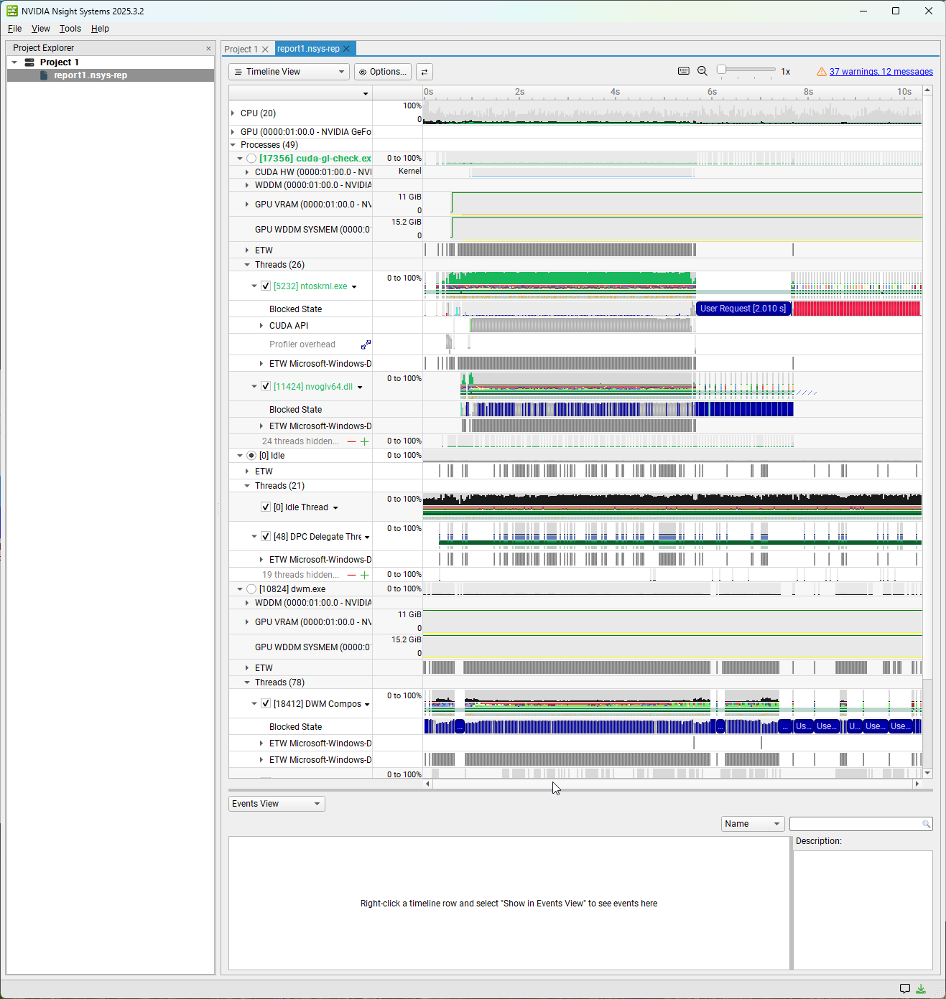
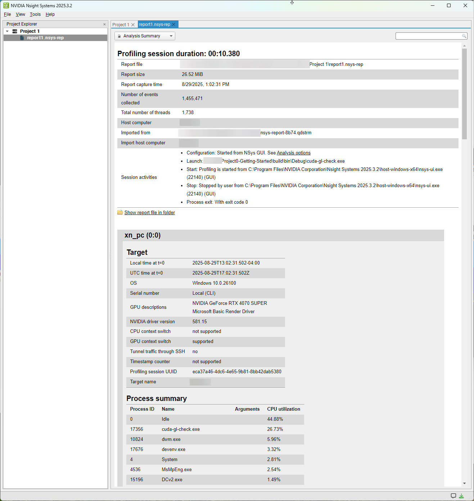
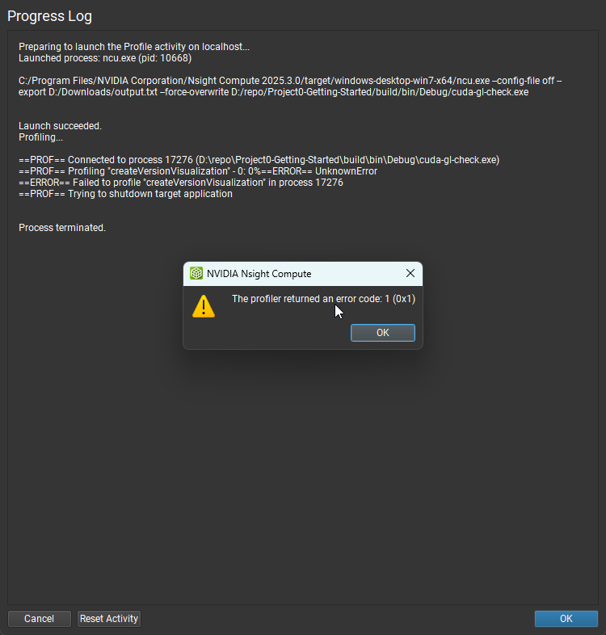
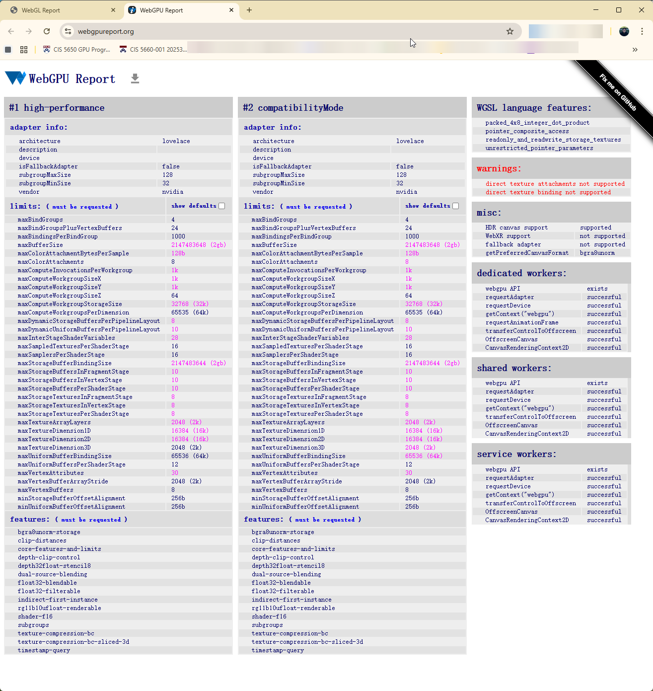
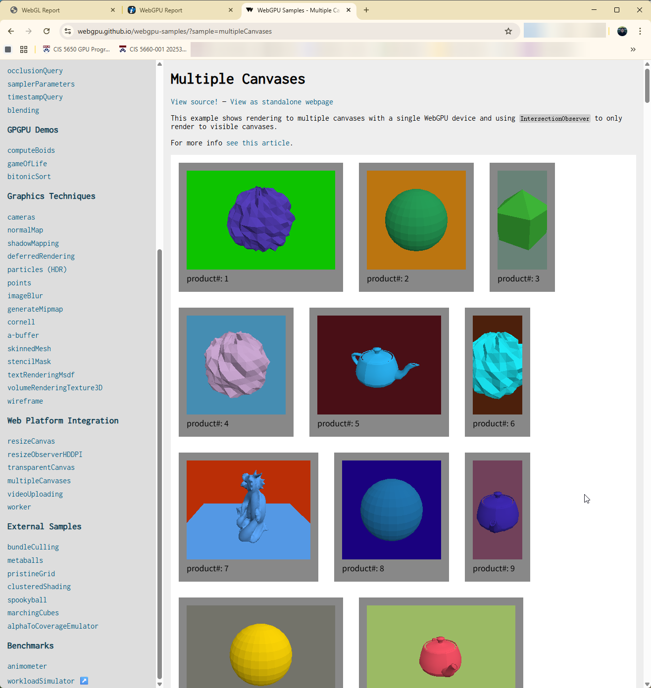

Project 0 Getting Started
====================

**University of Pennsylvania, CIS 5650: GPU Programming and Architecture, Project 0**

* Xiaonan Pan
  * [LinkedIn](https://www.linkedin.com/in/xiaonan-pan-9b0b0b1a7), [My Blog](www.tsingloo.com), [GitHub](https://github.com/TsingLoo)
* Tested on: 
  * Windows 11 24H2
  * 13600KF @ 3.5Ghz
  * 4070 SUPER 12GB
  * 32GB RAM

### Results of testing

Part 2.1.2: 

Part 2.1.3: Nsight Debugging

Part 2.1.4: Nsight Systems

Part 2.1.5: Nsight Compute

The known issue mentioned in this [Ed Post](https://edstem.org/us/courses/81464/discussion/6880884) occurs.

Part 2.2: Project Instructions - WebGL

Part 2.3: Project Instructions - WebGPU

