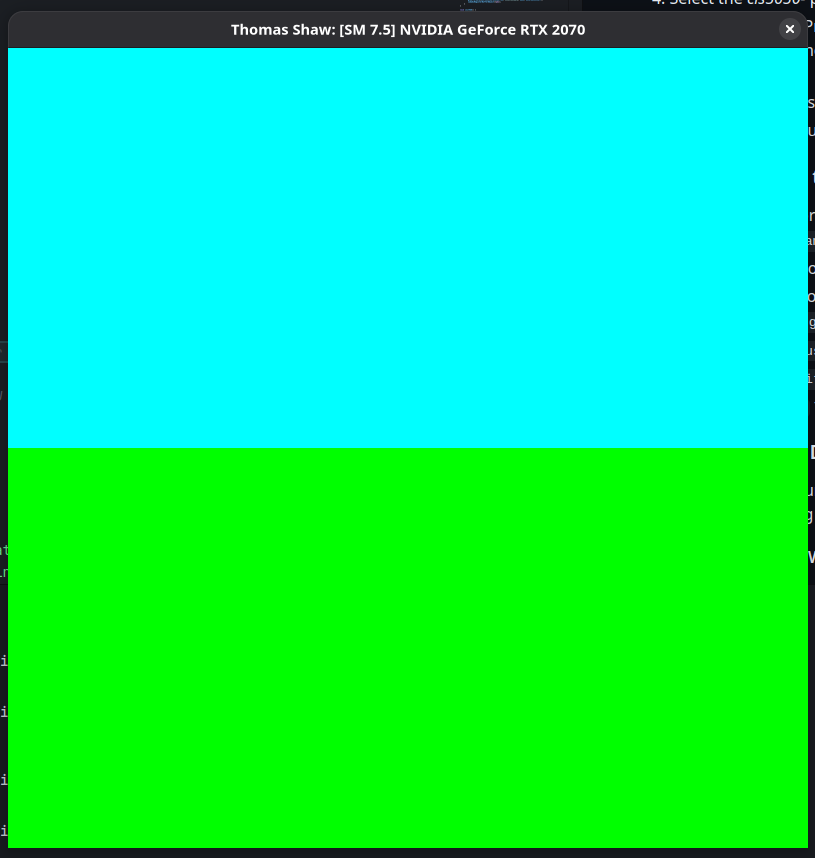
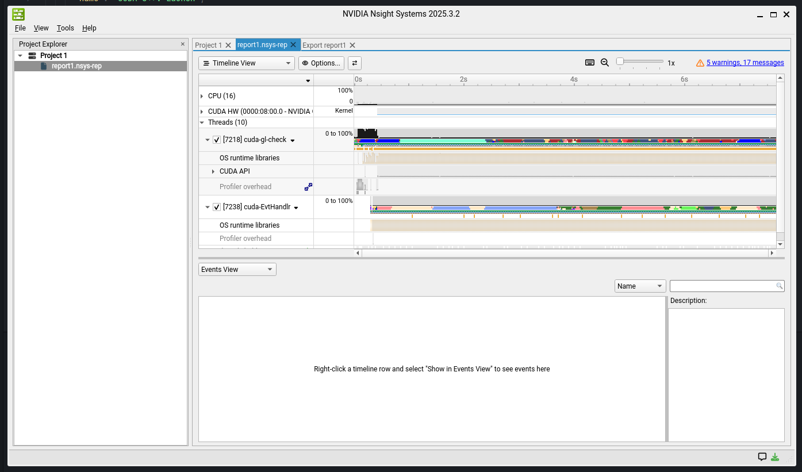
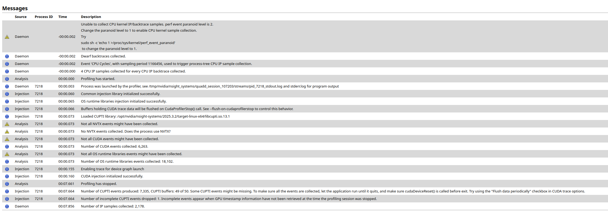
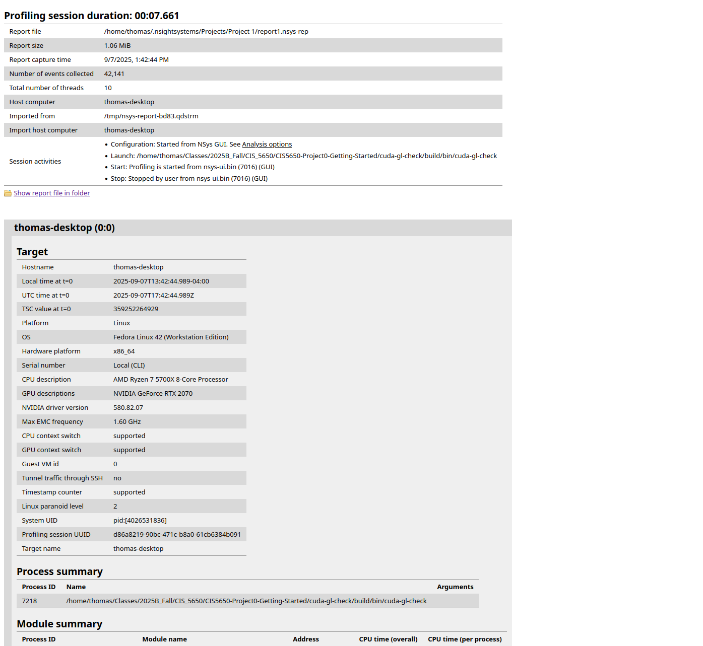
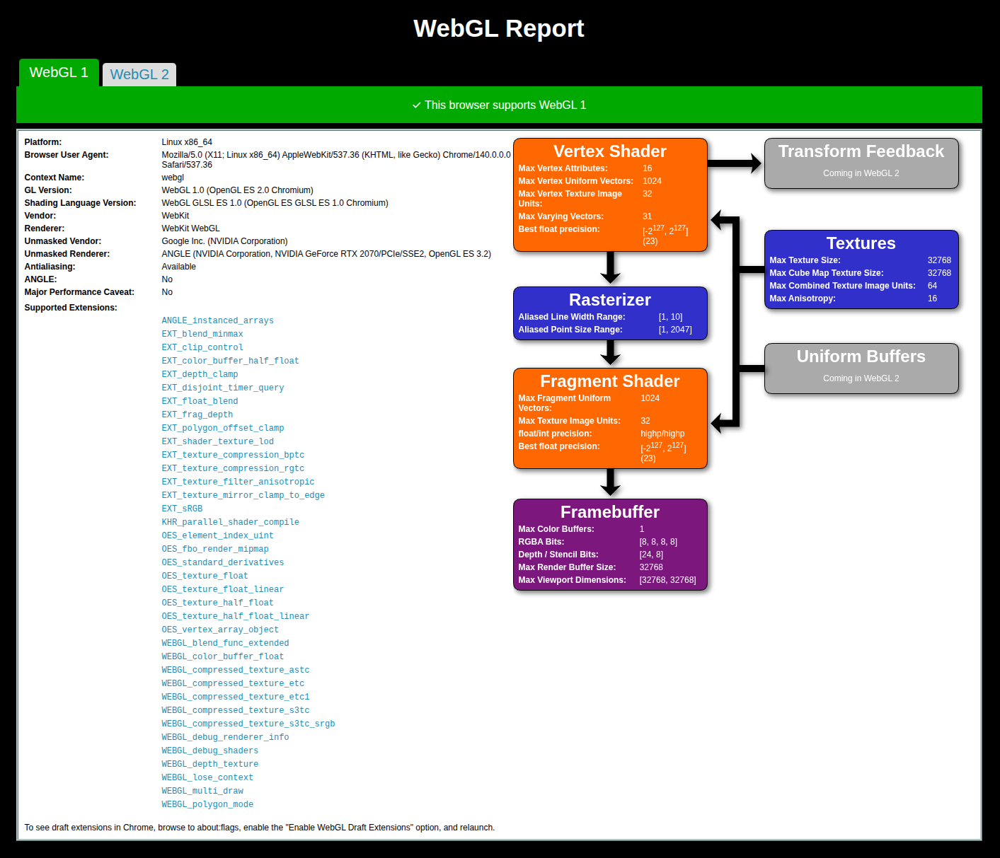
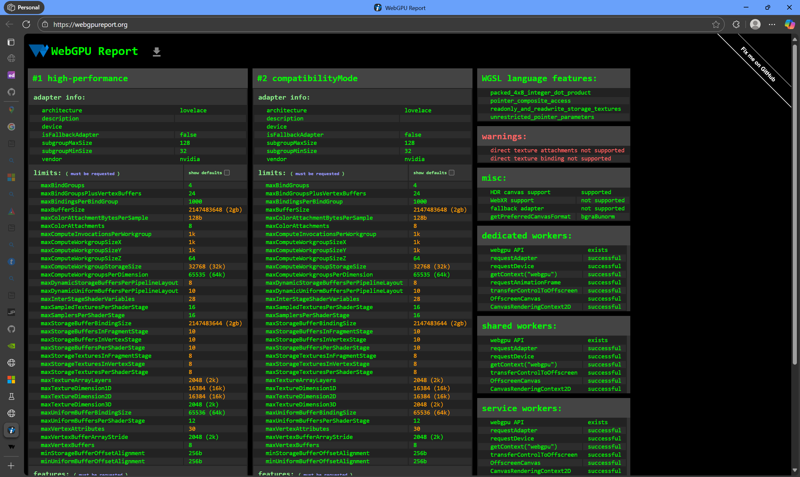

Project 0 Getting Started
====================

**University of Pennsylvania, CIS 5650: GPU Programming and Architecture, Project 0**

* Thomas Shaw
  * [LinkedIn](https://www.linkedin.com/in/thomas-shaw-54468b222), [personal website](https://tlshaw.me), [GitHub](https://github.com/printer83mph), etc.
* Tested on: Fedora 42, Ryzen 7 5700x @ 4.67GHz, 32GB, RTX 2070 8GB

### Results

Configuring my machine to work with CUDA was a bit frustrating, as I previously had an installation of Fedora 40 with proprietary non-CUDA drivers. The process to both A) upgrade to 42, which I had wanted to do for a while, and B) install CUDA toolkit + drivers, was a bit overcomplicated, so after fiddling for a couple days, I went with a clean slate (fresh install) and things worked out much nicer.

I used NVIDIA's "Package Manager Install" guide, which required some extra steps since I had Secure Boot enabled, but otherwise was straightforward.

I'm primarily using Visual Studio Code as my code editing environment, with `clangd` as a language server + linter + formatter. With some minimal configuration, this works nicely.

```
# .clangd

CompileFlags:
  Add:
    - -std=c++11
    - --cuda-path=/usr/local/cuda
    - --cuda-gpu-arch=sm_75
    - -L/usr/local/cuda/lib64
    - -I/usr/local/cuda/include
  Remove:
    - "-forward-unknown-to-host-compiler"
    - "-arch=native"
    - "--expt-*"
    - "--options-file"
    - "-G"
```

I combined this with the following build configuration:

```sh
CC=gcc CXX=g++ CUDACXX=nvcc cmake .. -G "Ninja" \
  -DCMAKE_BUILD_TYPE=Debug \
  -DCMAKE_CUDA_FLAGS="-g -G" \
  -DCMAKE_EXPORT_COMPILE_COMMANDS=ON
```

One of the main issues I ran into after a fresh install was that Wayland (compositor) didn't like the built binary. I wasn't sure exactly why without digging further into GTK, but the following error would appear:

```
$ cuda-gl-check/build/bin/cuda-gl-check
libdecor-gtk-WARNING: Failed to initialize GTK
Failed to load plugin 'libdecor-gtk.so': failed to init
```

This was resolved by setting the following environment variables when running the binary, whether debugging or just running raw:

```sh
export WAYLAND_DISPLAY=""
export XDG_SESSION_TYPE=x11
```

I also plugged these into `launch.json`:

```json
{
  "$schema": "vscode://schemas/launch",
  // Use IntelliSense to learn about possible attributes.
  // Hover to view descriptions of existing attributes.
  // For more information, visit: https://go.microsoft.com/fwlink/?linkid=830387
  "version": "0.2.0",
  "configurations": [
    {
      "name": "CUDA C++: Launch",
      "type": "cuda-gdb",
      "request": "launch",
      "environment": [
        {"name": "WAYLAND_DISPLAY", "value": ""},
        {"name": "XDG_SESSION_TYPE", "value": "x11"}
      ],
      "program": "${workspaceFolder}/build/bin/cuda-gl-check"
    },
    {
      "name": "CUDA C++: Attach",
      "type": "cuda-gdb",
      "request": "attach"
    }
  ]
}
```

### Screencaps











For WebGPU, I had to enable the "Unsafe WebGPU Support" flag in Chrome.

