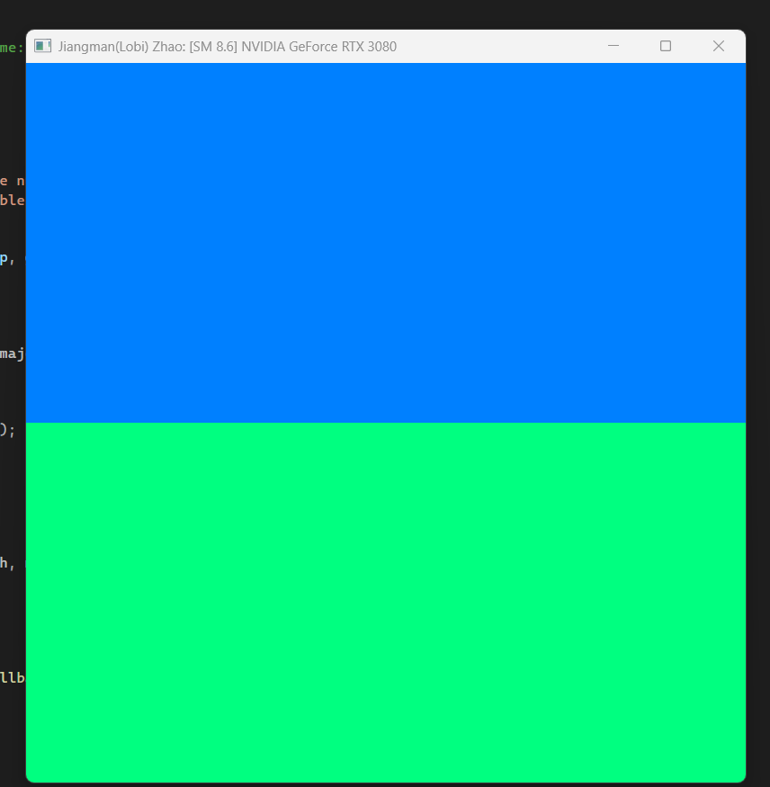
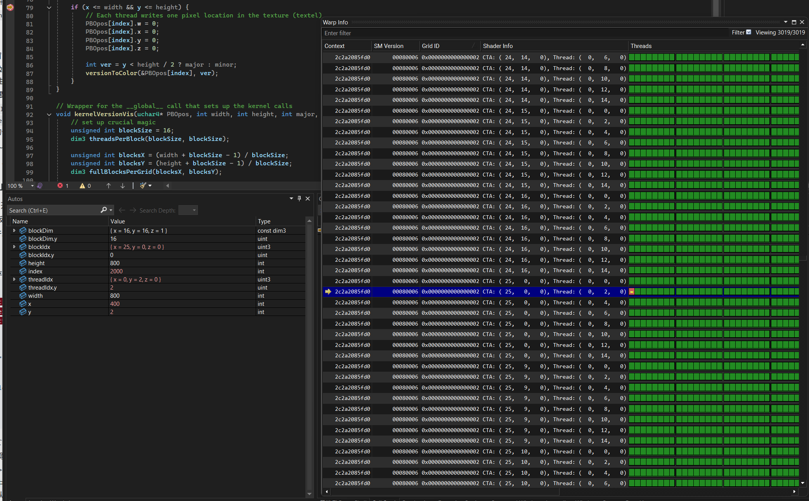
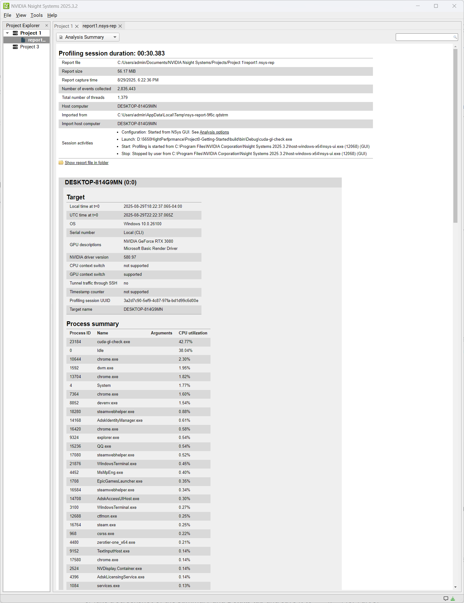
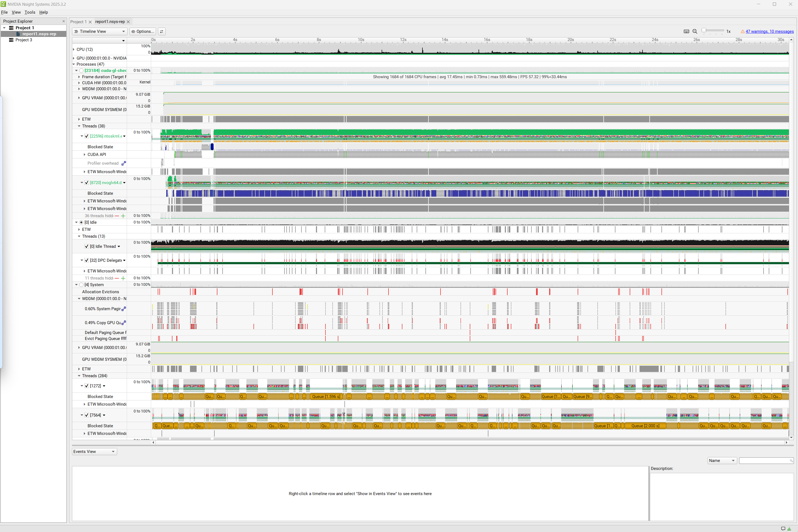
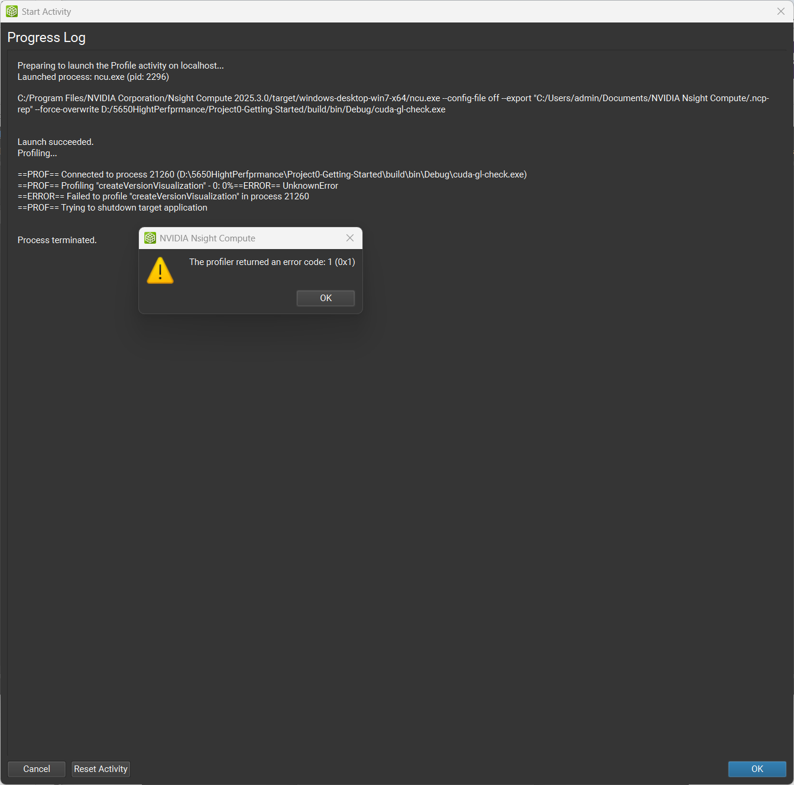
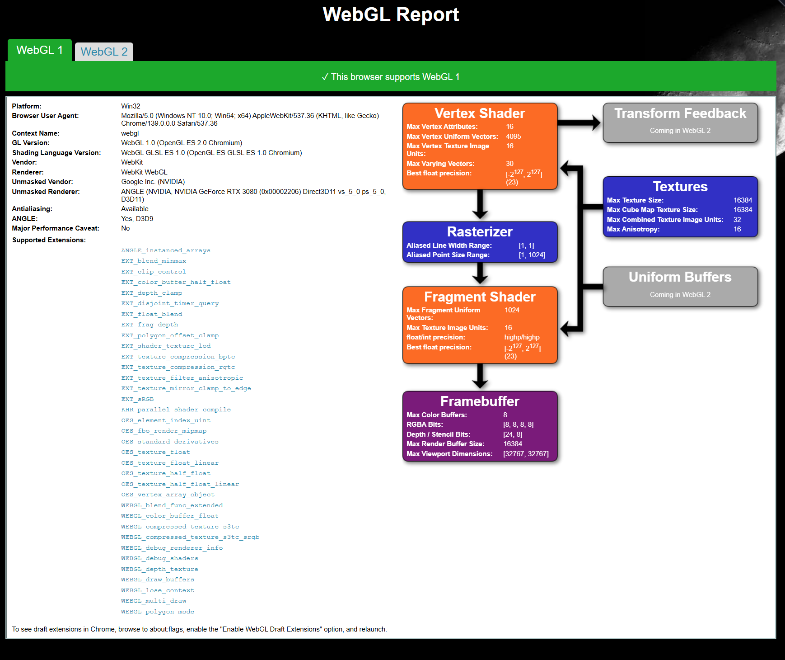
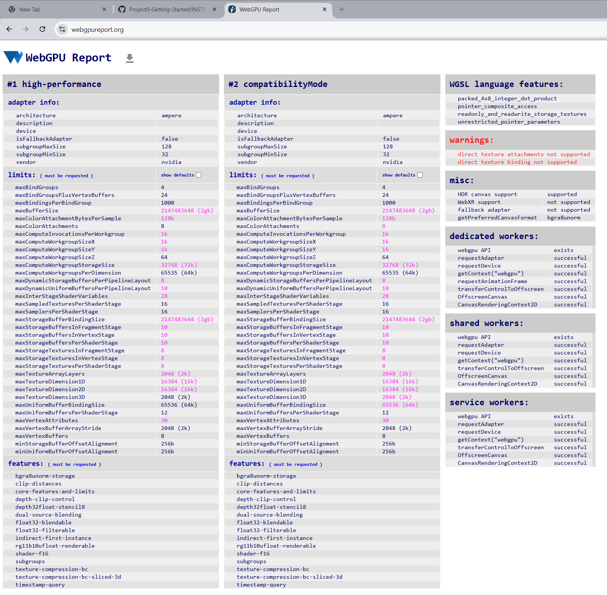

Project 0 Getting Started
====================

**University of Pennsylvania, CIS 5650: GPU Programming and Architecture, Project 0**

* Jiangman(Lobi) Zhao
  * [Lobi Zhao - LinkedIn](https://www.linkedin.com/in/lobizhao/), [Lobi Zhao - personal website](https://lobizhao.github.io/).
* Tested on: Windows 11 Pro, i5-10600KF @ 4.10GHz 32GB, RTX 3080 10GB

### README

## screenshots 
- part 2.12

- part 2.13

- part 2.14

- part 2.15

- part 2.2

- part 2.3

## analysis
