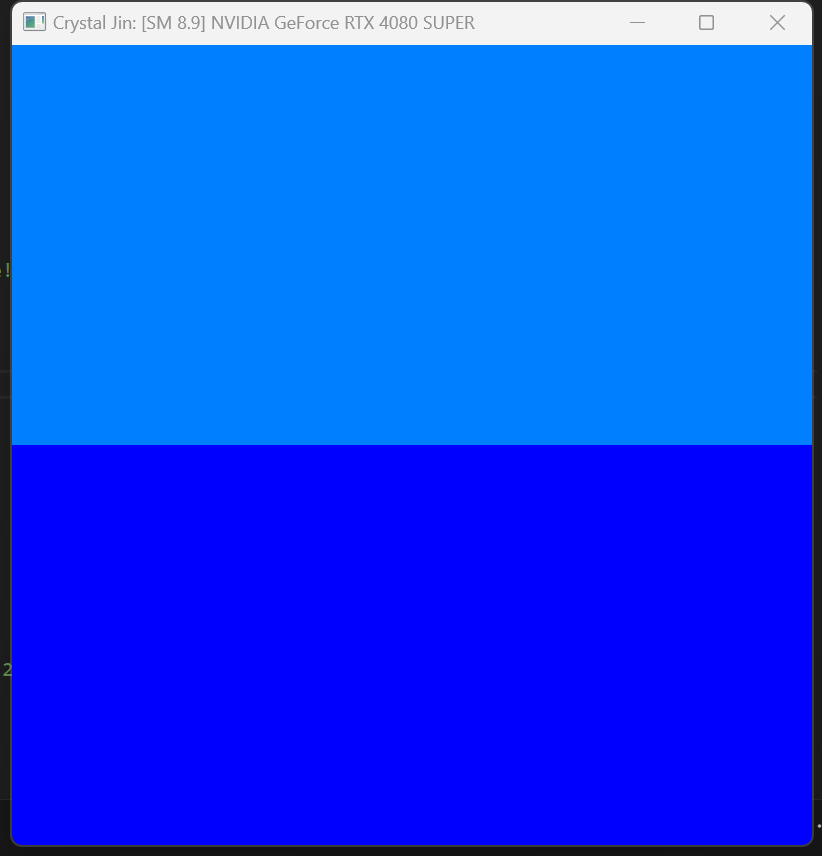
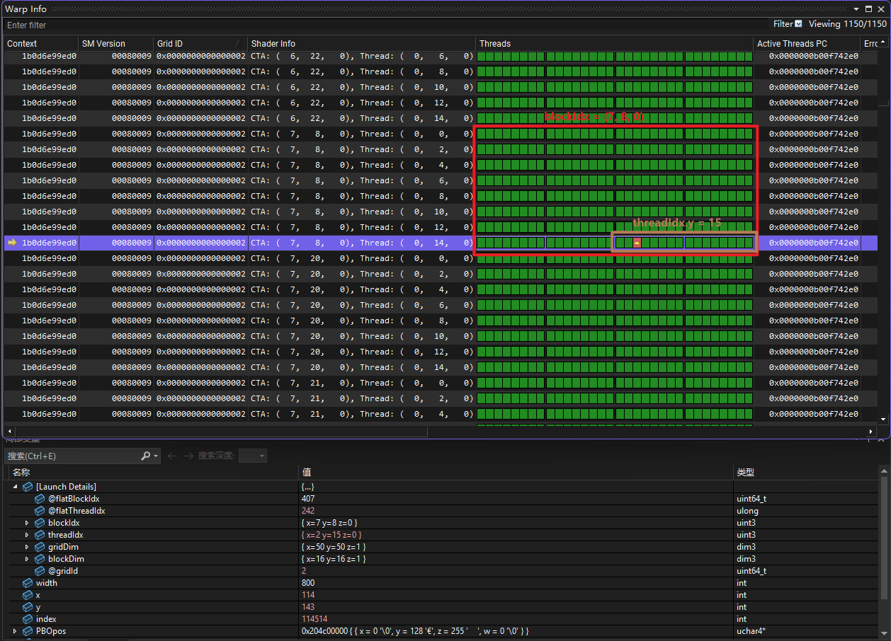
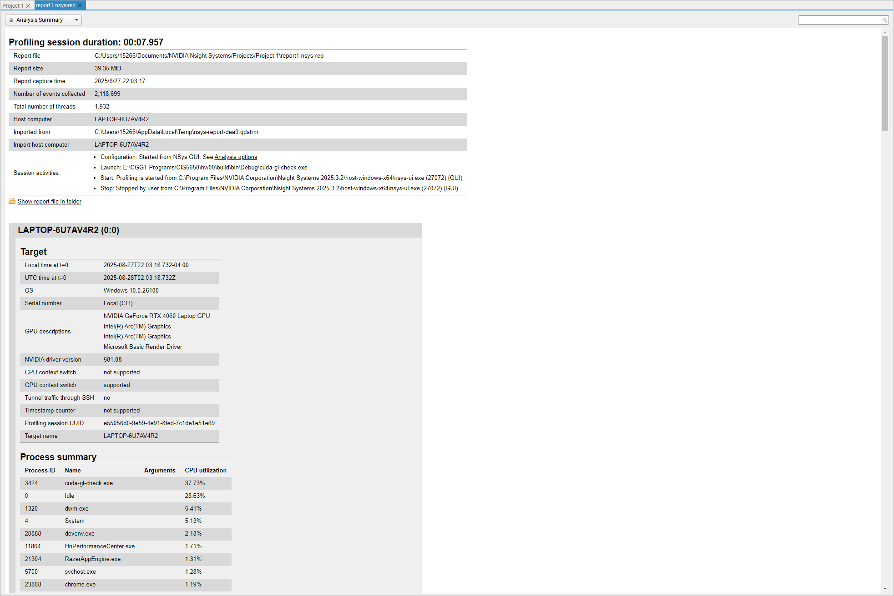
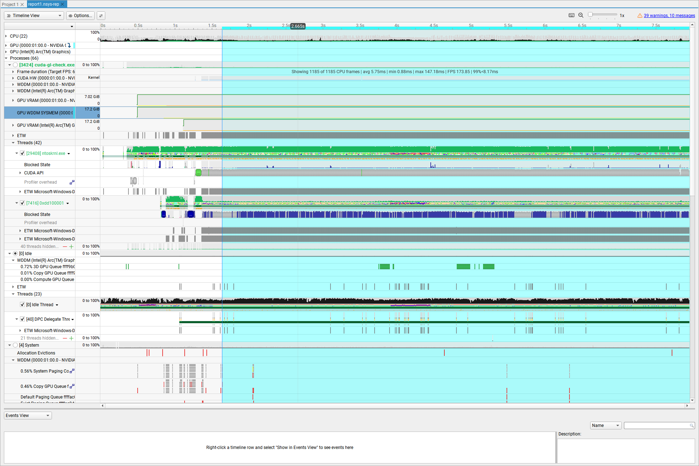
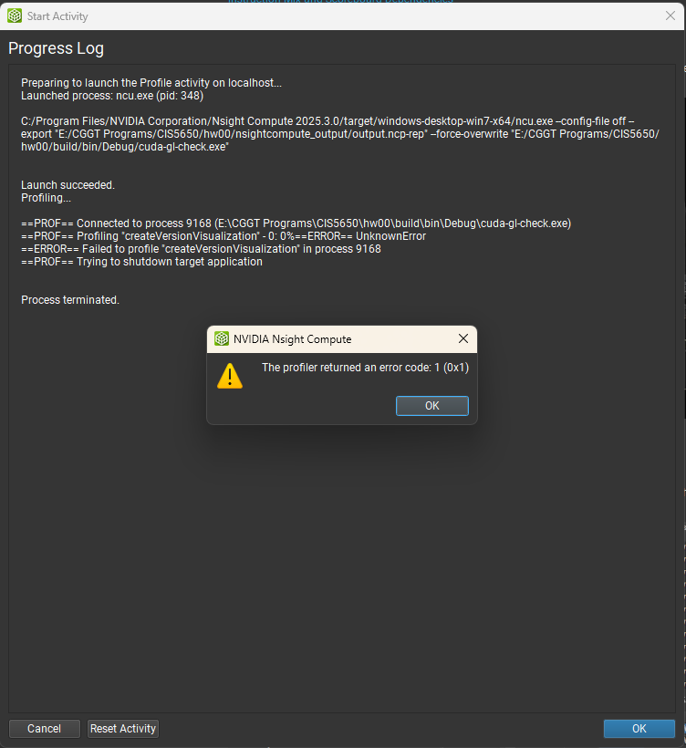

# Project 0 Getting Started

**University of Pennsylvania, CIS 5650: GPU Programming and Architecture, Project 0**

-   Yu Jiang
    -   [LinkedIn](https://www.linkedin.com/in/yu-jiang-450815328/), [twitter](https://x.com/lvtha0711)
-   Tested on: Windows 11, Ultra 7 155H @ 3.80 GHz 32GB, RTX 4060 8192MB (Personal Laptop)

## Part 2.1: Project Instructions - CUDA

### 2.1.1: Compute Capability

[SM 8.9] - NVIDIA GeForce RTX 4060 Laptop GPU

### 2.1.2: Modify the CUDA Project

### 2.1.3: Nsight Debugging

### 2.1.4: Nsight Systems

  

### 2.1.5: Nsight Compute

It has a bug now  

## Part 2.2: Project Instructions - WebGL

## Part 2.3: Project Instructions - WebGPU

