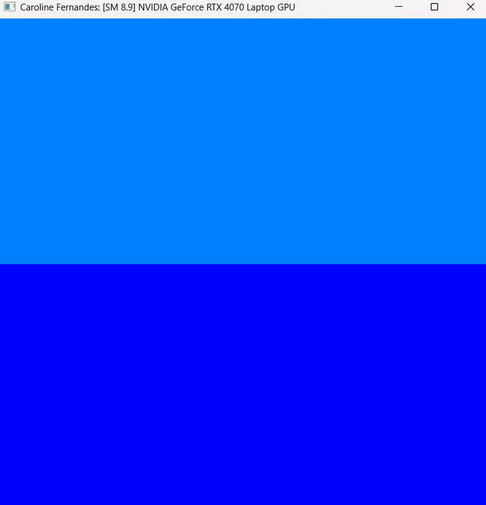
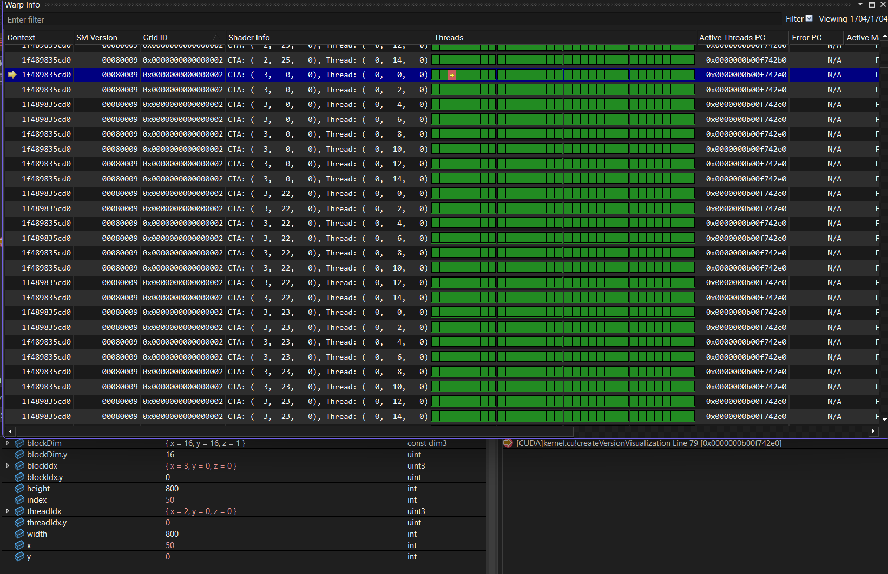
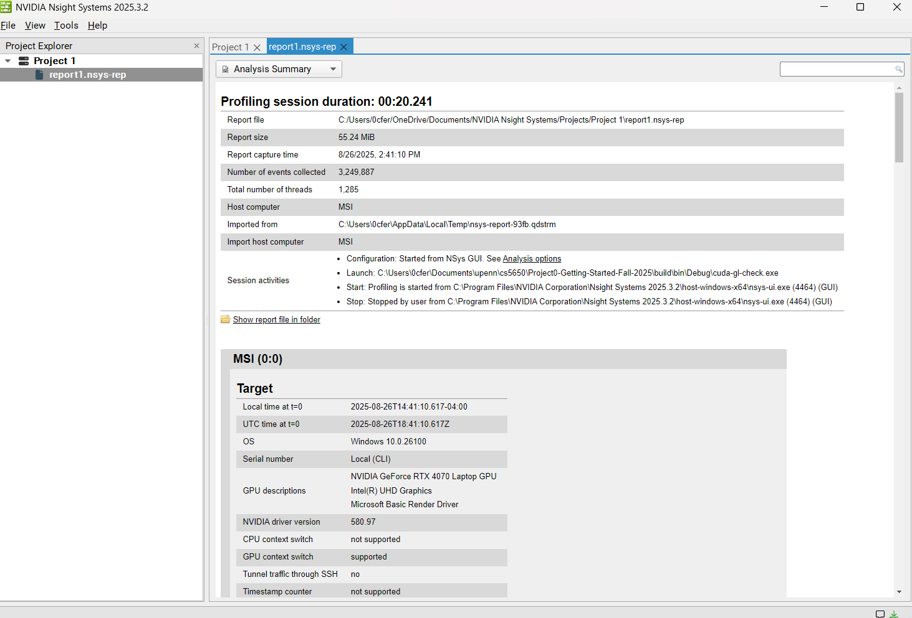
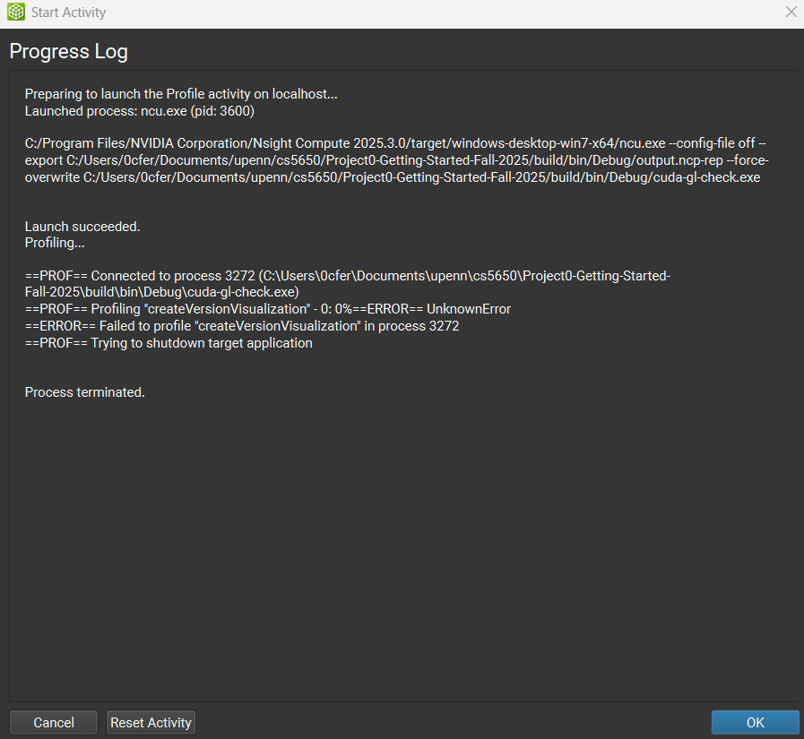
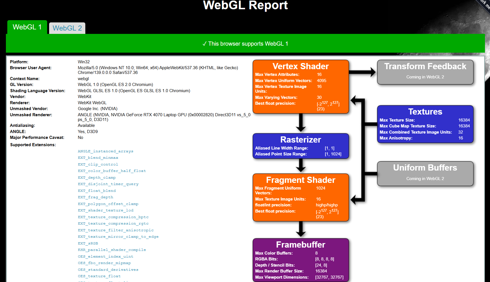
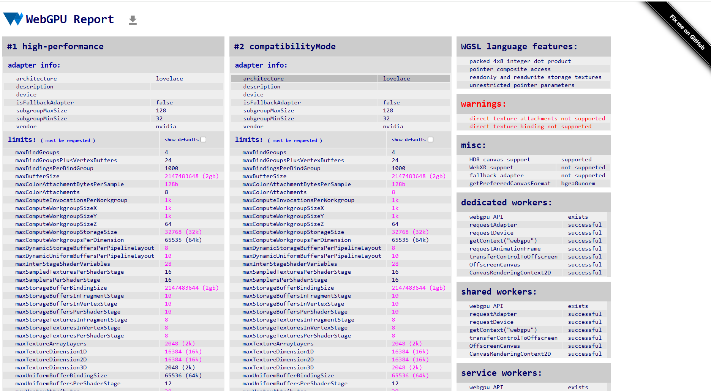
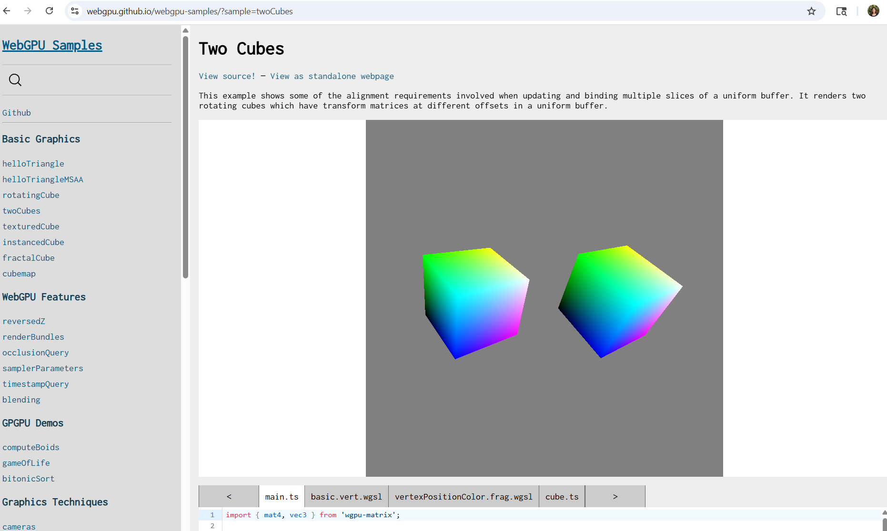

Project 0 Getting Started
====================

**University of Pennsylvania, CIS 5650: GPU Programming and Architecture, Project 0**

* Caroline Fernandes
  * [LinkedIn](https://www.linkedin.com/in/caroline-fernandes-0-/), [personal website](https://0cfernandes00.wixsite.com/visualfx)
* Tested on: Windows 11, i9-14900HX @ 2.20GHz, Nvidia GeForce RTX 4070

### Program Output

### Nsight Debugging

### Nsight compute error

### WebGL check

### WebGPU check

