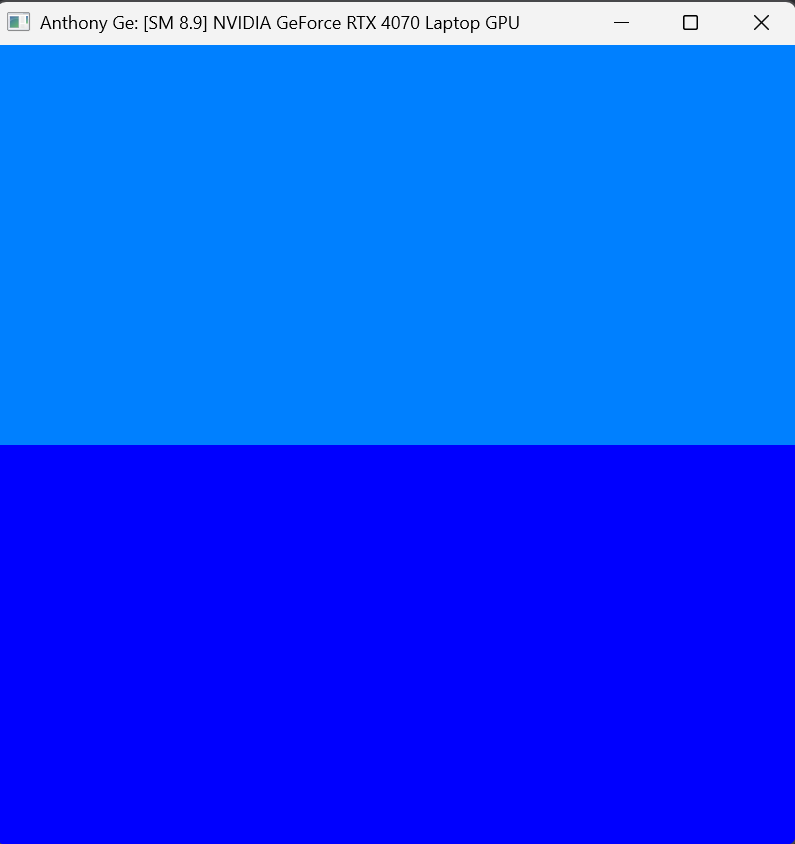
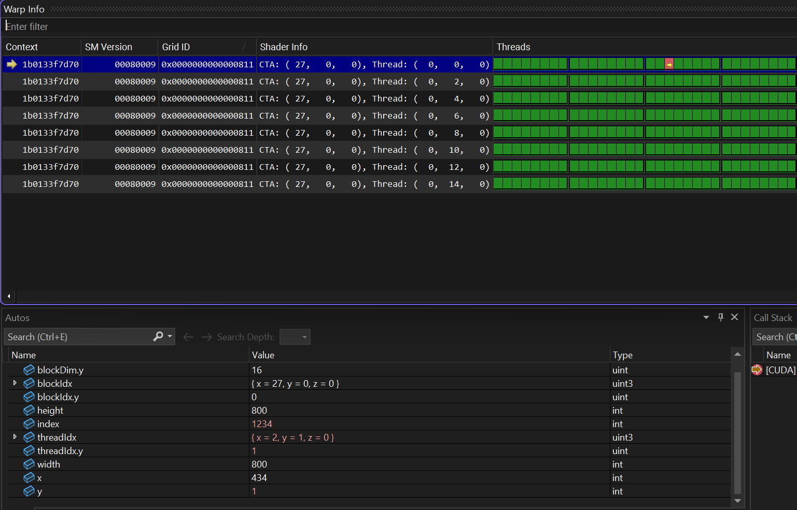
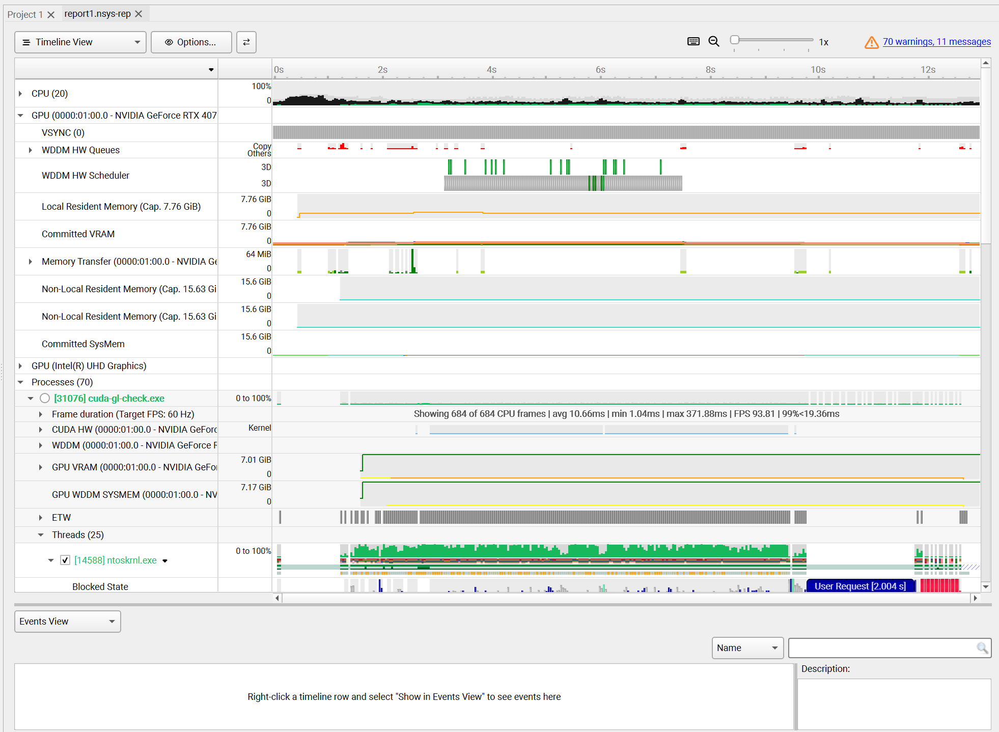
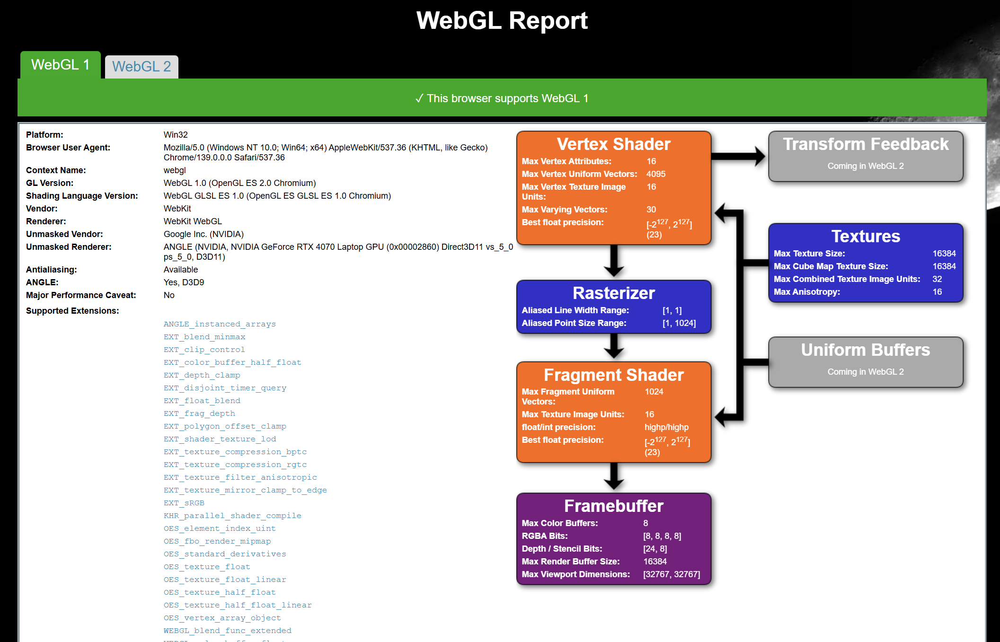
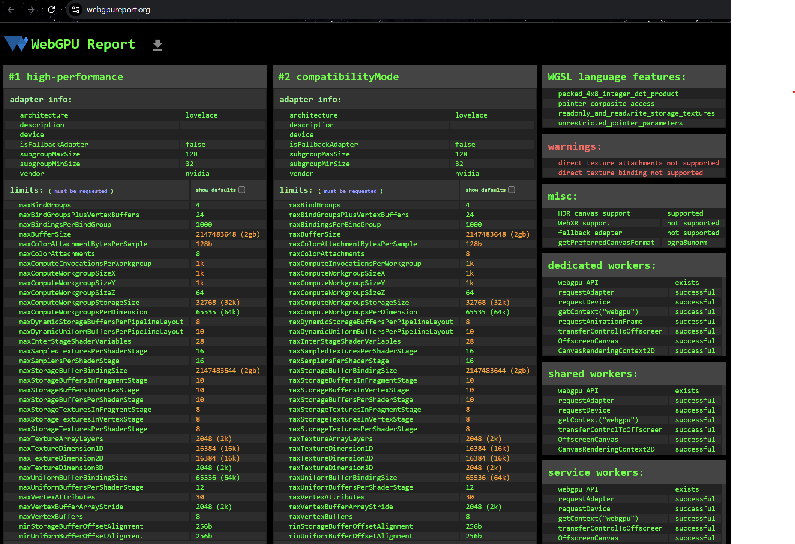

Project 0 Getting Started
====================

**University of Pennsylvania, CIS 5650: GPU Programming and Architecture, Project 0**

* Anthony Ge
  * (TODO) [LinkedIn](), [personal website](), [twitter](), etc.
* Tested on: Windows 11, i9-13900H @ 2600 Mhz 16GB, NVIDIA GeForce RTX 4070 Laptop GPU 8GB

### Project 0 Screenshots

Compute Capability: 8.9 with GeForce RTX 4070 Mobile GPU

1. CC modified cuda-gl-check screnshot: 
2. Thread warp info check with index 1234: 
3. NSight Systems profile timeline screenshot, not using integrated graphics: 
4. NSight Compute profile test is broken, skipped
5. WebGL support screenshot: 
6. WebGPU support screenshot: 