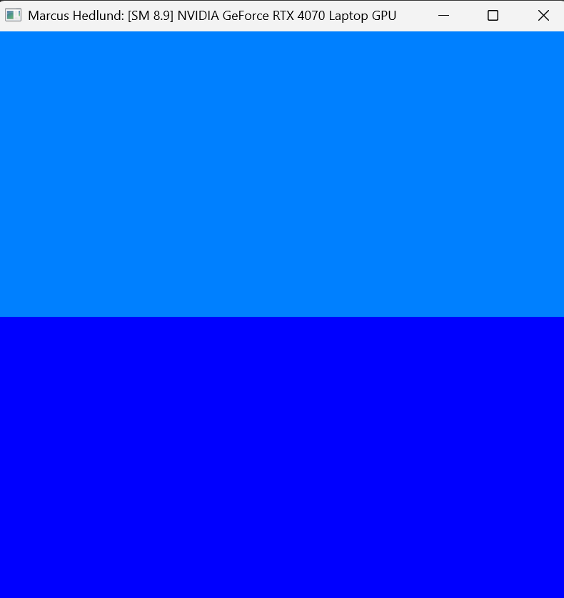
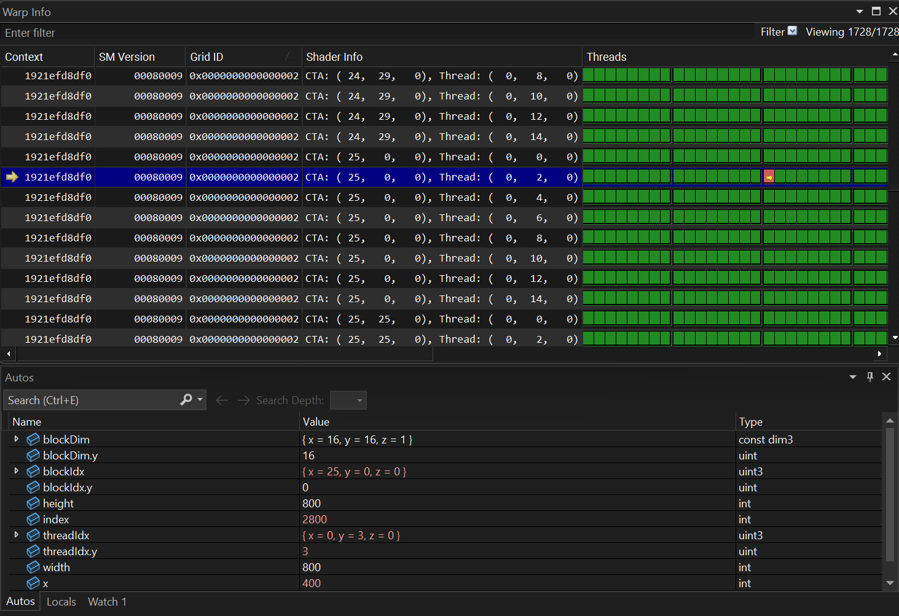
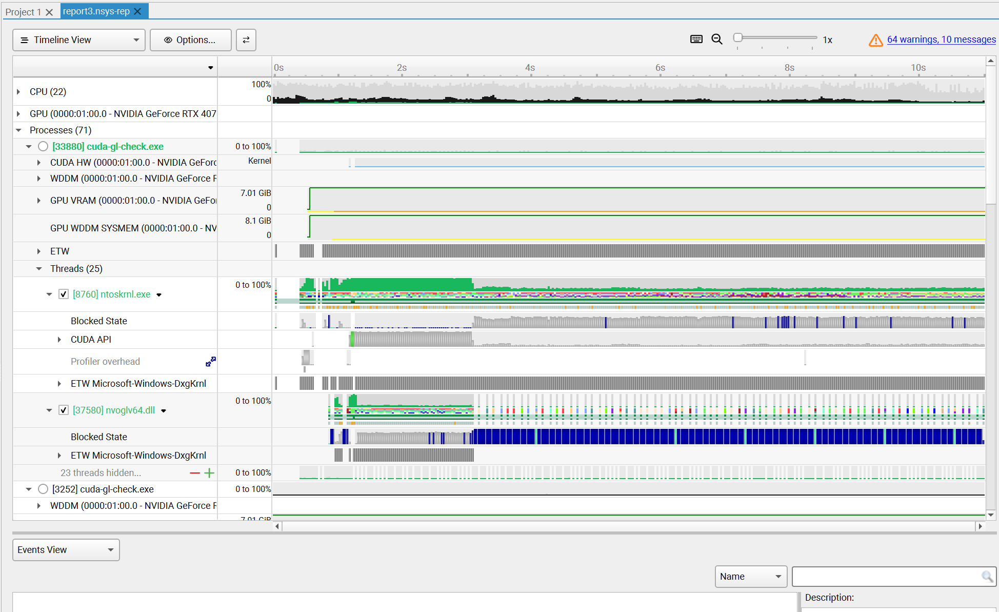
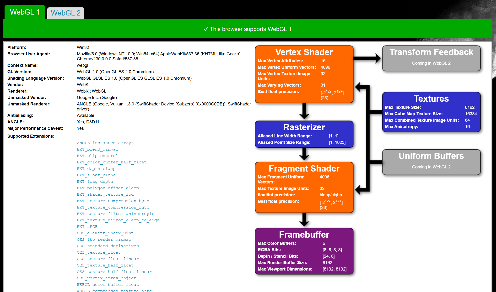
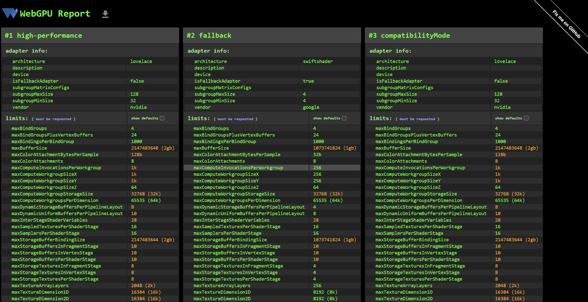

Project 0 Getting Started
====================

**University of Pennsylvania, CIS 5650: GPU Programming and Architecture, Project 0**

* Marcus Hedlund
  * [LinkedIn](https://www.linkedin.com/in/marcushedlund/)
* Tested on: Windows 11, Intel Core Ultra 9 185H @ 2.5 GHz 16GB, NVIDIA GeForce RTX 4070 Laptop GPU 8GB (Personal Computer)

## 2.1.1

* Compute Capability: 8.9

## 2.1.2

Modified the m_yourNameField 

## 2.1.3

Nsight Debugging in Nsight Visual Studio Edition using conditional breakpoint with an index of 2800.

## 2.1.4

Nsight Systems Timeline

## 2.1.5

Skipped because of Nsight Compute error.

## 2.2

WebGL Compatibility Report from [https://webglreport.com](https://webglreport.com)

## 2.3

WebGPU Compatibility Report from [https://webgpureport.org](https://webgpureport.org)

