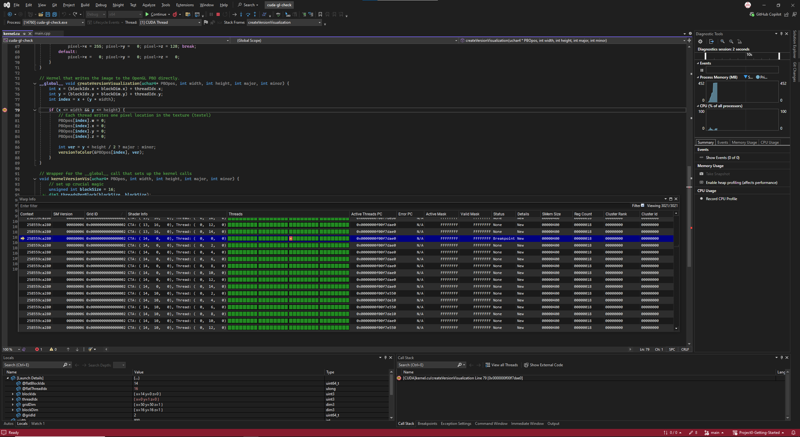
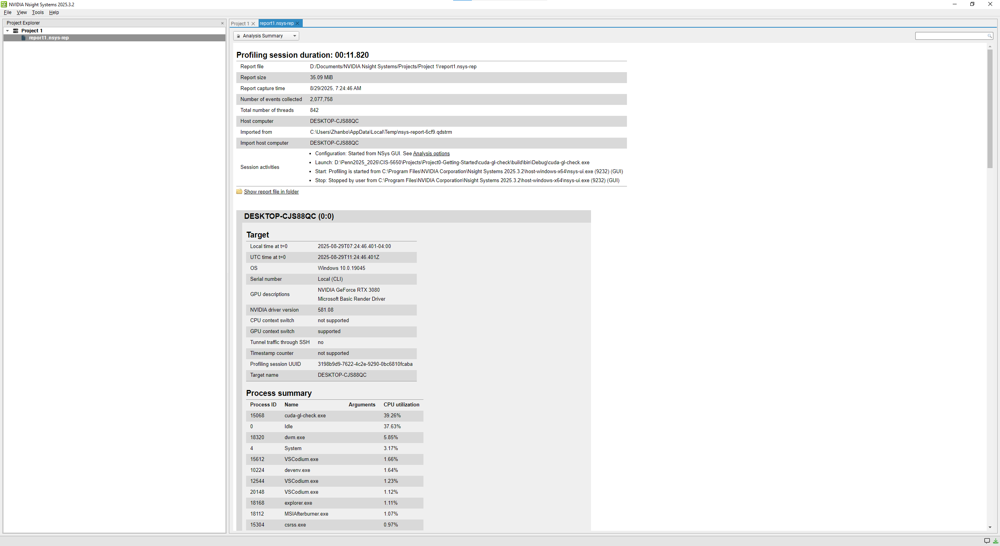
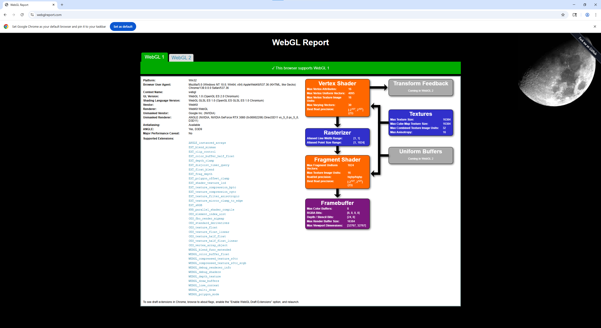
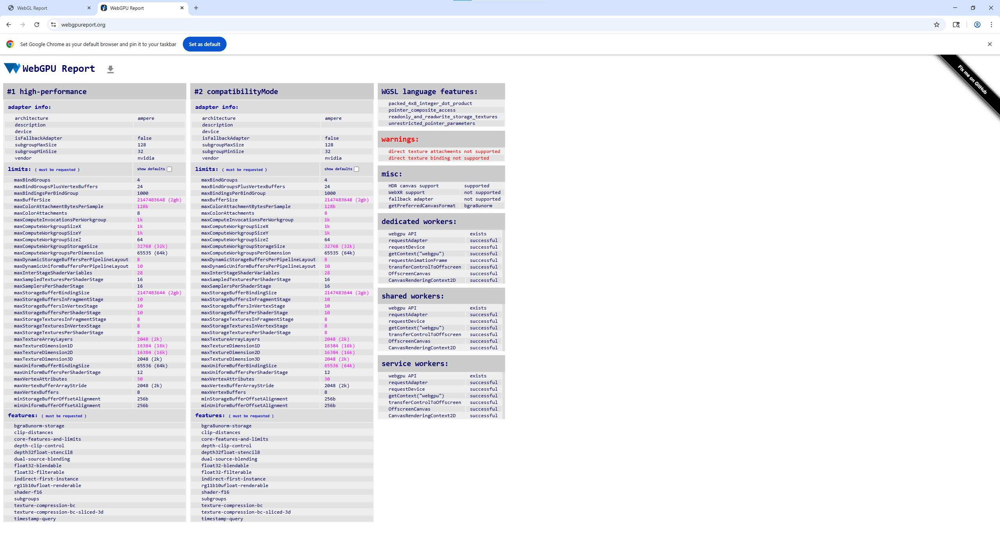

Project 0 Getting Started
====================

**University of Pennsylvania, CIS 5650: GPU Programming and Architecture, Project 0**

* Zhanbo Lin
  * [LinkedIn](https://www.linkedin.com/in/zhanbo-lin)
* Tested on: Windows 10, i5-10400F @ 2.90GHz 48GB, RTX-3080 10GB (Personal)
* GPU Compute Capability: 8.6

## Screenshots
### Part 2.1.2: Modify the CUDA Project and Take a Screenshot

### Part 2.1.3: Nsight Debugging

### Part 2.1.4: Nsight Systems
Analysis Summary

Timeline

### Part 2.1.5: Nsight Compute
Skipped due to the issue reported in https://edstem.org/us/courses/81464/discussion/6880884

### Part 2.2: WebGL

### Part 2.3: WebGPU

