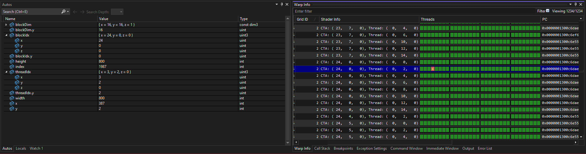
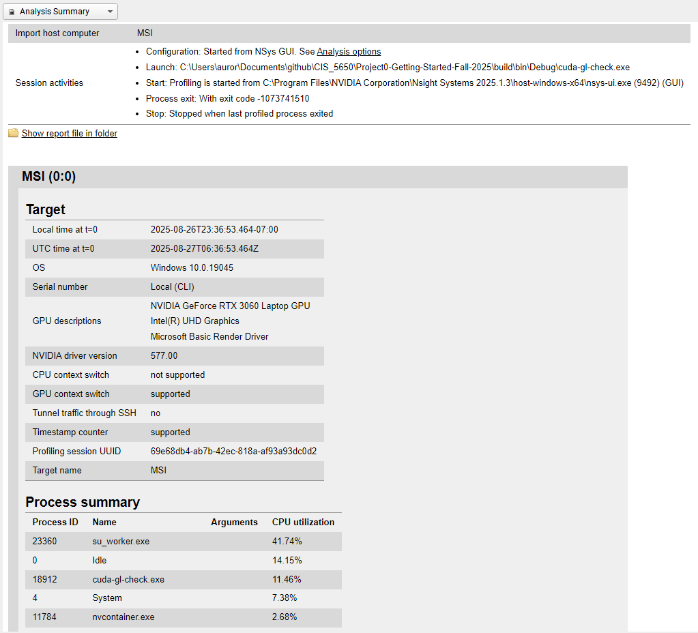
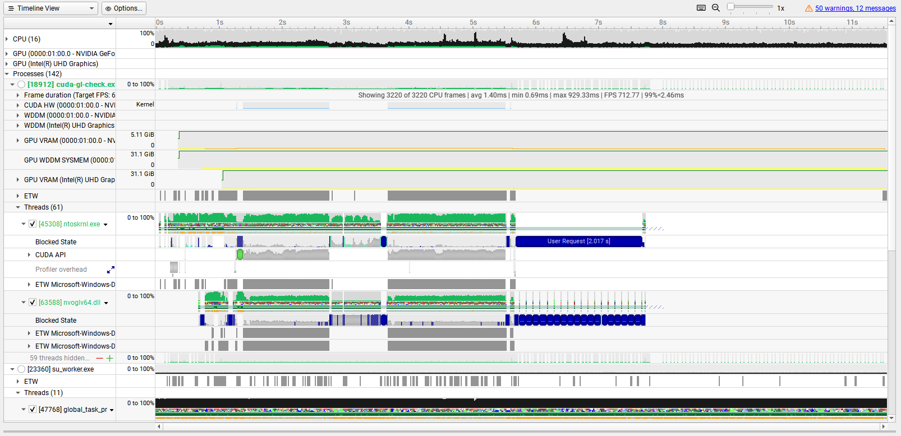
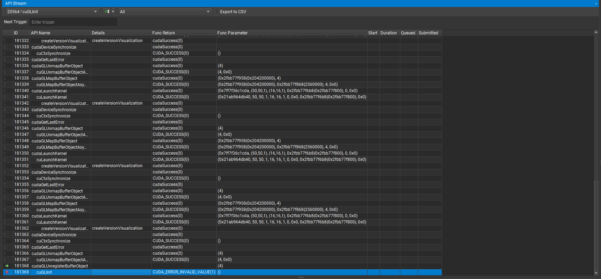

Project 0 Getting Started
====================

**University of Pennsylvania, CIS 5650: GPU Programming and Architecture, Project 0**

* Jacqueline (Jackie) Li
  * [LinkedIn](https://www.linkedin.com/in/jackie-lii/), [personal website](https://sites.google.com/seas.upenn.edu/jacquelineli/home), [Instagram](https://www.instagram.com/sagescherrytree/), etc.
* Tested on: Windows 10, 11th Gen Intel(R) Core(TM) i7-11800H @ 2.30GHz, NVIDIA GeForce RTX 3060 Laptop GPU (6 GB)

## Part 2.1

#### GPU: NVIDIA GeForce RTX 3060

### Part 2.1.1

Project built and compiled successfully in VS 2022.

### Part 2.1.2

Output for name change.

|  |
|:--:|

### Part 2.1.3

NSight debug output for index == 1987.

|  |
|:--:|

### Part 2.1.4

CUDA NSight Systems trace analysis summary.

|  |  |
|:--:|:--:|

### Part 2.1.5

CUDA NSight Compute trace report.

There is an error when I launch the report, which is not the GPU permissions error. I am not certain if I am resolving it correctly, or if this report contains the expected output, but when I launch NSight Compute, and then hit play on my project, it will generate only one line, which I manually need to step into to obtain the report. Again, I am not certain if I am doing this correctly, here is a screenshot of what came out of that report.

I tried this several times, the report remains constant.

|  |
|:--:|

