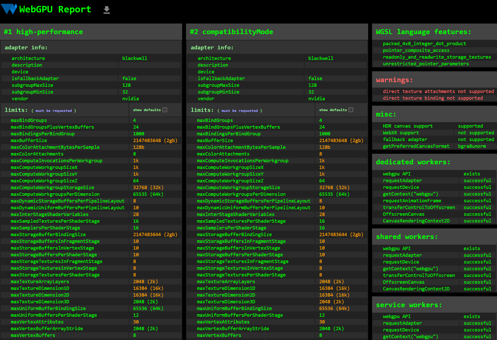
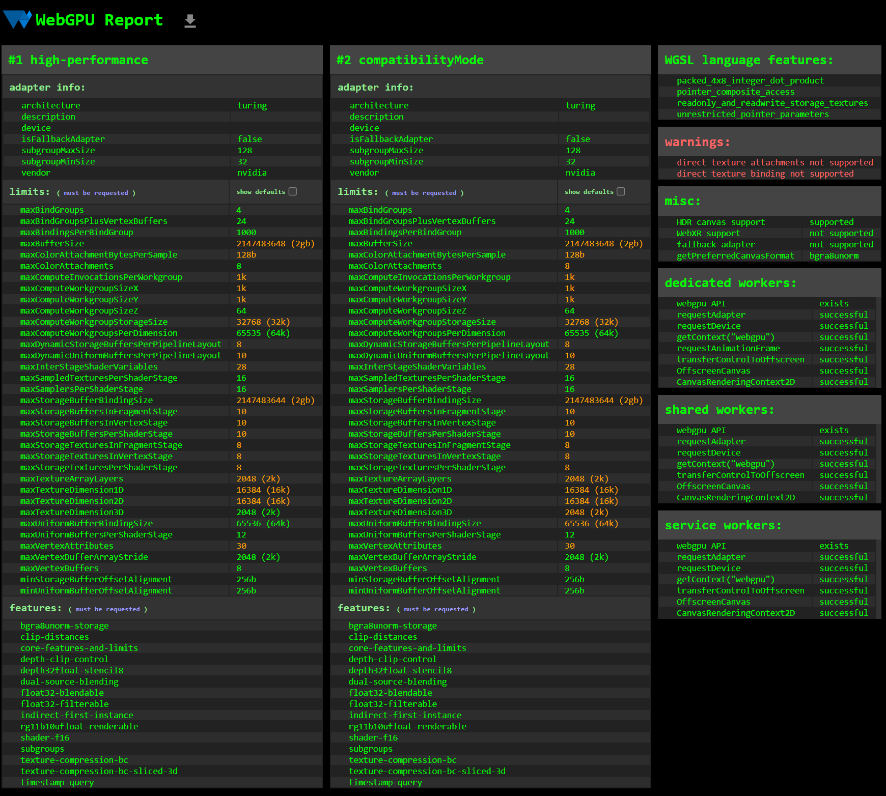

Project 0 Getting Started
====================

**University of Pennsylvania, CIS 5650: GPU Programming and Architecture, Project 0**

* Raymond Feng
  * [LinkedIn](https://www.linkedin.com/in/raymond-ma-feng/), [personal website](https://www.rfeng.dev/)
* Tested on: Windows 11, i9-9900KF @ 3.60GHz 32GB, NVIDIA GeForce RTX 2070 SUPER (Personal Computer)
  * Compute Capability: 7.5

### 2.1.2 - Modify the CUDA Project and Take a Screenshot

### 2.1.3 - Nsight Debugging

### 2.1.4 - Nsight Systems

### 2.1.5 - Nsight Systems
Skipped due to not working. [Ed post](https://edstem.org/us/courses/81464/discussion/6880884)

### 2.2 - WebGL

### 2.3 - WebGPU

