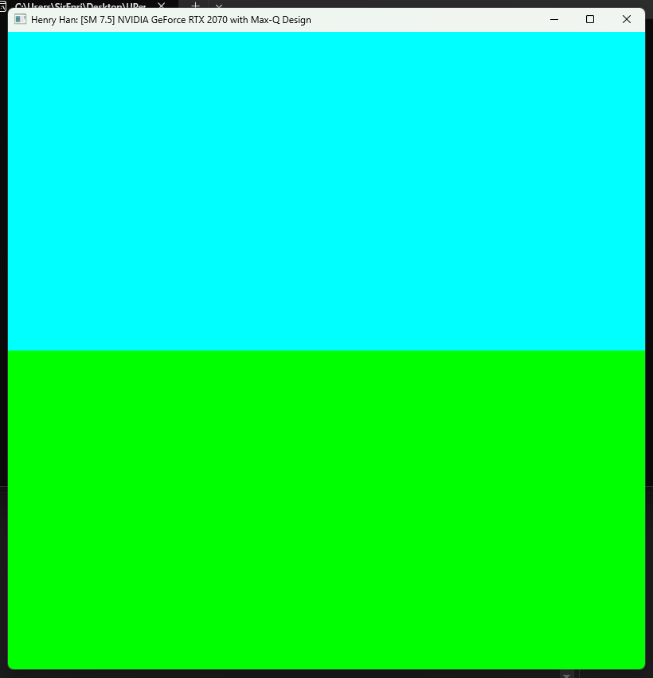
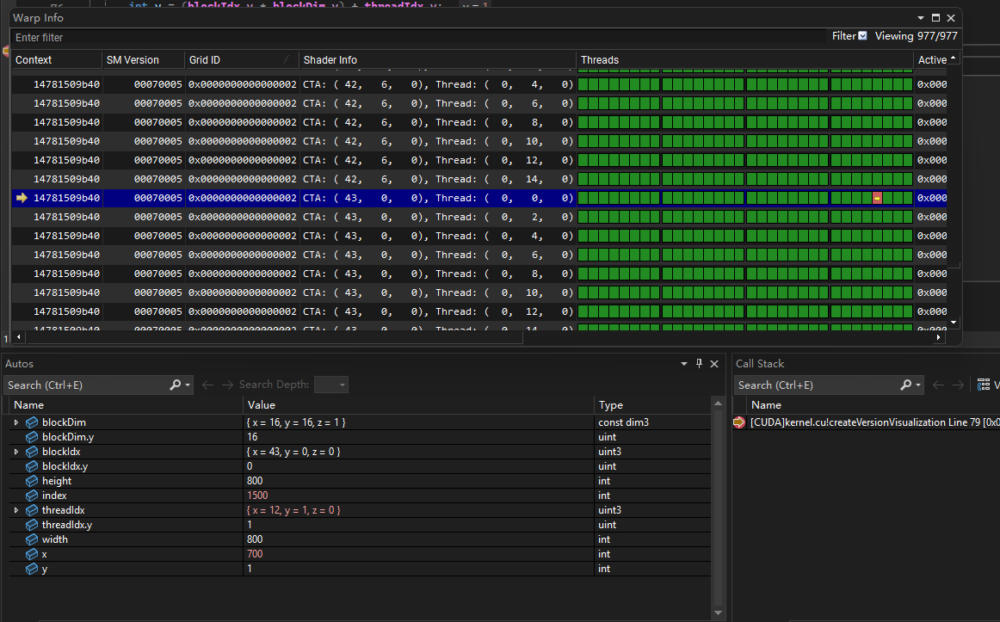
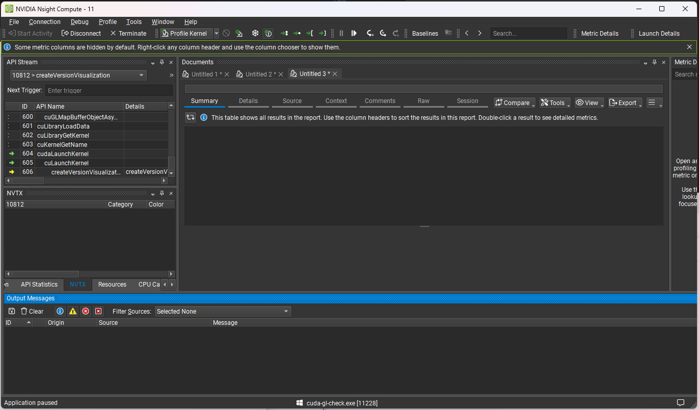
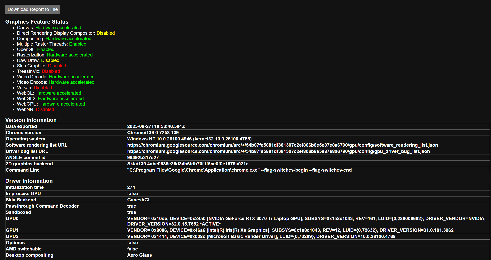
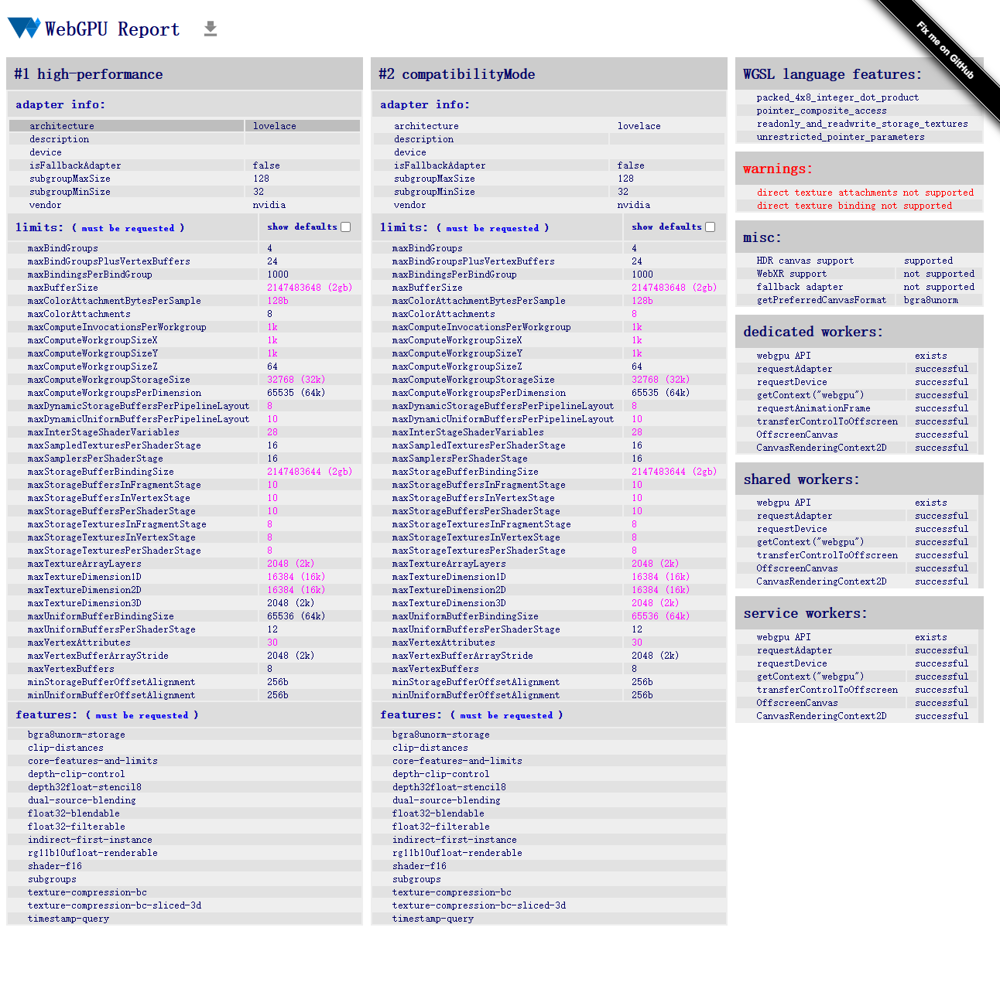

Project 0 Getting Started
====================

**University of Pennsylvania, CIS 5650: GPU Programming and Architecture, Project 0**

* Henry Han
  * https://github.com/sirenri2001
  * https://www.linkedin.com/in/henry-han-a832a6284/
* Tested on: Windows 11 Pro 24H2, i7-9750H @ 2.60GHz 16GB, RTX 2070 Max-Q

### Screenshots

**Running Application**

**Warp Info & Autos**

**NSight System**

**NSight Compute: I made a few tries to get NS Compute to work, but as soon as I select `Profile Kernels`, it will suddenly crush**

**WebGL**

**WebGPU**
