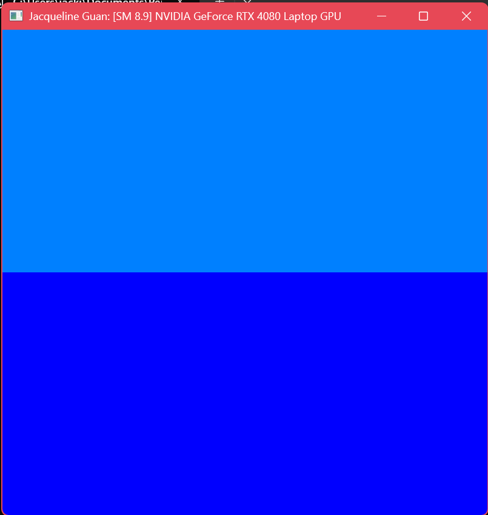
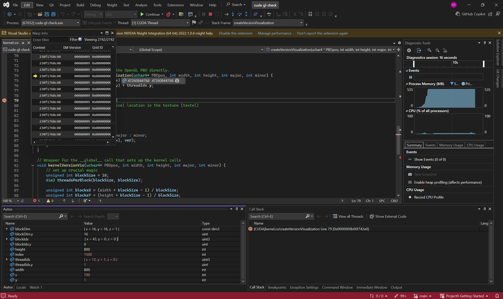
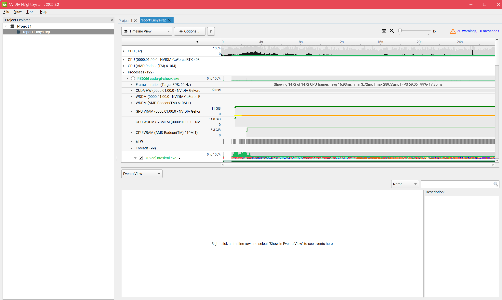
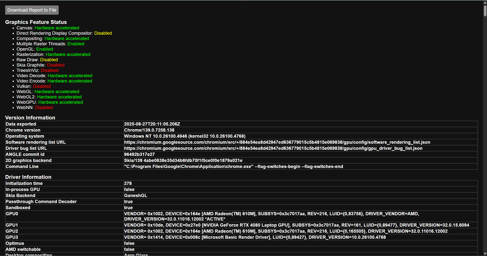
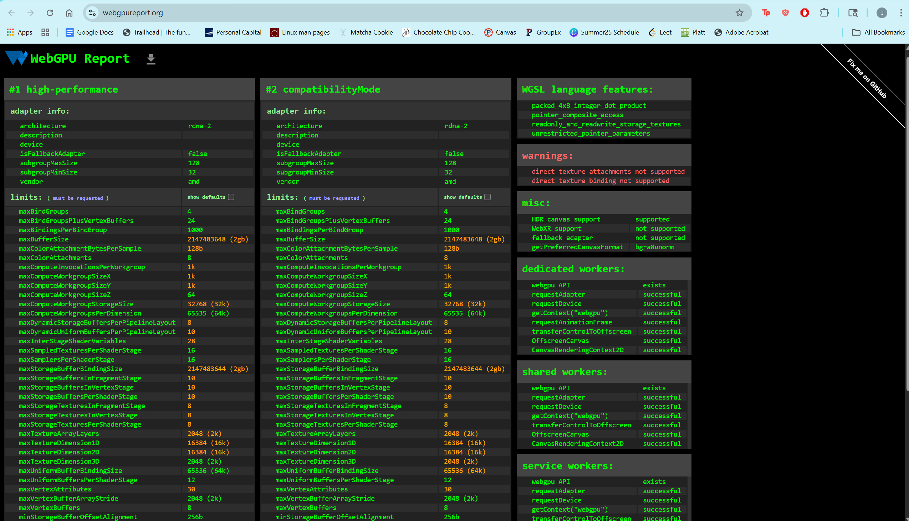

Project 0 Getting Started
====================

**University of Pennsylvania, CIS 5650: GPU Programming and Architecture, Project 0**

* Jacqueline Guan
  * [LinkedIn](https://www.linkedin.com/in/jackie-guan/)
  * [Personal website](https://jyguan18.github.io/)
* Tested on my personal laptop:
  * Windows 11 Pro 26100.4946
  * Processor	AMD Ryzen 9 7945HX with Radeon Graphics
  * 32 GB RAM
  * Nvidia GeForce RTX 4080

### README ###

| Part 2.1.2 | Part 2.1.3 | Part 2.1.4 |
| :--- | :---: | ---: |
|  |  |  |
| Part 2.2 | Part 2.3|  |
|  |  | |

Include screenshots, analysis, etc. (Remember, this is public, so don't put
anything here that you don't want to share with the world.)
