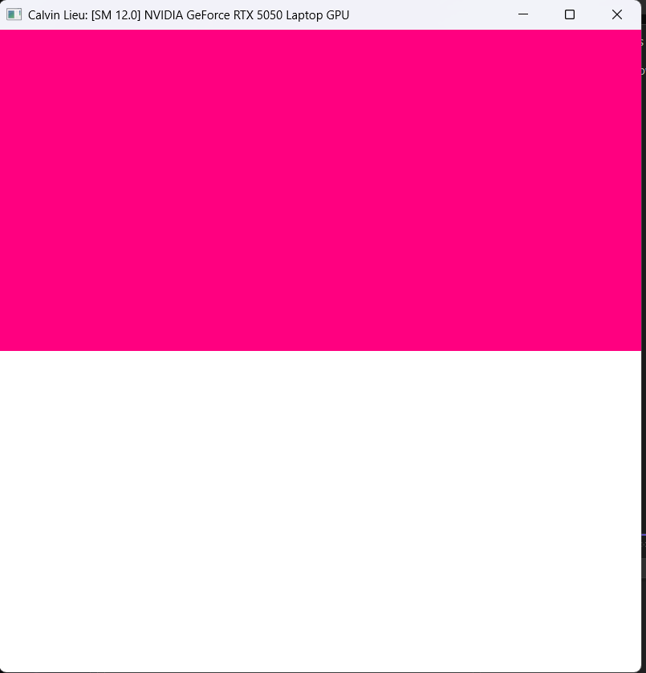
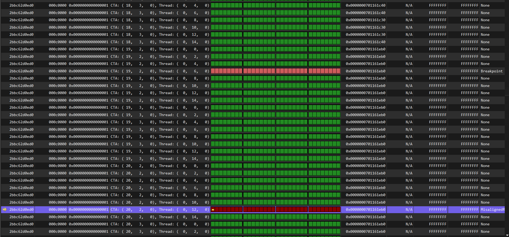
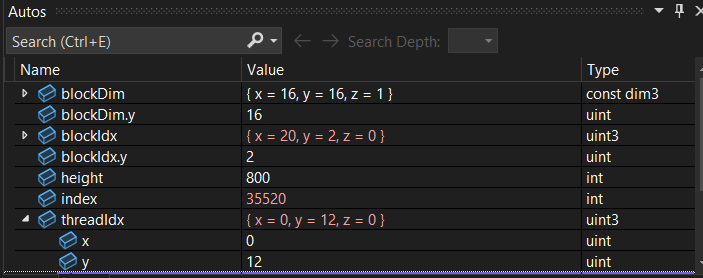
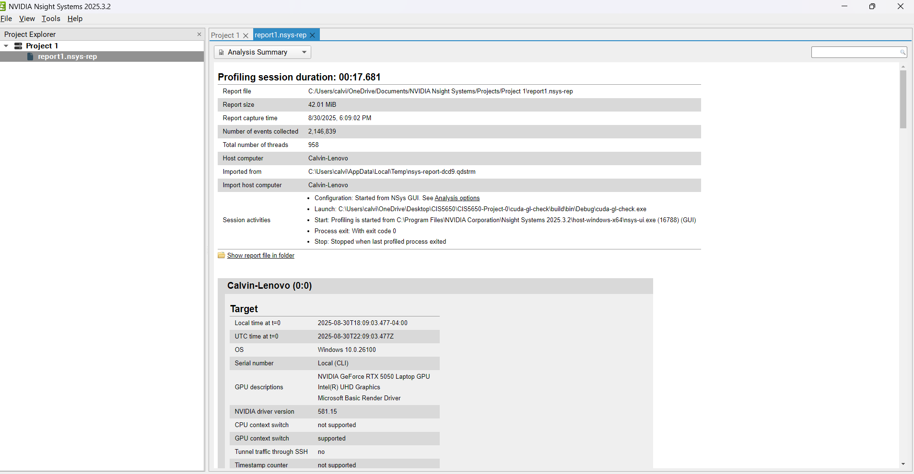
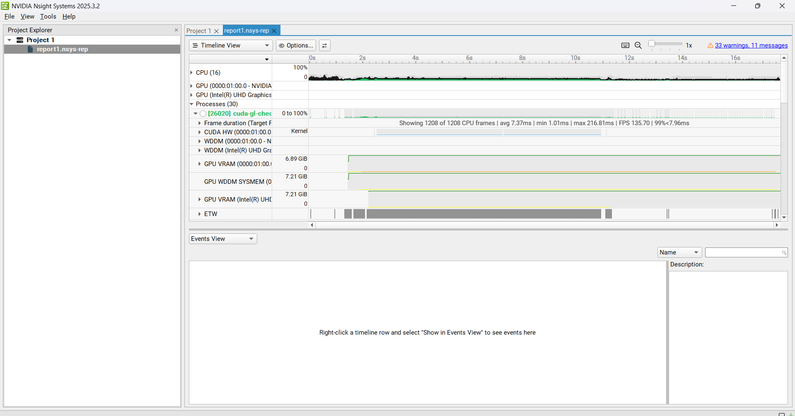
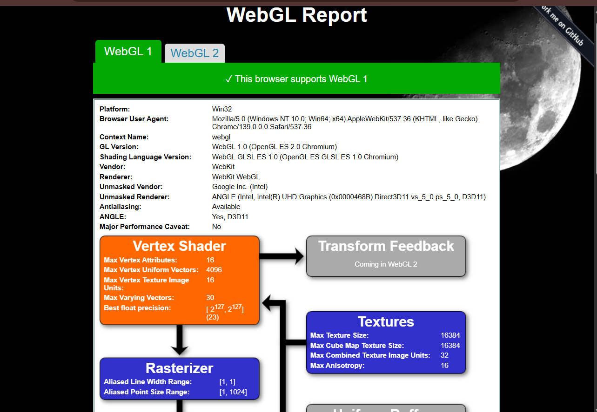
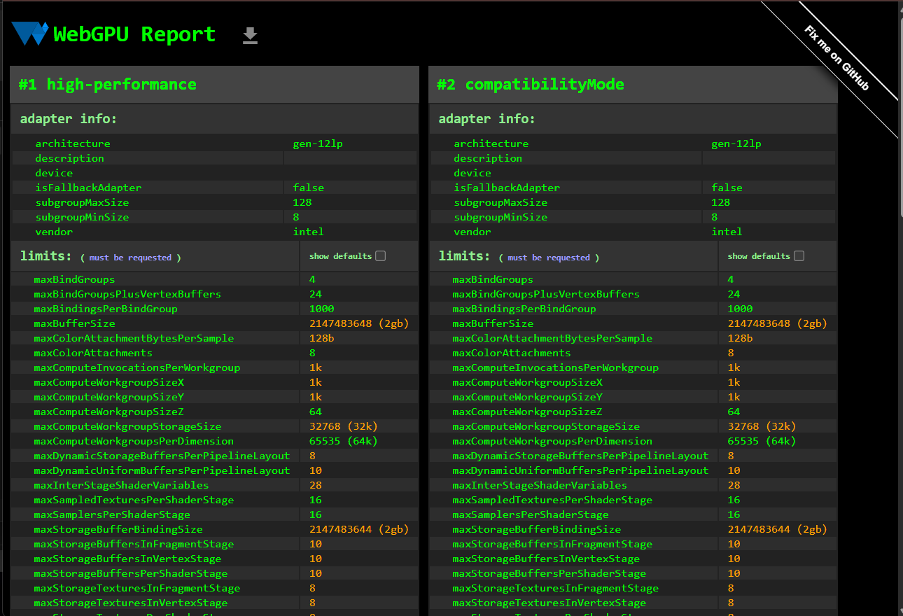

Project 0 Getting Started
====================

**University of Pennsylvania, CIS 5650: GPU Programming and Architecture, Project 0**

* Calvin Lieu
  * [LinkedIn](www.linkedin.com/in/calvin-lieu-91912927b)
* Tested on: Windows 11, i5-13450HX @ 2.40GHz 16GB, NVIDIA GeForce RTX 5050 Laptop GPU 8GB (Personal)

### 

Installing all the tools I need for GPU programming using an unfamiliar interface was certainly tricky! This was my first time setting up my own Windows system and first time using Visual Studio so this setup took a lot longer than expected. Thankfully everything seems to be working as expected. Proof below :)

---

### CUDA project edit
  
*First time editing a CUDA project.*

---

### Nsight CUDA debugging
  
*Breakpoint hit on a matched thread.*

  
*The matching thread's info in locals tab.*

The Nsight debugging tool looks like it will be very useful in identifying bugs in specific threads.

---

### Nsight Systems profiling
  
*Nsight Systems timeline.*

  
*Summary report.*

The Nsight Systems tool will be essential for optimizing code and ensuring efficient scaling with its detailed metrics and visualisations.

---

### Web graphics capability
  
*WebGL compatibility report.*

  
*WebGPU compatibility report.*

My system is compatible with both WebGL and WebGPU—happy days.

