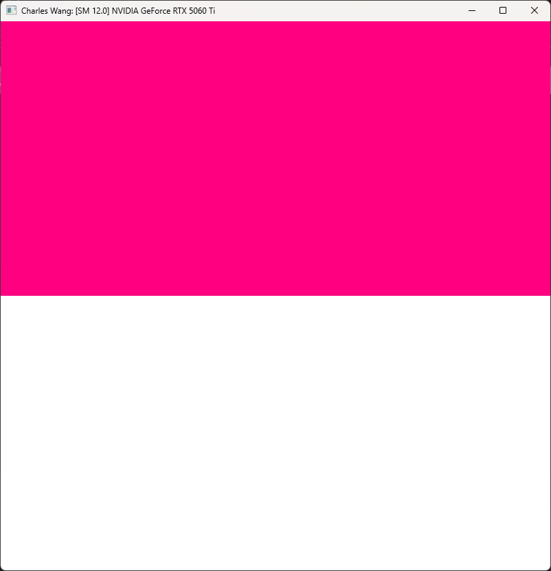
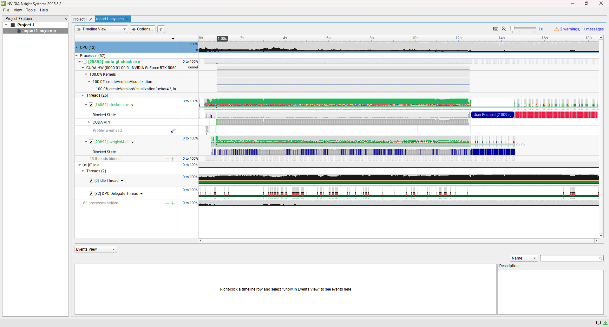
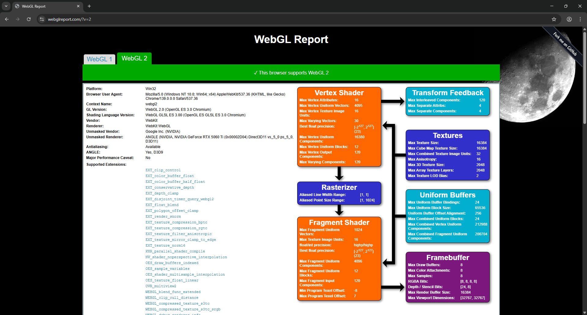
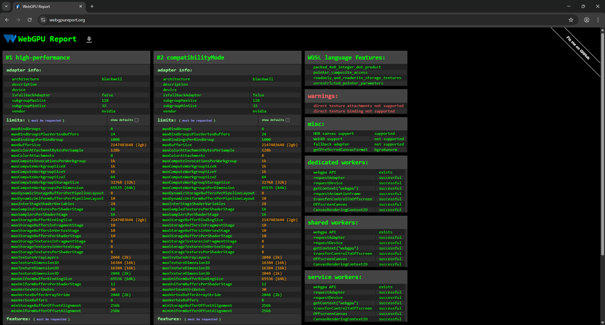

Project 0 Getting Started
====================

**University of Pennsylvania, CIS 5650: GPU Programming and Architecture, Project 0**

* Name: Charles Wang
  * [LinkedIn](https://linkedin.com/in/zwcharl/)
  * [Personal website](https://charleszw.com/)
  * [itch.io page](https://aczw.itch.io/)
* Tested on my personal computer.
  * Windows 11 Pro 26100.4946
  * Ryzen 5 7600X @ 4.7Ghz
  * 32 GB RAM
  * RTX 5060 Ti 16 GB
    * Compute Capability: 12.0

### README

Include screenshots, analysis, etc. (Remember, this is public, so don't put anything here that you don't want to share with the world.)

|Part 2.1.2|Part 2.1.4|
|:--------:|:--------:|
|||
|Part 2.2|Part 2.3|
|||
