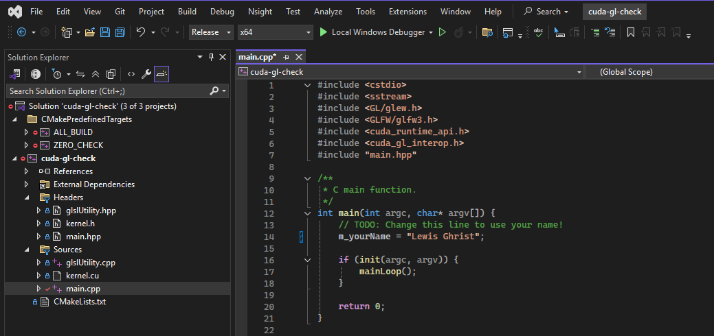
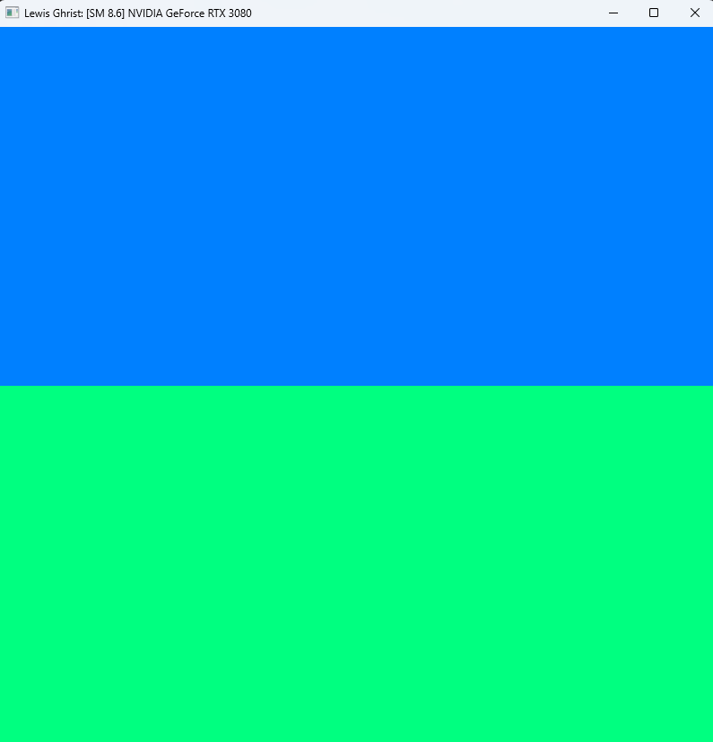
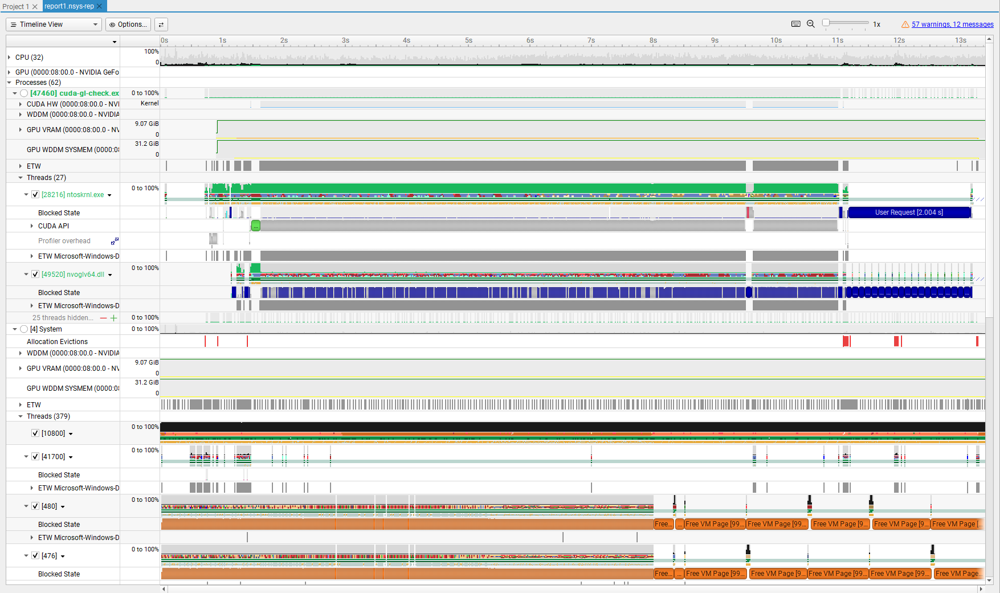
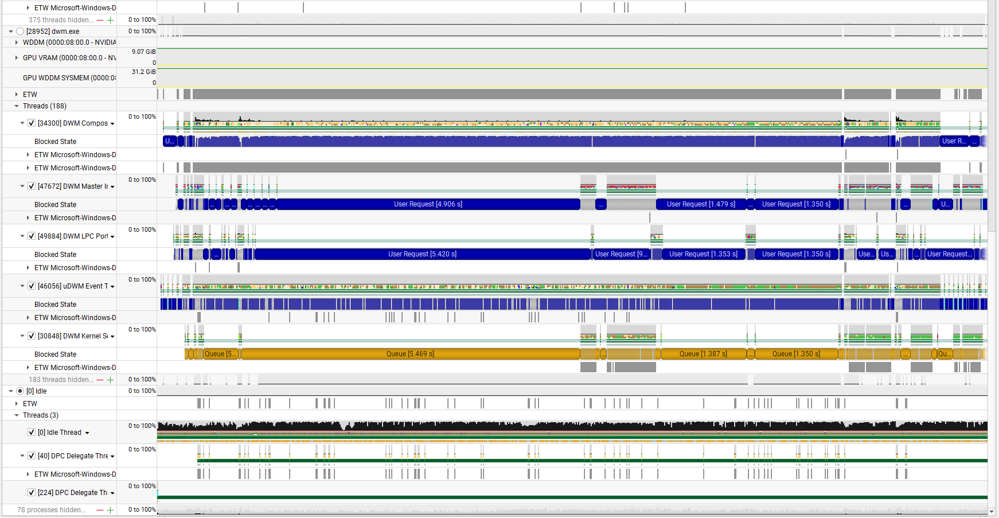
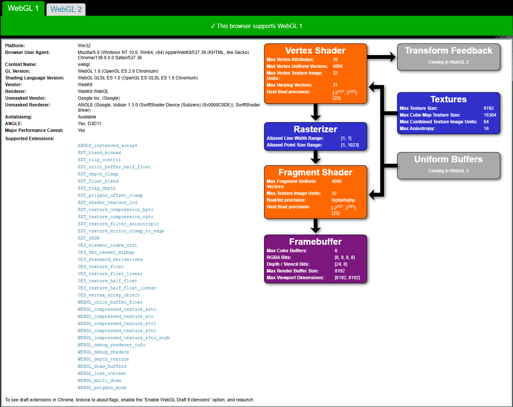
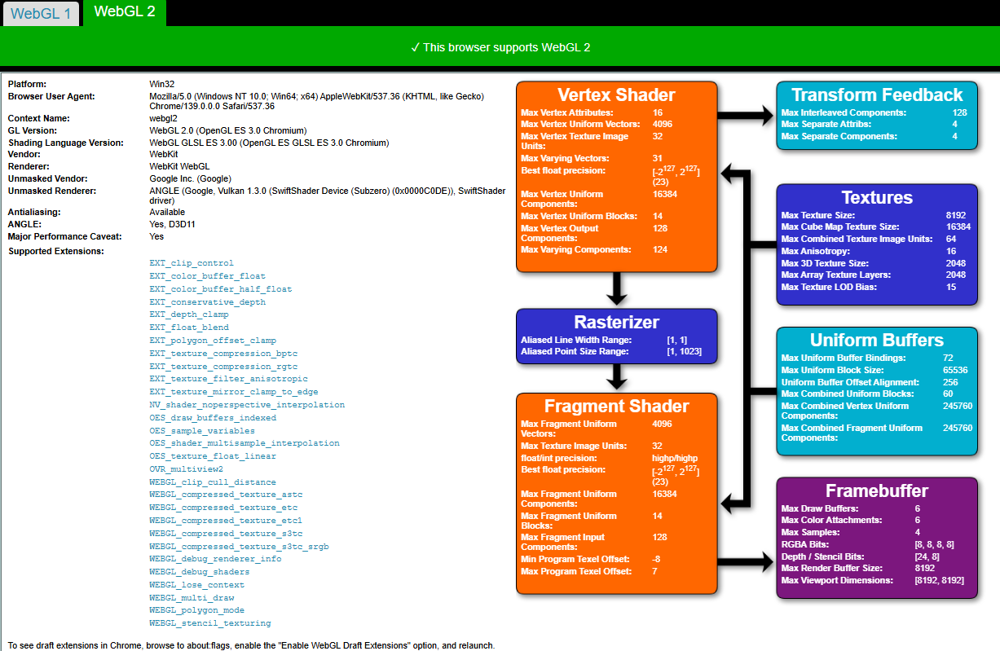
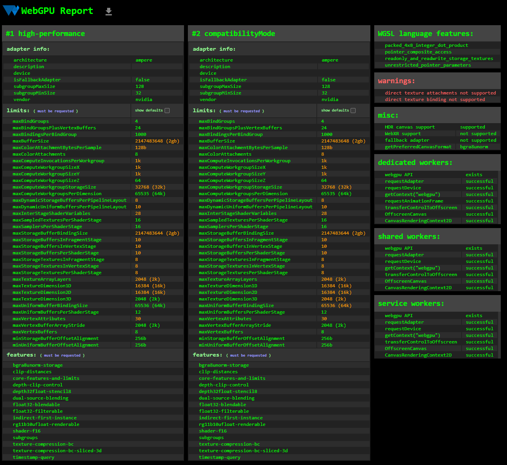

Project 0 Getting Started
====================

**University of Pennsylvania, CIS 5650: GPU Programming and Architecture, Project 0**

* Lewis Ghrist
* [LinkedIn](https://www.linkedin.com/in/lewis-ghrist-4b1b3728b/), [personal website](https://siwel-cg.github.io/siwel.cg_websiteV1/index.html#home)
* Tested on: Windows 11, AMD Ryzen 9 5950X 16-Core Processor, 64GB, NVIDIA GeForce RTX 3080 10GB (Personal PC)

**Features Completed**
Built and tested cuda-gl-check using the Nsight debugger. Used Nsight Systems to run performance analysis. Nsight Compute was running into an unexpected error, so no screen shot is included. Tested WebGL and WebGPU support. 

**Screenshots**
Title Bar:

Window:

Nsight Systems Report

Nsight Compute Report:

WebGL Support:

WebGPU Support:
