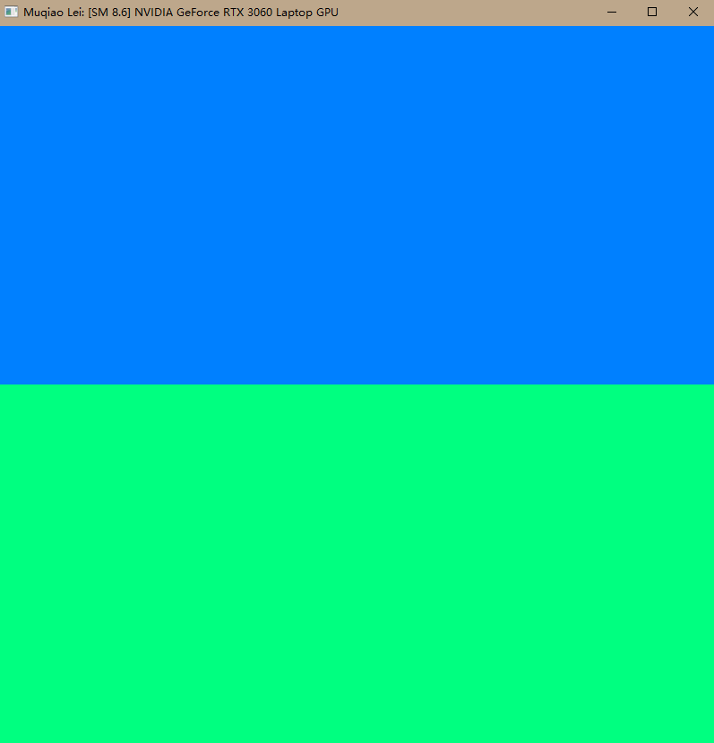
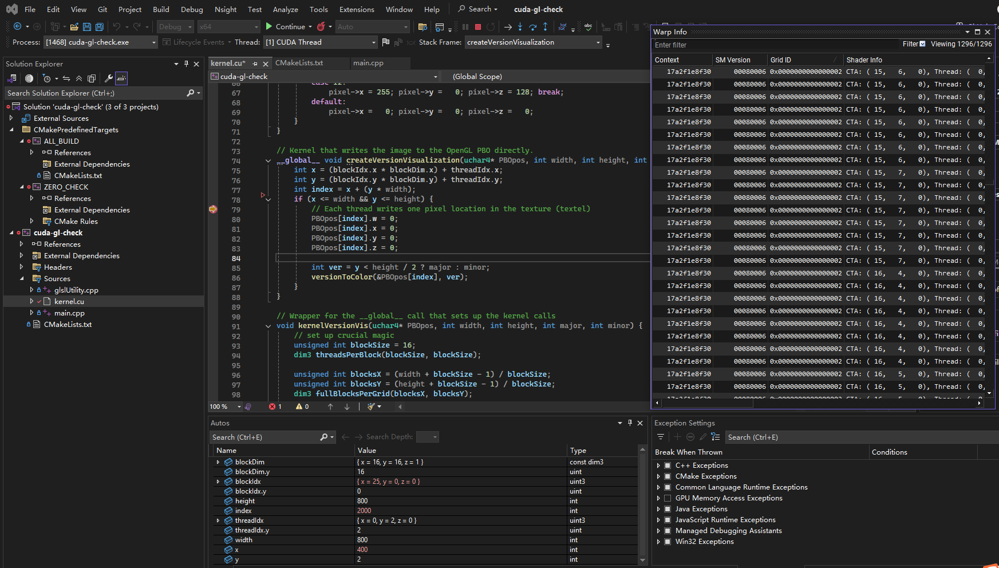
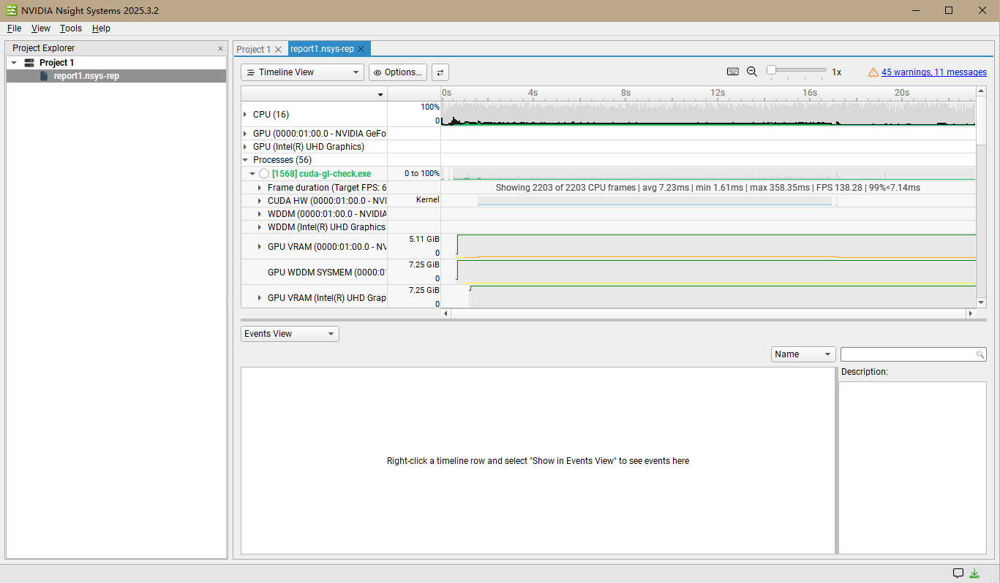
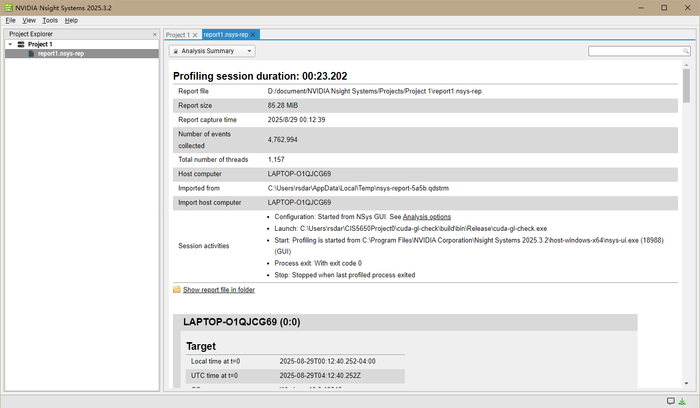
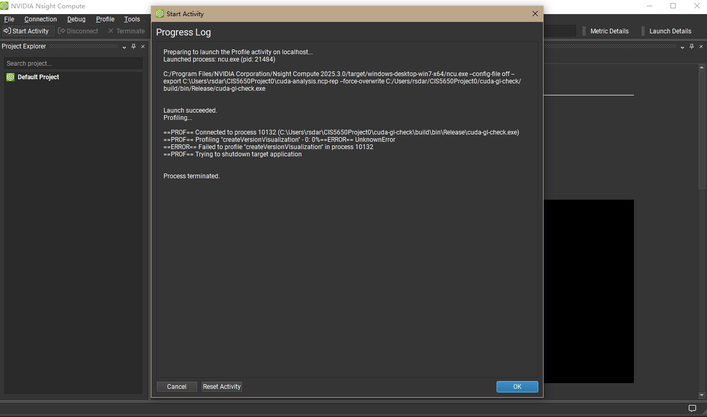
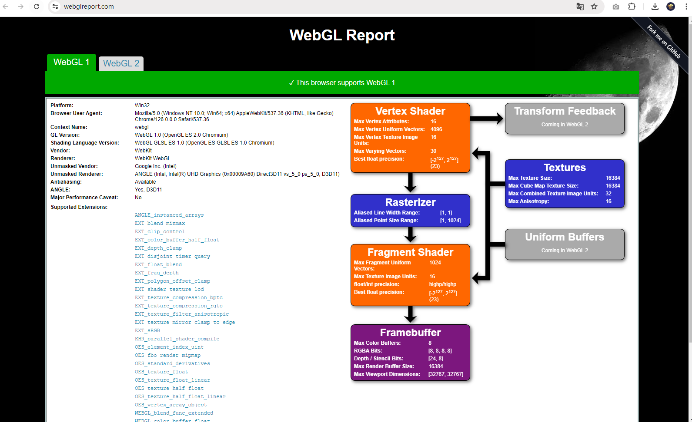
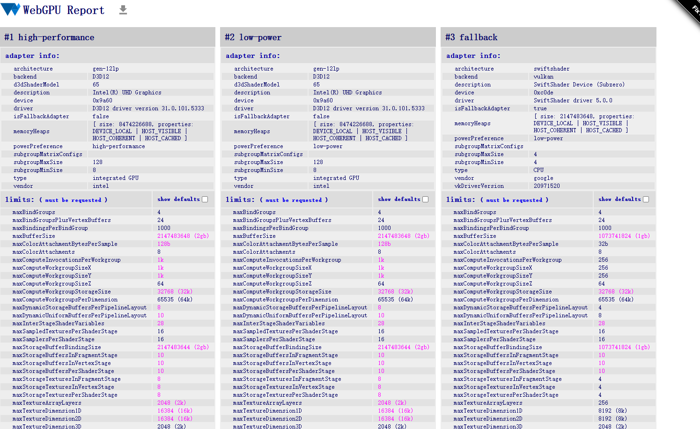
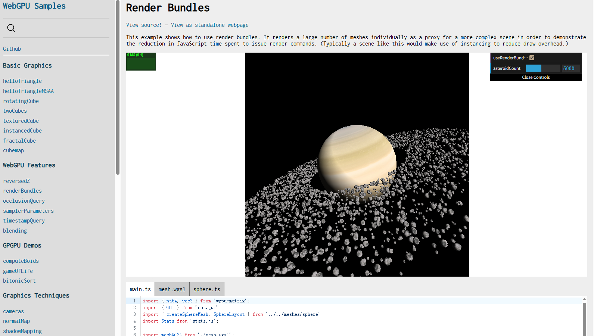

Project 0 Getting Started
====================

**University of Pennsylvania, CIS 5650: GPU Programming and Architecture, Project 0**

* Muqiao Lei
  * [LinkedIn](https://www.linkedin.com/in/muqiao-lei-633304242/) · [GitHub](https://github.com/rmurdock41)
* Tested on: Windows 10, 11th Gen Intel(R) Core(TM) i7-11800H @ 2.30GHz 2.30 GHz, NVIDIA GeForce RTX 3060 Laptop GPU (Personal Computer)

### CUDA GL Check Results

This project successfully demonstrates CUDA and OpenGL functionality. The program runs correctly and displays both blue and green regions, indicating proper CUDA/OpenGL interoperability.

**GPU Information:**

- GPU Model: NVIDIA GeForce RTX 3060 Laptop GPU  
- Compute Capability: 8.6 (SM 8.6)
- CUDA Version: 13.0

The program successfully shows my name "Muqiao Lei" in the title bar, confirming the code modification was completed correctly.

### Nsight Debugging

Successfully used Nsight Visual Studio Edition to debug the CUDA kernel. Key achievements:

- Set breakpoints in `kernel.cu` at line 79
- Used conditional breakpoints with `index == 2000`
- Examined thread execution with Autos and Warp Info windows
- Observed variable values including `blockIdx`, `threadIdx`, and `index`

The debugging session showed proper thread execution with:

- blockIdx = {x = 25, y = 0, z = 0}
- threadIdx = {x = 0, y = 2, z = 0}  
- index = 2000

### Nsight Systems Performance Analysis

Performed system-wide performance analysis using Nsight Systems 2025.3.2:

- Analysis session duration: 23.202 seconds
- Events collected: 4,762,994
- Total threads: 1,157
- Successfully profiled CUDA kernel execution and OpenGL rendering

The timeline view shows clear CPU and GPU activity patterns, with visible CUDA kernel execution phases.

### Nsight Compute Analysis

Due to a known issue with Nsight Compute on this project (as confirmed by course staff), this section was skipped per instructor guidance. The profiler works correctly with cuda-introduction projects but encounters errors with the main cuda-gl-check executable.

### WebGL Support

WebGL is fully supported on this system:

- WebGL 1.0: Fully supported
- Browser: Chrome 128.0.0.0 on Windows
- Graphics: ANGLE (Intel) with NVIDIA GeForce RTX 3060 Laptop GPU acceleration
- All major WebGL features are available including shaders, textures, and framebuffers

### WebGPU Support

- **Browser:** Chrome 126 (64-bit)
- **Backend:** D3D12  
- **Adapter:** Intel UHD Graphics (integrated)  
- **isFallbackAdapter:** false  
- **Status:** `chrome://gpu` reports **WebGPU: Hardware accelerated**  

Here is a sample on [WebGPU Samples](https://webgpu.github.io/webgpu-samples)

### Development Environment

- **Operating System**: Windows 10
- **IDE**: Visual Studio 2022 with CUDA integration
- **CUDA Toolkit**: Version 13.0 
- **CMake**: Used for project configuration
- **Git**: Repository management and version control

### Build Process

The project was successfully built using:

1. CMake GUI for configuration with Visual Studio 17 2022 generator
2. x64 platform target (required for CUDA compatibility)
3. Both Debug and Release configurations tested

### Conclusions

This project successfully demonstrates a complete CUDA development environment setup with:

- Working CUDA compilation and execution
- OpenGL interoperability  
- Professional debugging tools (Nsight)
- Web graphics API compatibility
- Proper development workflow with Git integration

The RTX 3060 Laptop GPU with compute capability 8.6 provides good performance for GPU computing tasks and supports all required technologies for the course.