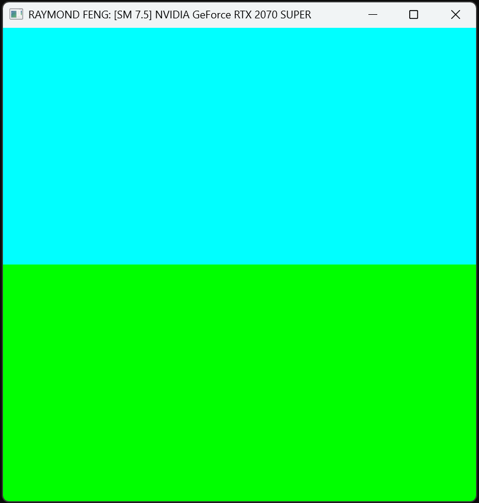
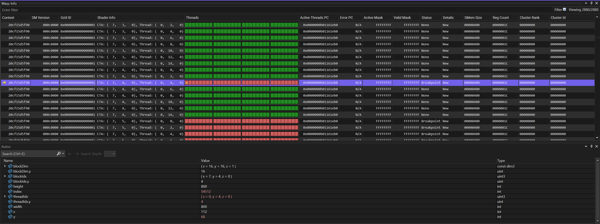
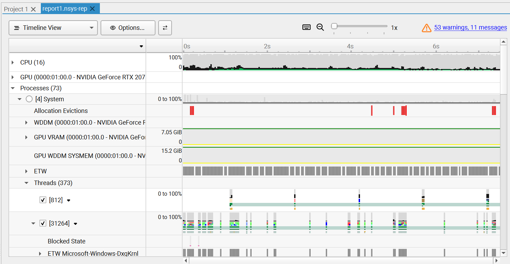
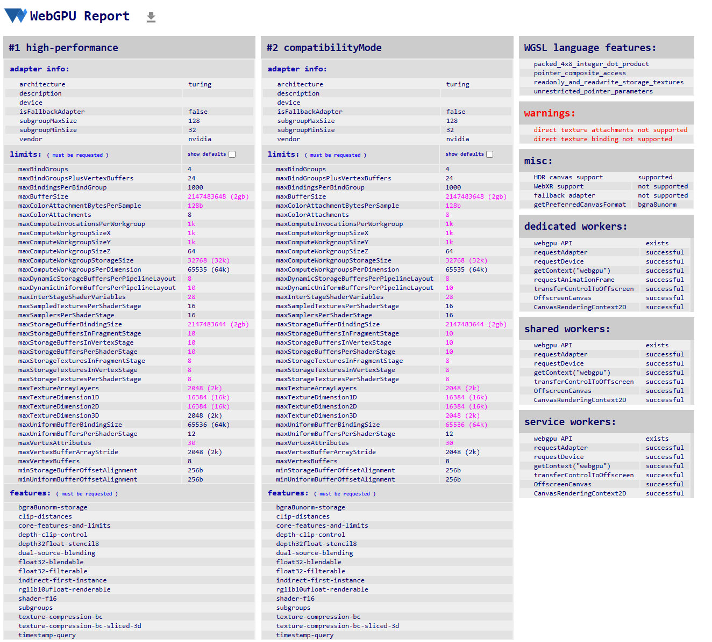

Project 0 Getting Started
====================

**University of Pennsylvania, CIS 5650: GPU Programming and Architecture, Project 0**

* Name: Harry Guan (17885658)
  *  [LinkedIn](https://au.linkedin.com/in/harry-guan-aa466819a?trk=people-guest_people_search-card), [twitter]()
* Tested on: Windows 11, Intel i7-14700 @ 2.10GHz 32GB, NVIDIA T1000 8GB (Moore 100C virtual labs)

### Screenshots

Note: Using the virtual labs from Moore 100C with very limited permission. Nsight systems and Nsight Compute does not work. 

### Part 2.1.2: Modify the CUDA Project and Take a Screenshot

### Part 2.1.3: Nsight Debugging

### Part 2.1.4: Nsight Systems
No permission 
### Part 2.1.5: Nsight Compute
No permission 
### Part 2.2: Project Instructions - WebGL

### Part 2.3: Project Instructions - WebGPU
