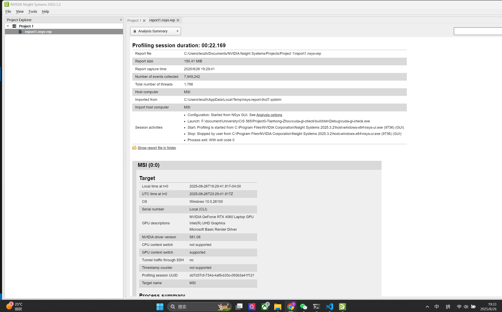
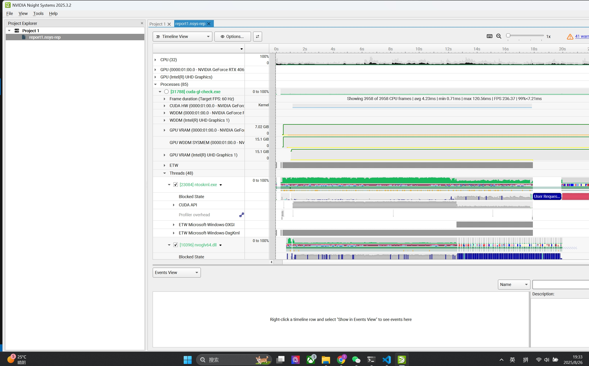
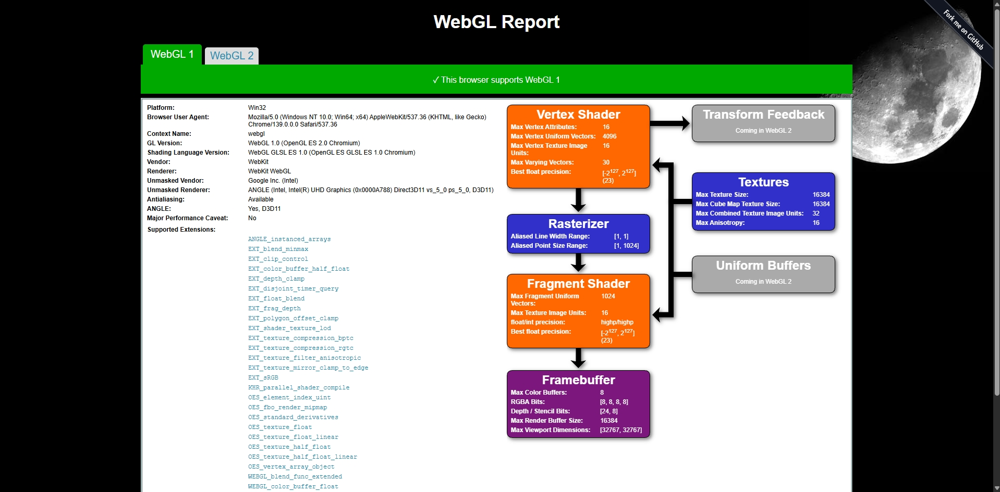
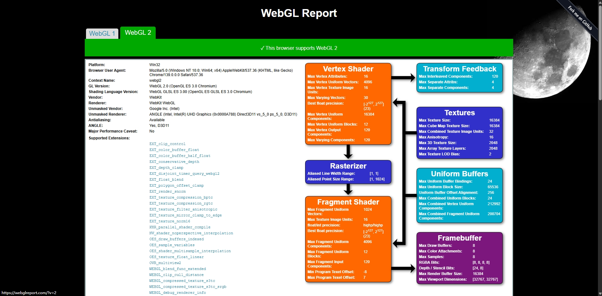
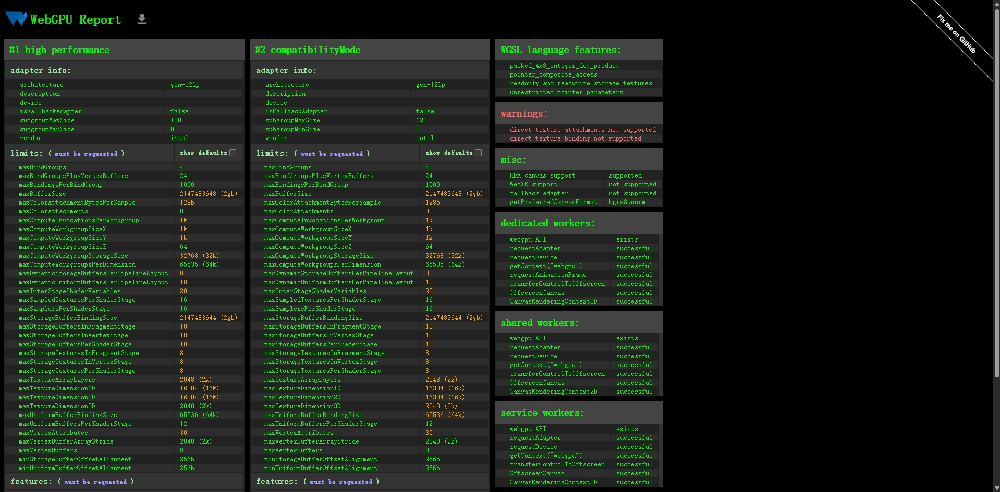
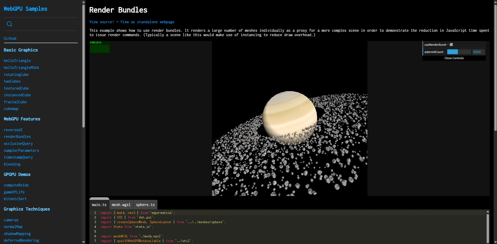

Project 0 Getting Started
====================

**University of Pennsylvania, CIS 5650: GPU Programming and Architecture, Project 0**

* Tianhong Zhou
  * [LinkedIn](https://www.linkedin.com/in/tianhong-zhou-b559aa159/)
* Tested on: Windows 11, i9-13950HX @ 2.20GHz, 32GB RAM, NVIDIA GeForce RTX 4060 Laptop GPU 8GB (Personal Laptop)

### Images of testing

Part 2.1.2: Modify the CUDA Project and Take a Screenshot

Part 2.1.3: Nsight Debugging

Part 2.1.4: Nsight Systems

Part 2.1.5: Nsight Compute

Part 2.2: Project Instructions - WebGL

Part 2.3: Project Instructions - WebGPU

