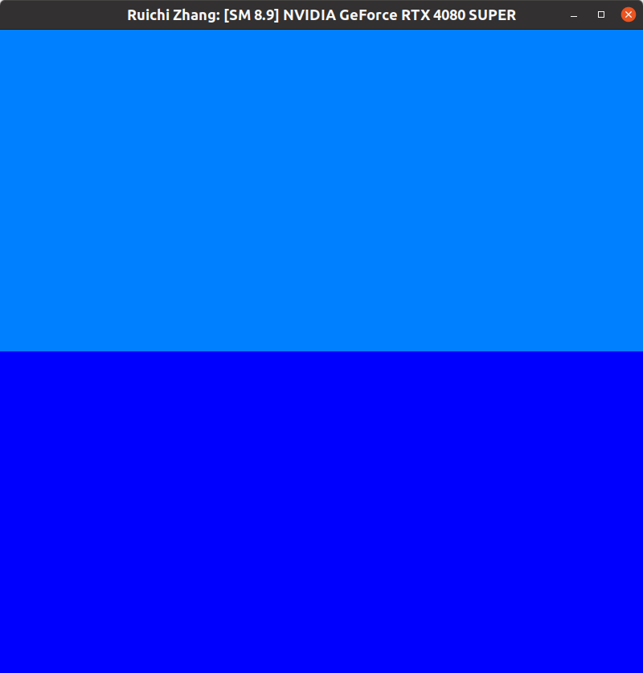
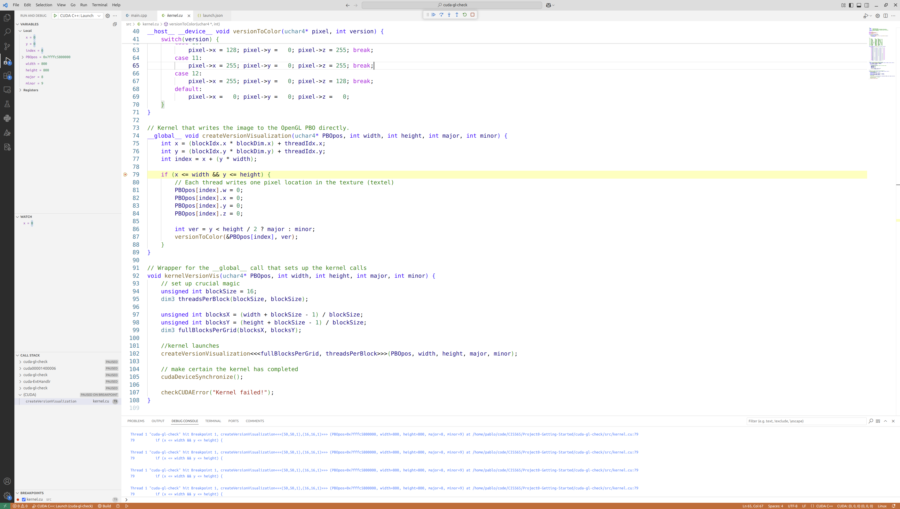
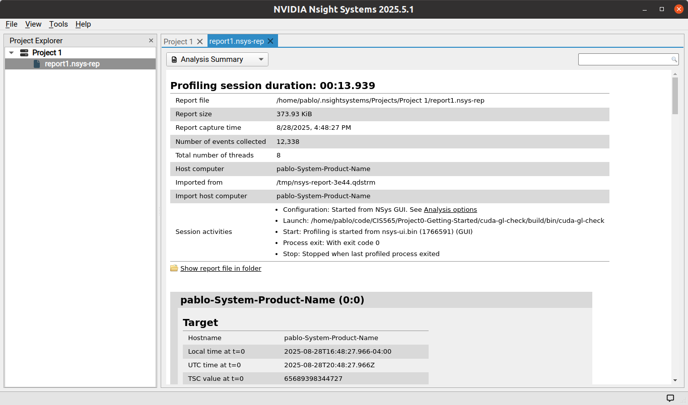
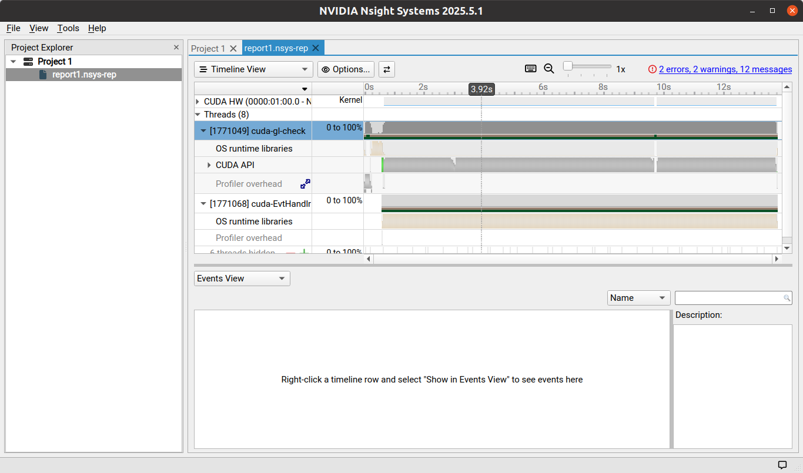
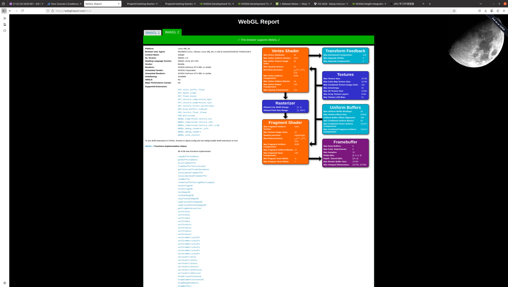
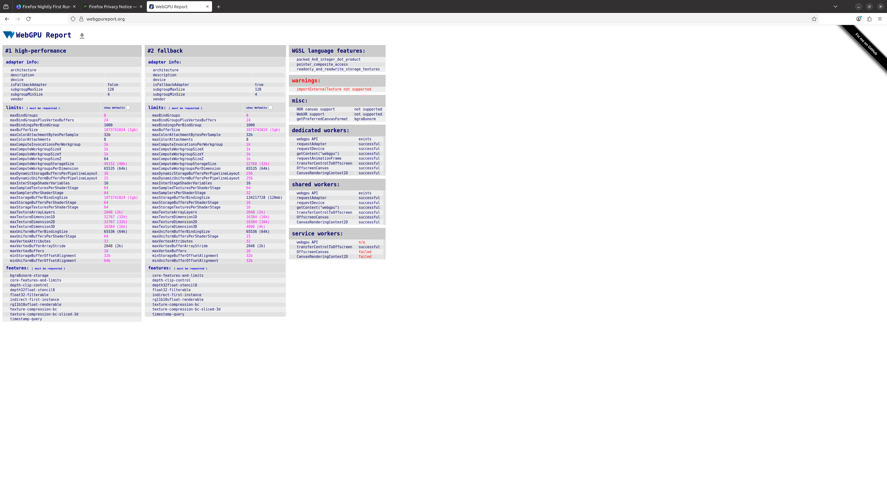

Project 0 Getting Started
====================

**University of Pennsylvania, CIS 5650: GPU Programming and Architecture, Project 0**

* Ruichi Zhang

* Tested on: Ubuntu 20.04.6 LTS , AMD® Ryzen 9 7950x3d 16-core processor × 32 , NVIDIA GeForce RTX 4080 SUPER (Personal Computer)

#### Part 2.1.1: Build and Run CUDA GL Check

Compute Capability: 8.9 for GeForce RTX 4080.

#### Part 2.1.2: Modify the CUDA Project and Take a Screenshot
<!-- Include screenshots, analysis, etc. (Remember, this is public, so don't put
anything here that you don't want to share with the world.) -->

#### Part 2.1.3: Nsight Debugging

#### Part 2.1.4: Nsight Systems

#### Part 2.1.5: Nsight Compute

#### Part 2.2: Project Instructions - WebGL

#### Part 2.3: Project Instructions - WebGPU
