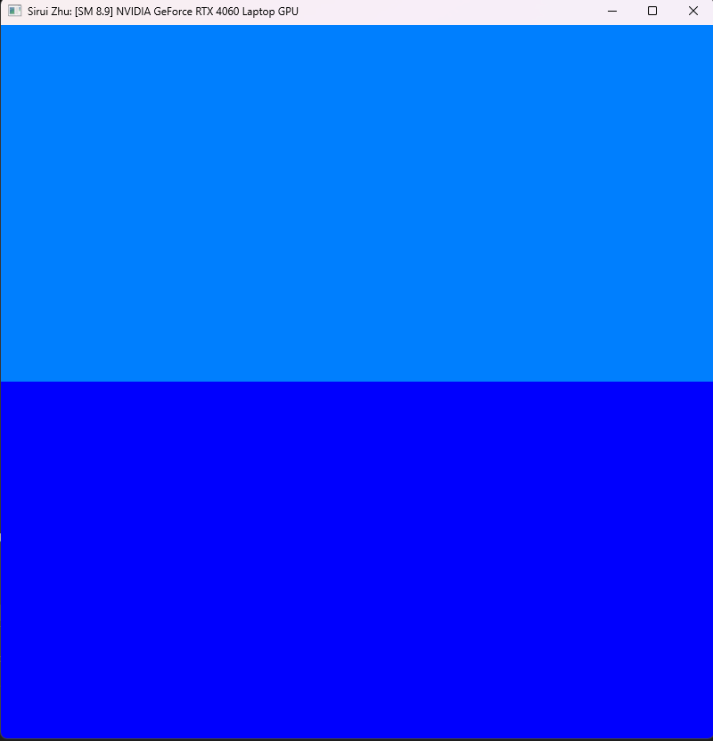

Project 0 Getting Started
====================

**University of Pennsylvania, CIS 5650: GPU Programming and Architecture, Project 0**

* Sirui Zhu
  * [LinkedIn](https://www.linkedin.com/in/sirui-zhu-28a24a260/)
* Tested on: Windows 11, i7-13620H, RTX 4060 (Personal)

### (TODO: Your README)

Compute Capability: 8.9

## Screenshots

### CUDA GL Check Window

### Nsight Debugging

### Nsight Systems

### Nsight Compute

### WebGL Report

### WebGPU Report

