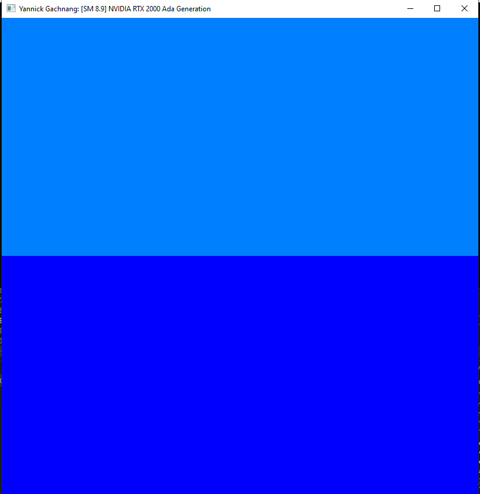
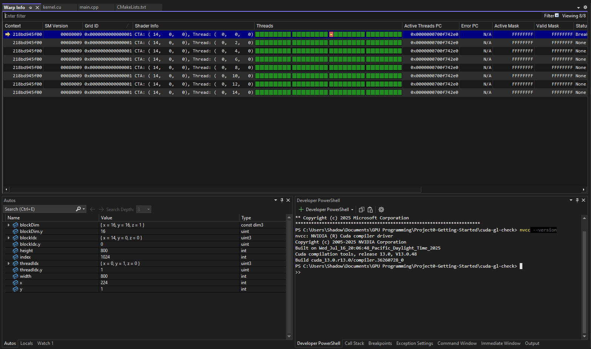
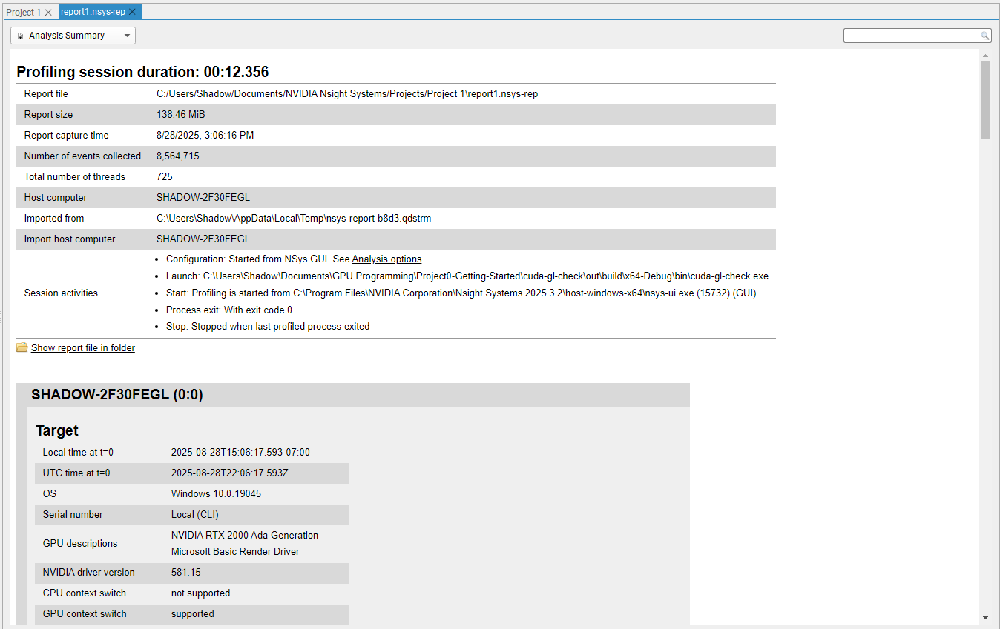
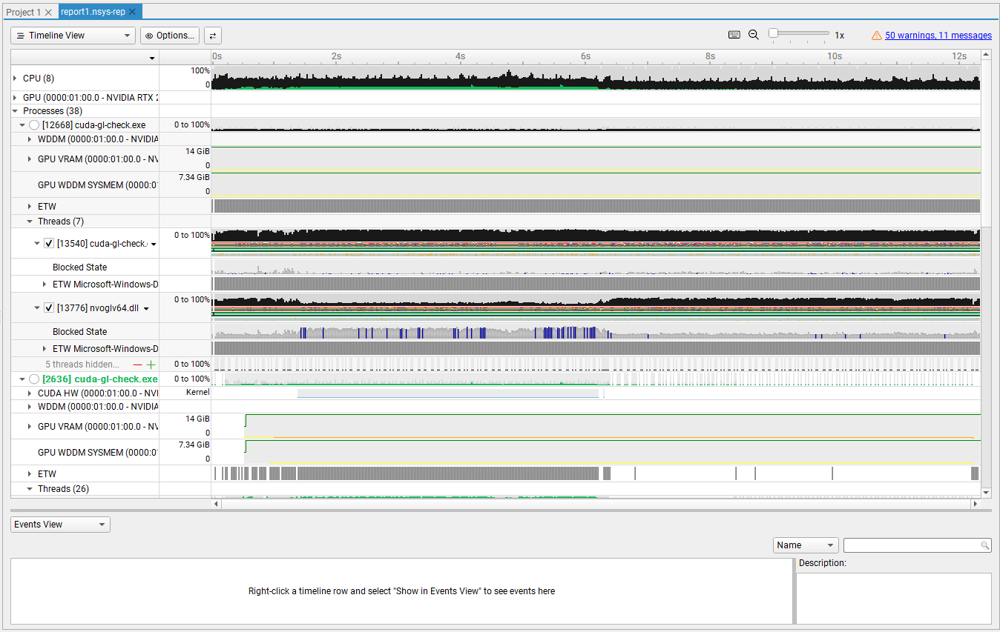
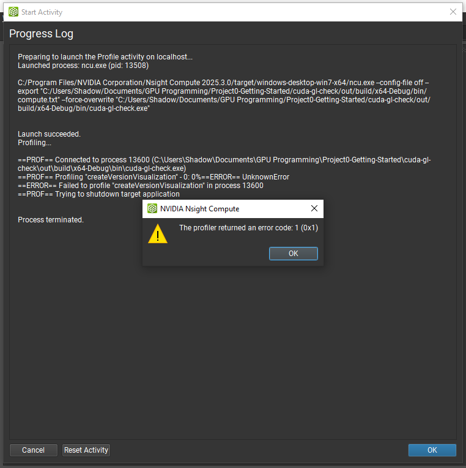
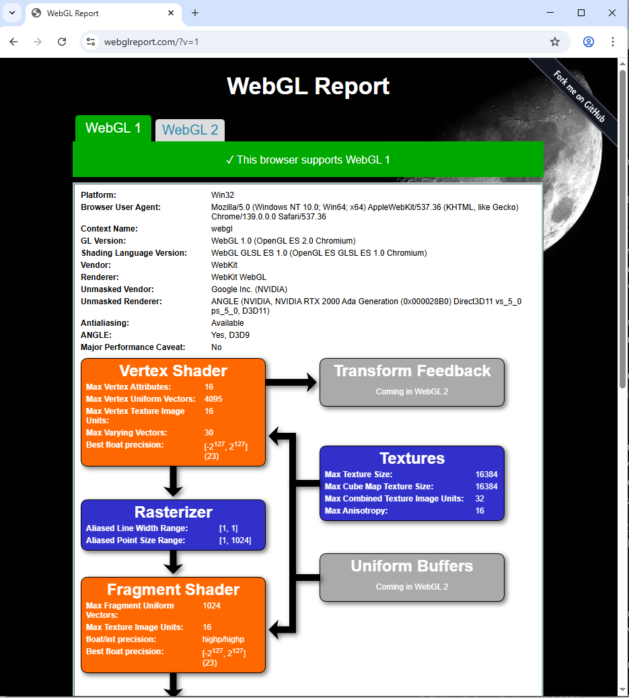
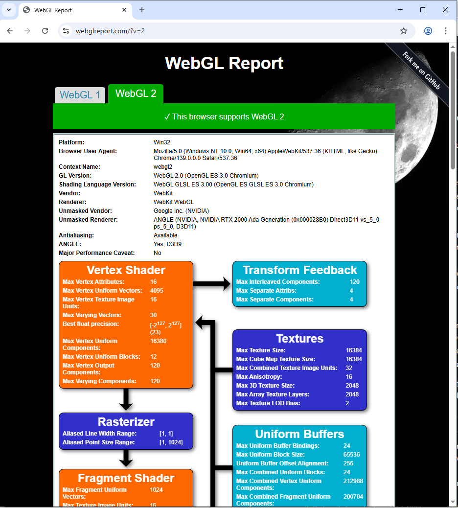
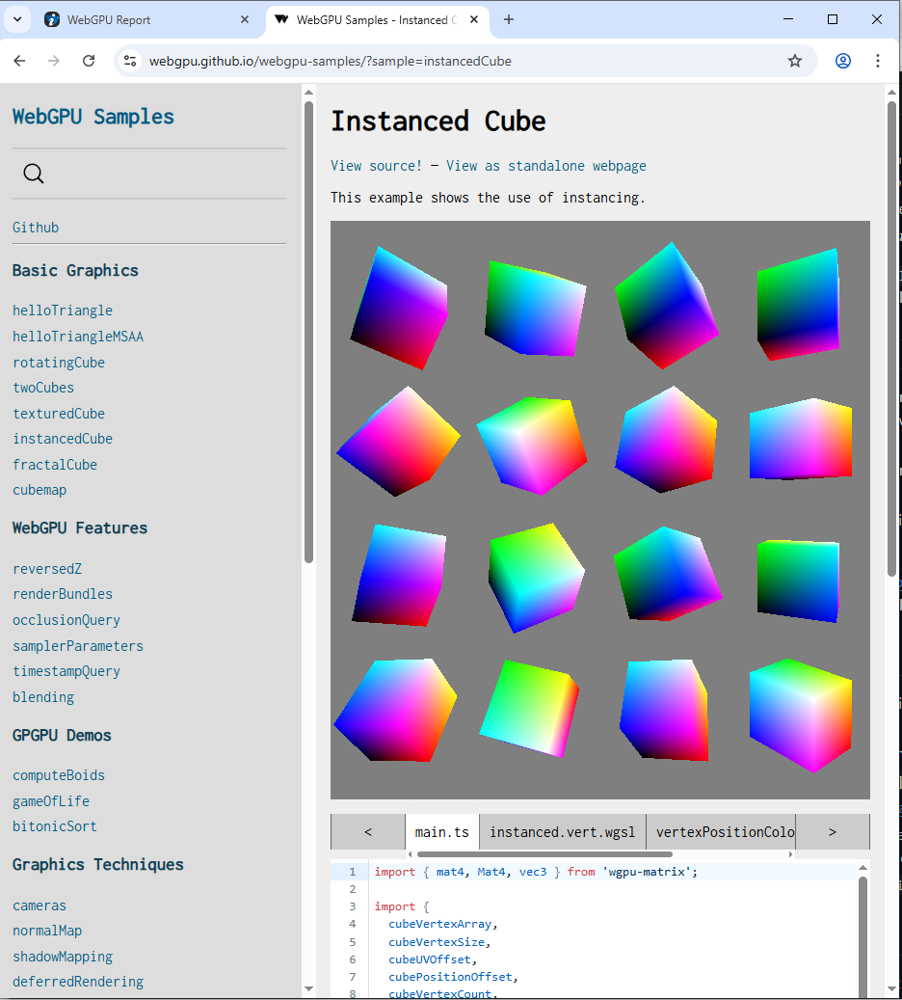

Project 0 Getting Started
====================

**University of Pennsylvania, CIS 5650: GPU Programming and Architecture, Project 0**

* Yannick Gachnang
  * [LinkedIn](https://www.linkedin.com/in/yannickga/)
* Tested on: Windows 10, EPYC 9354 @ 3.25GHz, 16GB RAM, RTX 2000 Ada 23GB VRAM

## Part 2.1.2

Below is an image showing what the `cuda-gl-check` looks like after compiling and running it. I'm not sure if there is supposed to be more than just two blue rectangles however.

## Part 2.1.3

Below is an image showing the warp info at `index == 1024`.

## Part 2.1.4

The first image below shows the analysis tab of Nsight Systems. The second image shows the timeline tab of Nsight Systems.

## Part 2.1.5

This part I was not able to complete successfully. Trying to run the compiled binaries for `cuda-gl-check` within Nsight Compute leads to an error.
I was unable to track down what is causing the error (because the error message doesn't really give a lot of information) and Performance counters are enabled.

## Part 2.2

The two images below show the output of the test website for WebGL version 1 and 2 respectively.

## Part 2.3

The image below shows an example of a WebGPU demonstration sample working

## Additional notes

I had to add `target_include_directories(${CMAKE_PROJECT_NAME} PRIVATE "C:/Program Files/NVIDIA GPU Computing Toolkit/CUDA/v13.0/include")` to the `cuda-gl-check` CMake list because somehow the compiler didn't find CUDA (despite it being in the system PATH).