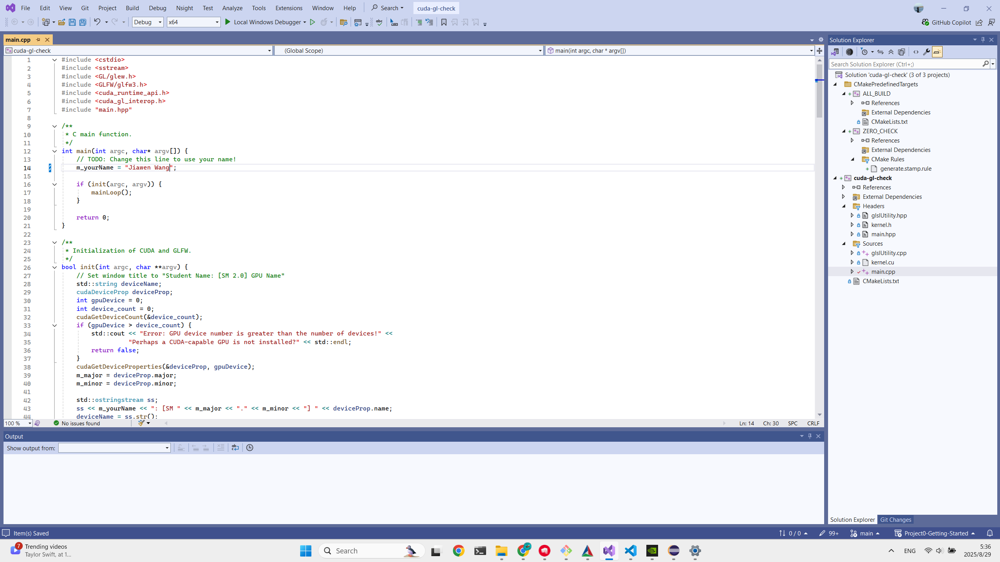
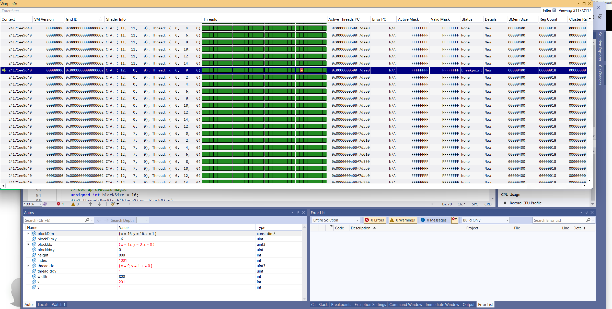
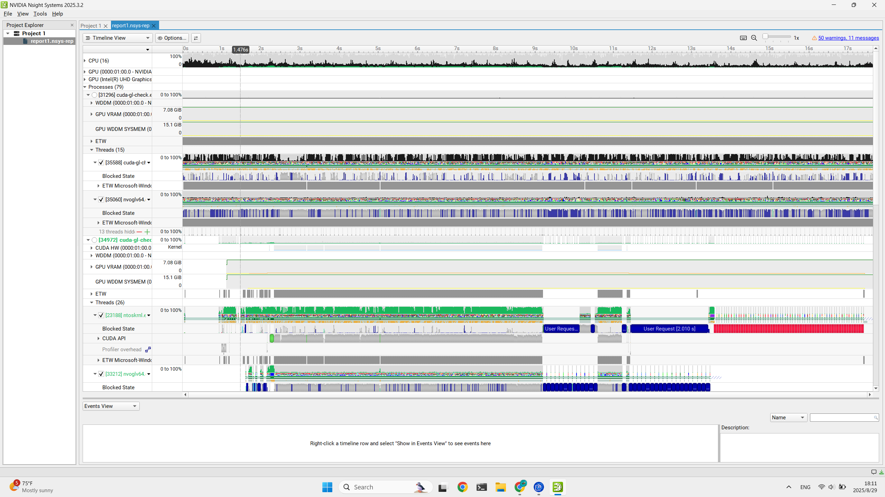
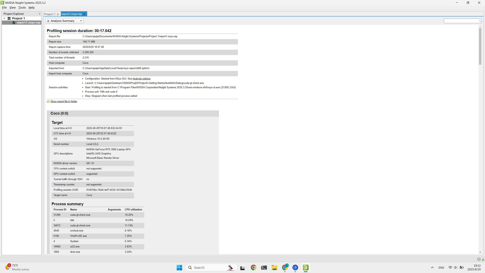
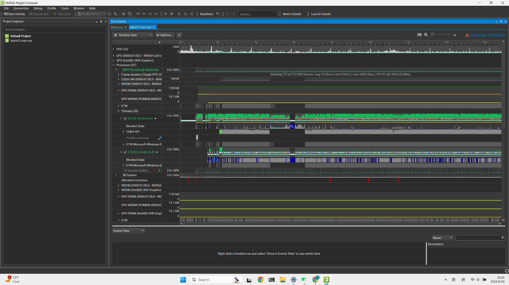
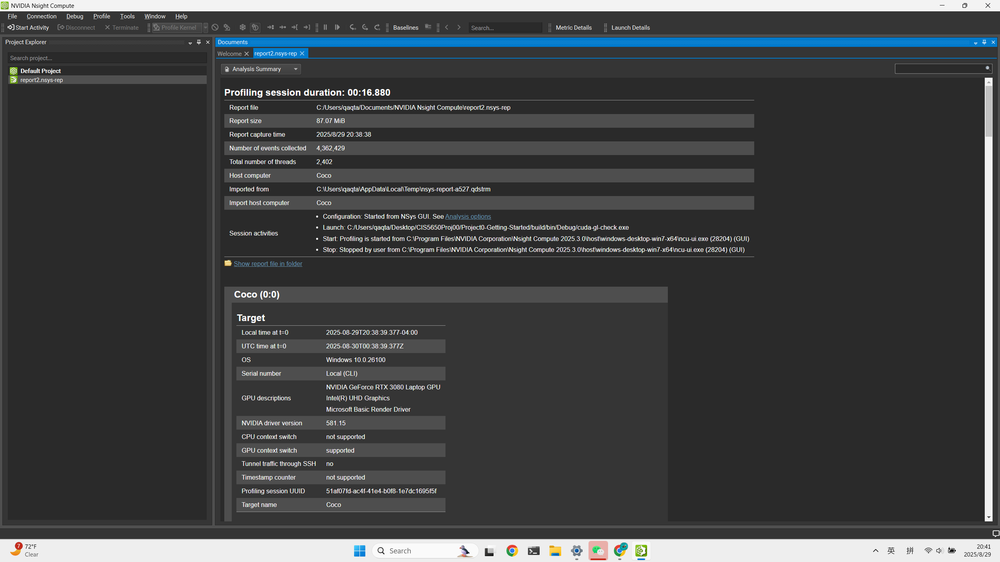
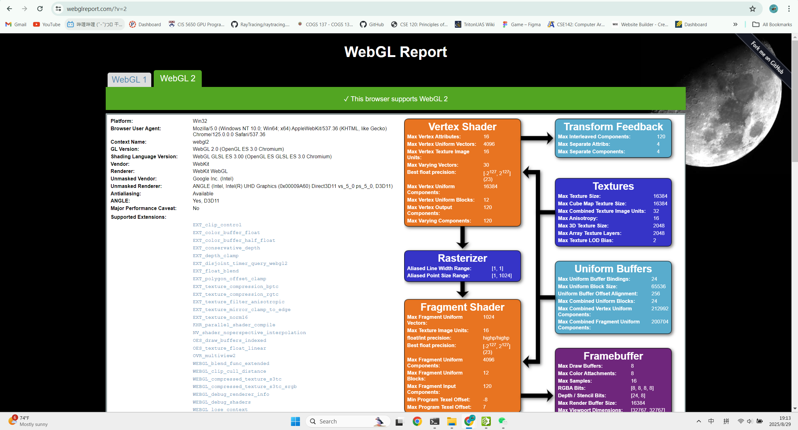
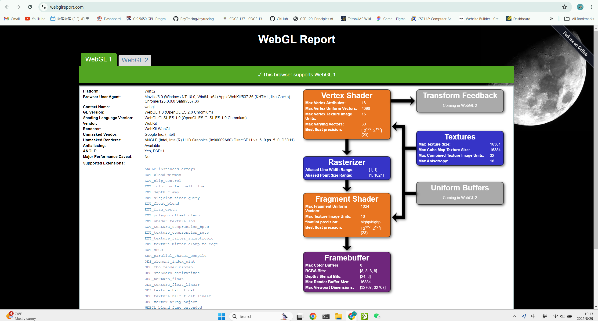
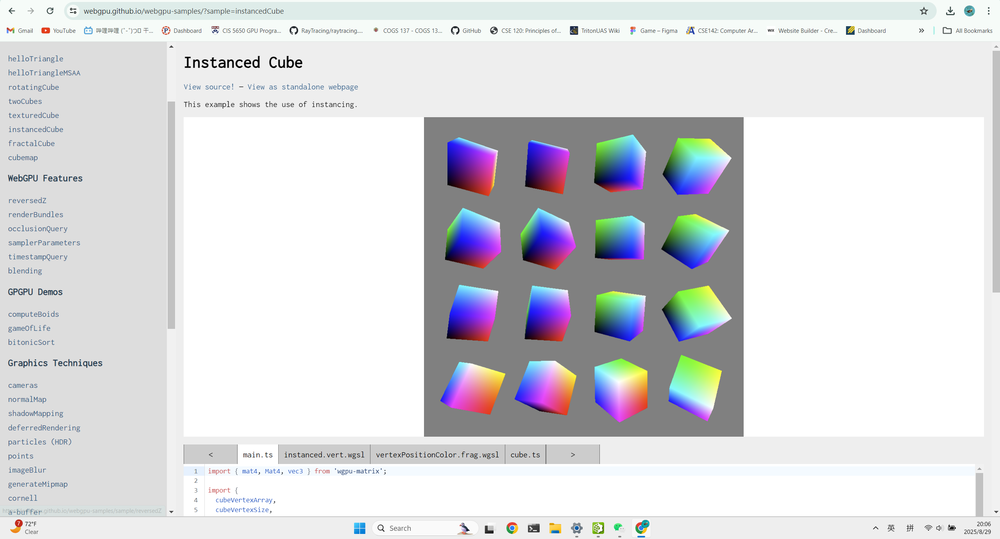

Project 0 Getting Started
====================

**University of Pennsylvania, CIS 5650: GPU Programming and Architecture, Project 0**

* Jiawen Wang
  * [LinkedIn](https://www.linkedin.com/in/cocodayow/)
* Tested on: Windows 11, i9-11900H @ 2.50GHz, 32GB RAM, NVIDIA GeForce RTX 3080 Laptop GPU

### README

This is a setup for GPU programming

## Part 2.1.2

## Nsight Visual Studio

## Nsight Systems

## Nsight Compute

## WebGL

## WebGPU

