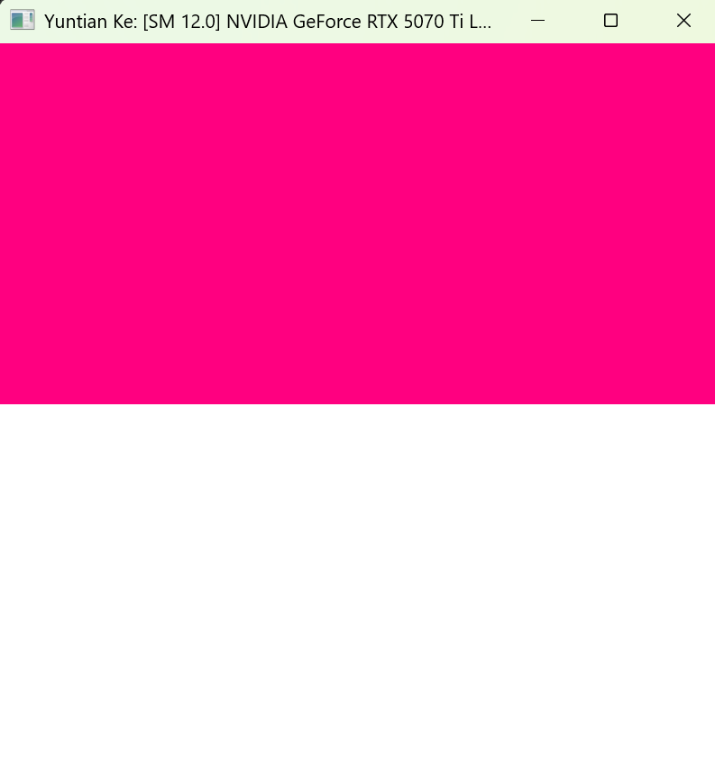
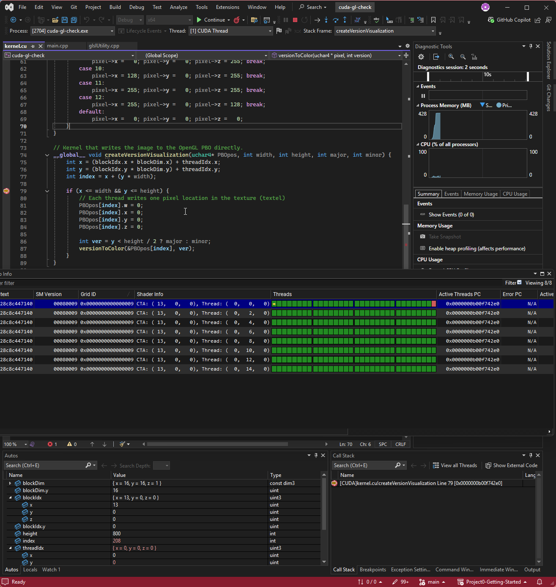
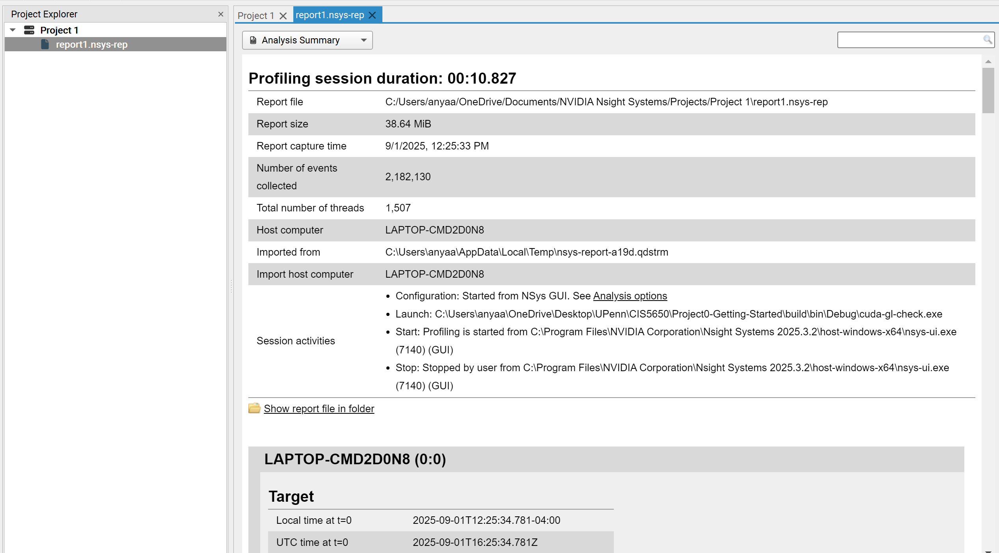
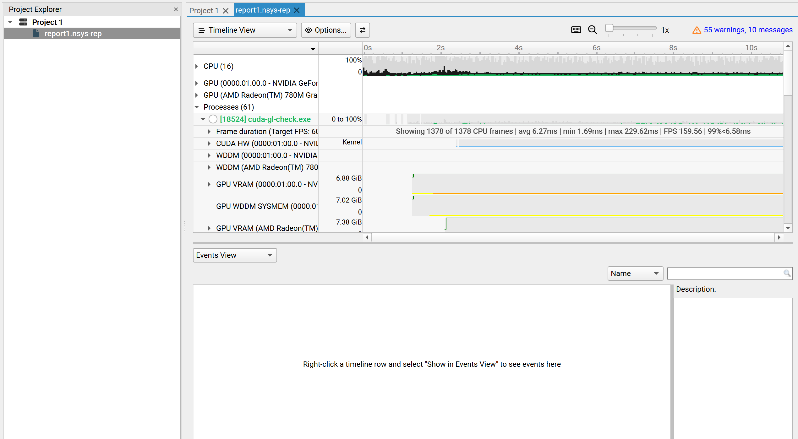
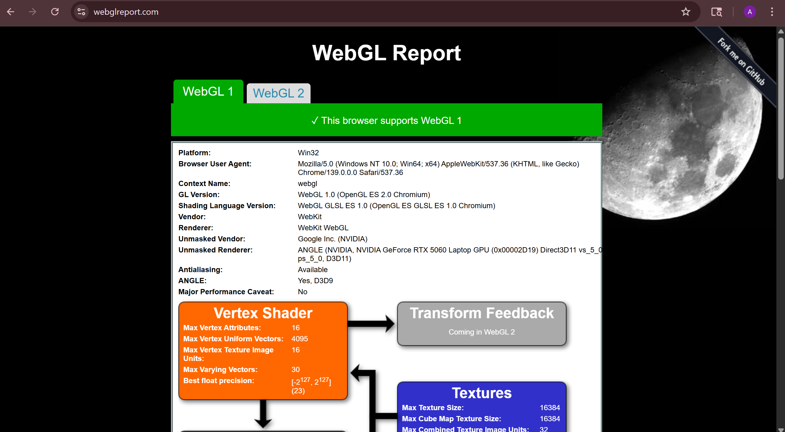
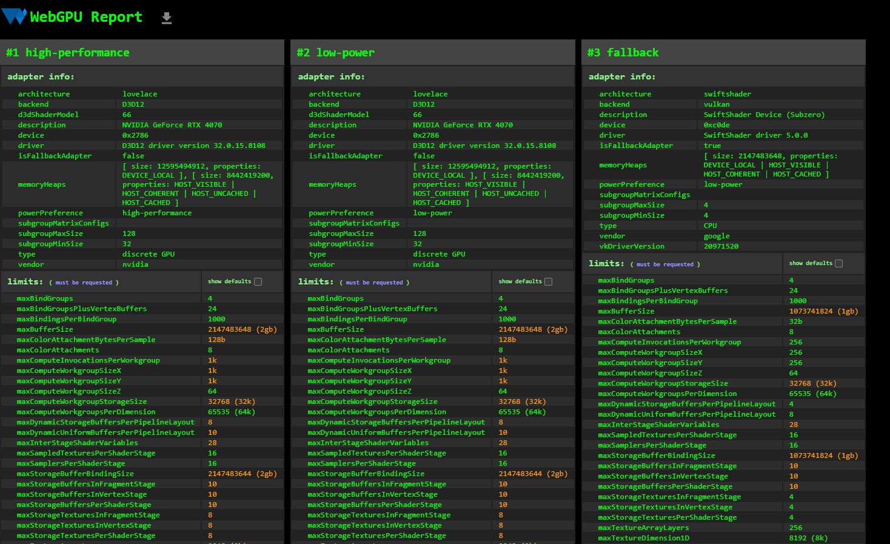

Project 0 Getting Started
====================

**University of Pennsylvania, CIS 5650: GPU Programming and Architecture, Project 0**

* Anya Agarwal
  * [LinkedIn](https://www.linkedin.com/in/anya-agarwal/)
* Tested on: Windows 11, AMD Ryzen 7 260 @ 380GHz 16GB, RTX 5060 - Personal Computer

### 2.1.1
The compute capability of my CUDA-compatible GPU is 12.0.

### 2.1.2
Screenshot of running CUDA program:

### 2.1.3
Autos and Warp Info of Debugger:

### 2.1.4
Nsight Systems Analysis Summary:

Nsight Systems Timeline:

### 2.1.5
I ran into the same error posted on EdStem, so I was not able to complete this section.

### 2.2
WebGL Status Check:

### 2.3
WebGPU Status Check:

