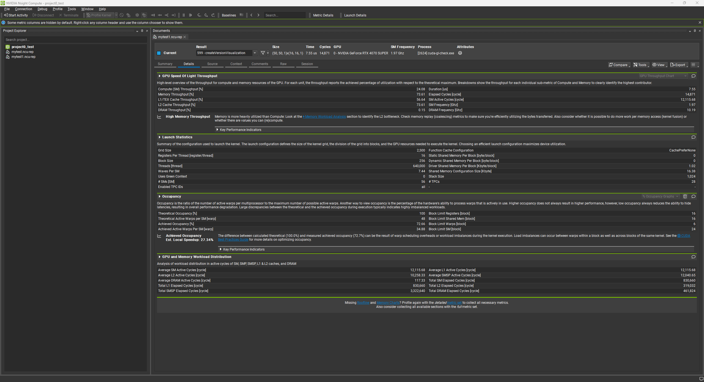

Project 0 Getting Started
====================

**University of Pennsylvania, CIS 5650: GPU Programming and Architecture, Project 0**

* Oliver Hendrych
  * [LinkedIn](https://www.linkedin.com/in/oliver-hendrych/)
* Tested on: Windows 11, i7-14700K @ 3.4GHz 32GB, RTX 4070 SUPER 12GB (Personal)

## Assignment

Include screenshots, analysis, etc. (Remember, this is public, so don't put
anything here that you don't want to share with the world.)

### 2.1.1.1

Compute Capability: 8.9 (GeForce RTX 4070)

### 2.1

#### 2.1.2

Modified CUDA Project Window:

#### 2.1.3

I set to the conition to `index == 1621`.  With a width of 800, that would mean the pixel is at x=21, y=2.
With block sizes of 16x16, then the block index should be x=1, y=0, and the thread index should be x=5, y=2, which is what we observe.

#### 2.1.4

In the analysis summary, we can see details about the configuration, and we can see that most of the CPU utilization comes from the `cuda-gl-check.exe`, followed by `Idle`

We can see the `cuda-gl-check.exe` process, and if we look at the kernel calls, we can see the createVersionVisualization kernel invokes in the event view.

#### 2.1.5

Note: there is a known bug relating to Nsight Compute when trying to use the kernel replay. For that reason, rather than trying to downgrade Nsight Compute (which would also involve downgrading my CUDA Toolkit version), I used the WAR which is to use Application for the replay mode. I'm not sure if it makes a difference. [https://forums.developer.nvidia.com/t/error-failed-to-profile-createversionvisualization-in-process-12840/343411/16](https://forums.developer.nvidia.com/t/error-failed-to-profile-createversionvisualization-in-process-12840/343411/16)

In the summary view, we can see the createVersionVisualization kernel calls.

In the detailed view, we can see details about the throughput and launch statistics.

### 2.2

In Chrome, we can see that both WebGL versions (1 and 2) are available.

### 2.3

In Chrome, we can see that WebGPU is enabled with an nvidia vendor.

