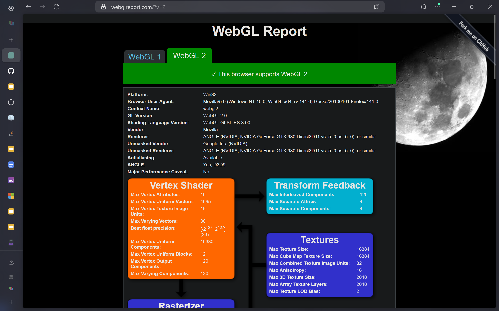

Project 0 Getting Started
====================

**University of Pennsylvania, CIS 5650: GPU Programming and Architecture, Project 0**

* Avi Serebrenik
  * [https://www.linkedin.com/in/avi-serebrenik-a7386426b/](), [https://aviserebrenik.wixsite.com/cvsite]()
* Tested on: Windows 11, i7-13620H @ 2.4GHz 32GB, RTX 4070 8GB

### Images:

