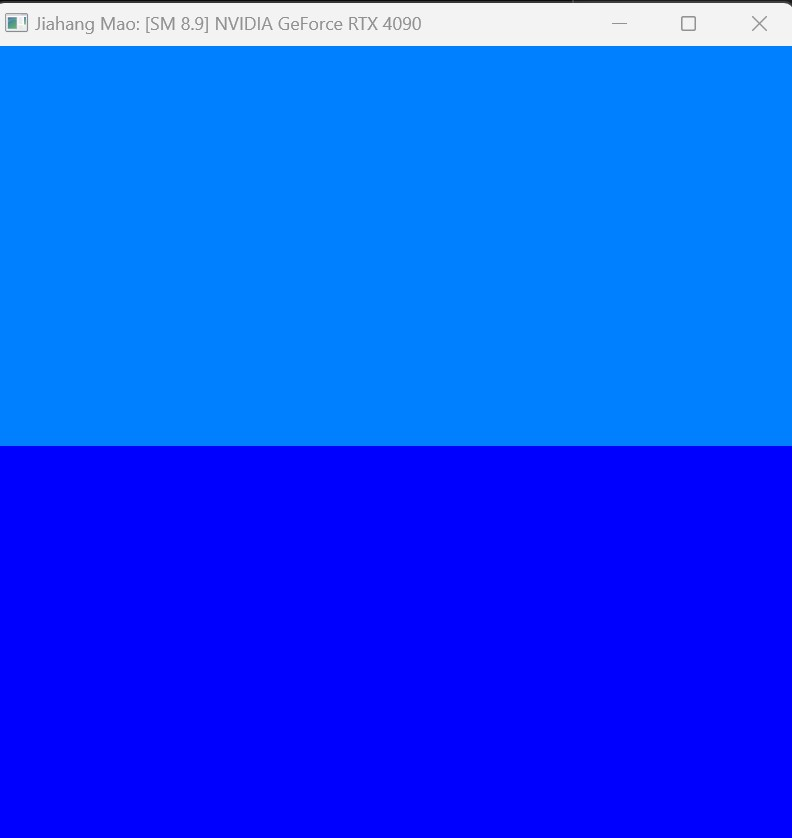

Project 0 Getting Started
====================

**University of Pennsylvania, CIS 5650: GPU Programming and Architecture, Project 0**

* Jiahang Mao
  * [LinkedIn](https://www.linkedin.com/in/jay-jiahang-m-b05608192/)
* Tested on: Windows 11, i5-13600kf @ 5.0GHz 64GB, RTX 4090 24GB, Personal

### (TODO: Jiahang Mao)

### Execution Overview

### Nsight Debugger Output

### Nsight Debugger Performance Summary

### Nsight Debugger Timeline View

### Nsight Compute Details

### Nsight Compute Summary

### WebGL Report

### WebGPU Report

