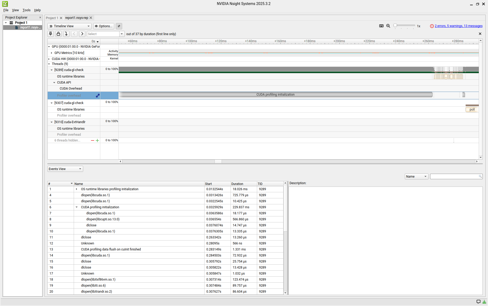
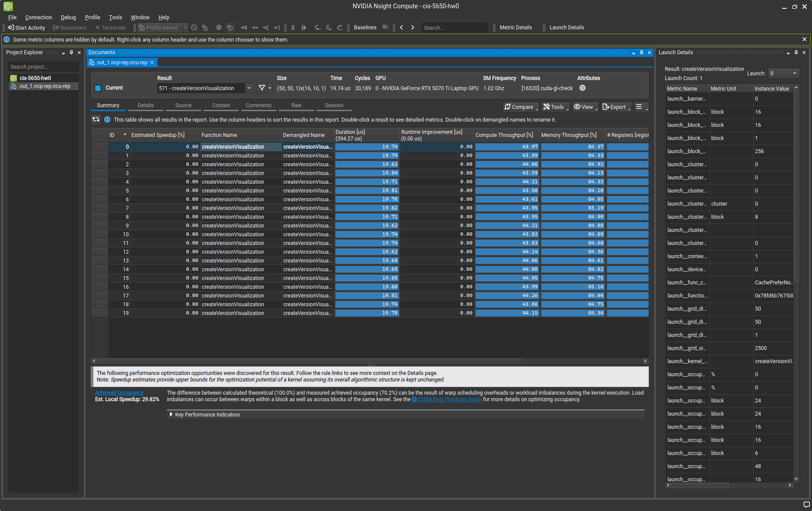
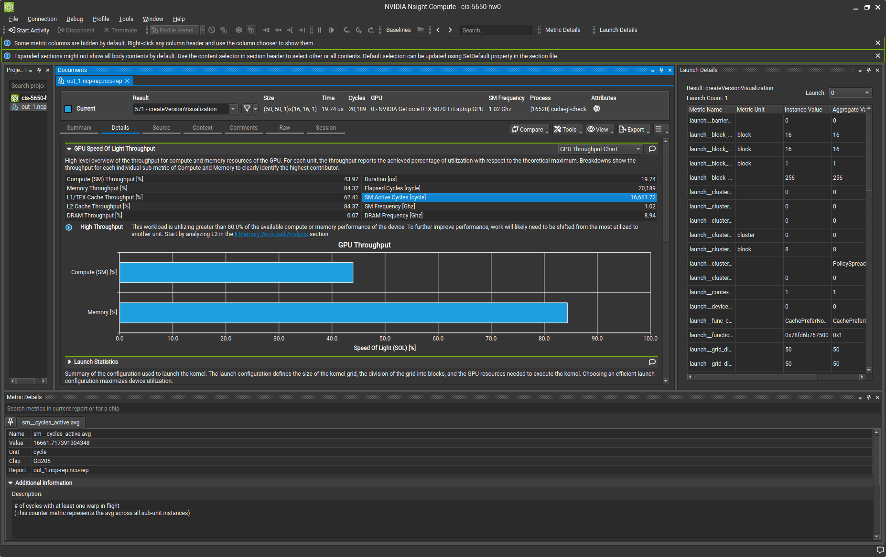

# CUDA Setup and Development Environment Setup

**University of Pennsylvania, CIS 5650: GPU Programming and Architecture, Project 0**

* Amy Liu
  * [Personal Website](https://amyliu.dev/), [LinkedIn](https://linkedin.com/in/miyalana), [Github](https://github.com/mialana).
* Tested on: Ubuntu 24.04.3 LTS, Intel(R) Core(TM) Ultra 9 275HX 32GiB, NVIDIA GeForce RTX 5070Ti 12227MiB

## Part 1: Installation and Setup

NVIDIA Drivers:
- **Version:** 580.76.05
- **Method:** Added Ubuntu PPA repository to local APT registry in order to install latest 580 beta driver. ([primary followed guide](https://linuxconfig.org/how-to-install-the-nvidia-drivers-on-ubuntu-22-04))

CUDA:
- **Version:** 13.0
- **Method:** From NVIDIA `.run` file. Deselected auto-install of drivers in execution menu. ([primary followed guide](https://docs.nvidia.com/cuda/cuda-installation-guide-linux/#runfile-installation))

## Part 2.1: Development Environment Testing

### Part 2.1.1: Project Build & Run

#### GPU Optimus Mode

On Linux Wayland, NVIDIA GPU is not the primary GPU. Build & run without modification leads to the following error:

```bash
Cuda error: Kernel failed!: CUDA-capable device(s) is/are busy or unavailable.
```

To solve this, two environment variables must be added wherever I run the executable (e.g. from command line, from all Nsight applications, etc ):

```bash
__PRIME_RENDER_OFFLOAD=1
__GLX_VENDOR_LIBRARY_NAME=nvidia
```

Alternatively, modify the `/etc/environment` file to contain:

```bash
QT_QPA_PLATFORMTHEME="wayland;xcb"
GBM_BACKEND=nvidia-drm
__GLX_VENDOR_LIBRARY_NAME=nvidia
ENABLE_VKBASALT=1
LIBVA_DRIVER_NAME=nvidia
WLR_NO_HARDWARE_CURSORS=1
```

#### GLFW and Wayland incompability

When using GLFW on Wayland, the `glfwInit()` function does not work (program will exit at `Line 49` of `main.cpp`). To counter this, set two environment variables:

```bash
WAYLAND_DISPLAY=""
XDG_SESSION_TYPE=x11
```

#### CMakeLists.txt Modification

Due to having a very new GPU model, I changed the `CUDA_ARCHITECTURES` variable from `native` to my explicit arch, i.e. `120`.

```bash
if(CMAKE_VERSION VERSION_LESS "3.23.0")
    set_target_properties(${CMAKE_PROJECT_NAME} PROPERTIES CUDA_ARCHITECTURES OFF)
elseif(CMAKE_VERSION VERSION_LESS "3.24.0")
    set_target_properties(${CMAKE_PROJECT_NAME} PROPERTIES CUDA_ARCHITECTURES all-major)
else()
    set_target_properties(${CMAKE_PROJECT_NAME} PROPERTIES CUDA_ARCHITECTURES 120)
endif()
```

#### `run.sh`

Wrote a simple run script to facilitate 1. build + run as well as 2. run without build from command line. Simplifies environment variable requirements mentioned above.

Located at `cuda-gl-check/run.sh`.

### Part 2.1.2: CUDA Project UI Modification


### Part 2.1.3: Nsight Debugger

Final `launch.json` configuration:

```json
{
    "version": "0.2.0",
    "configurations": [
        {
            "name": "CUDA C++: Launch",
            "type": "cuda-gdb",
            "request": "launch",
            "program": "${workspaceFolder}/build/bin/cuda-gl-check",
            "environment": [
                { "name": "__NV_PRIME_RENDER_OFFLOAD", "value": "1" },
                { "name": "__GLX_VENDOR_LIBRARY_NAME", "value": "nvidia" }
            ]
        }
    ]
}
```

### Part 2.1.4: Nsight Systems

Configuration:\


Timeline Window:


Analysis Summary Window:


### Part 2.1.5: Nsight Compute

Configuration:


Summary Window:


Details Window:



## Part 2.2: WebGL

Works on both Zen (Firefox-based) and Arc (Chromium) browsers.


## Part 2.3: WebGPU

Does **not** work on Linux Wayland.


Works on Linux Xorg. This requires logging out and toggling a startup option.


