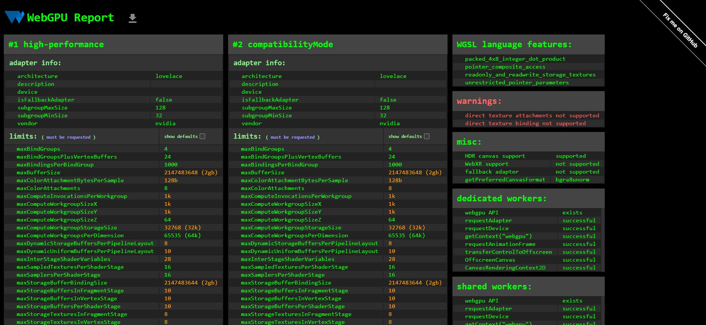

Project 0 Getting Started
====================

**University of Pennsylvania, CIS 5650: GPU Programming and Architecture, Project 0**

* Cindy Wei  
  *LinkedIn: https://www.linkedin.com/in/cindy-wei-7ba778227/

* Tested on: Windows 11 (build 26100), **NVIDIA GeForce RTX 4070 Laptop GPU (SM 8.9)** — personal laptop

### README

#### Screenshots

**CUDA GL Check**

**Nsight VS: Autos + Warp Info (breakpoint in `kernel.cu`)**  

**Nsight Systems: Analysis Summary**  

**Nsight Compute: Summary**  

**Nsight Compute: Details**  

**WebGL (webglreport.com or chrome://gpu)**  

**WebGPU (webgpureport.org)**  

#### CMake changes
- **None** (no edits to either `CMakeLists.txt` beyond the provided source lists).

