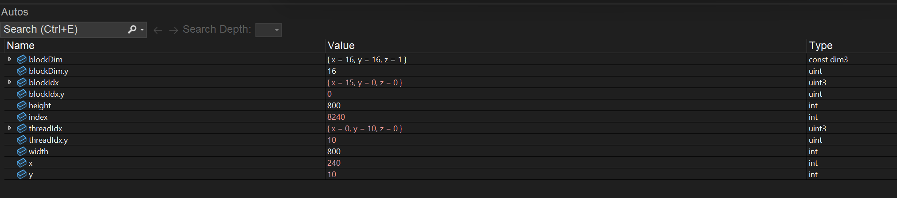

Project 0 Getting Started
====================

**University of Pennsylvania, CIS 5650: GPU Programming and Architecture, Project 0**

* Aaron Tian
  * [LinkedIn](https://www.linkedin.com/in/aaron-c-tian/), [personal website](https://aarontian-stack.github.io/)
* Tested on: Windows 22H2 (26100.4946), Intel Core Ultra 7 265k @ 3.90GHz 22GB, RTX 5070 12GB

### 2.1.2

### 2.1.3

### 2.1.4

### 2.1.5

Nsight compute does not work with this homework. 

https://edstem.org/us/courses/81464/discussion/6880884

### 2.2

### 2.3

