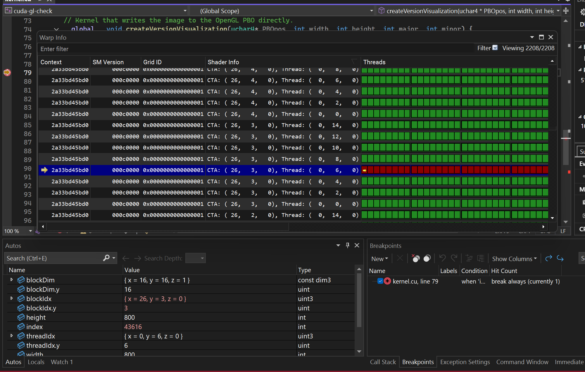
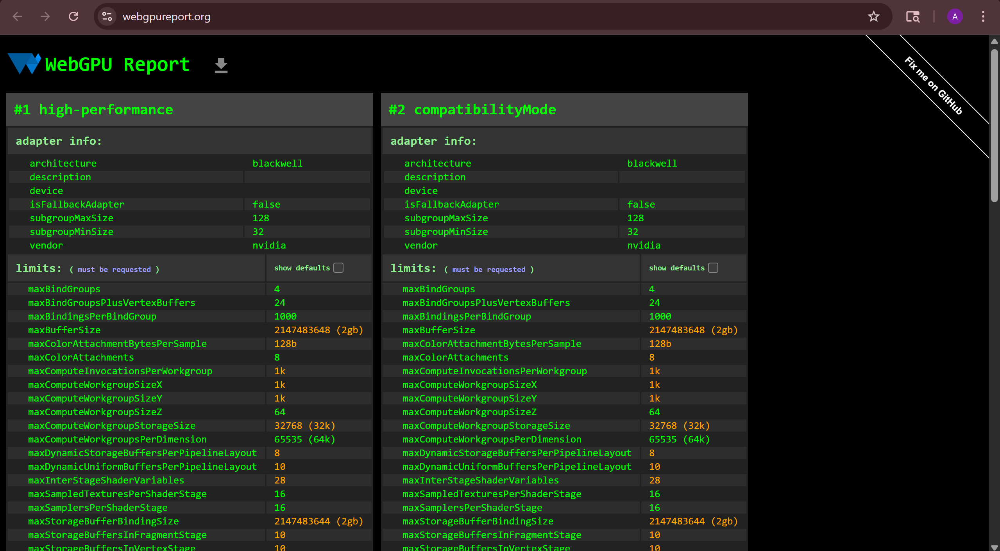

Project 0 Getting Started
====================

**University of Pennsylvania, CIS 5650: GPU Programming and Architecture, Project 0**

* Cecilia Chen 
  * 
* Tested on: Windows 11, i7-13700F @ 2.1GHz 16GB, GeForce GTX 4070 12GB (Personal Computer)

### Result

* Test 1

* Test 2 - Debugging

* WebGL Report

* WebGPU Report

