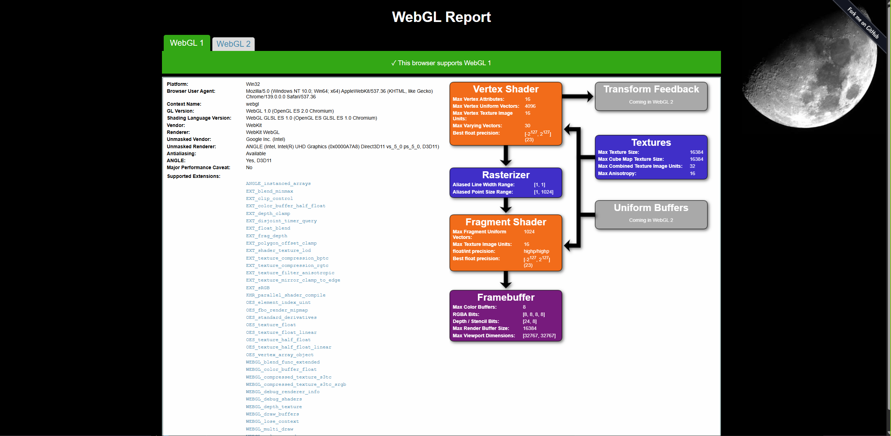

Project 0 Getting Started
====================

**University of Pennsylvania, CIS 5650: GPU Programming and Architecture, Project 0**

* Harris Kokkinakos
  * [https://www.linkedin.com/in/haralambos-kokkinakos-5311a3210/](), [https://harriskoko.github.io/Harris-Projects/]()
* Tested on: Windows 24H2, i9-12900H @ 2.50GHz 16GB, RTX 3070TI Mobile (Personal Laptop)

### Screenshots

