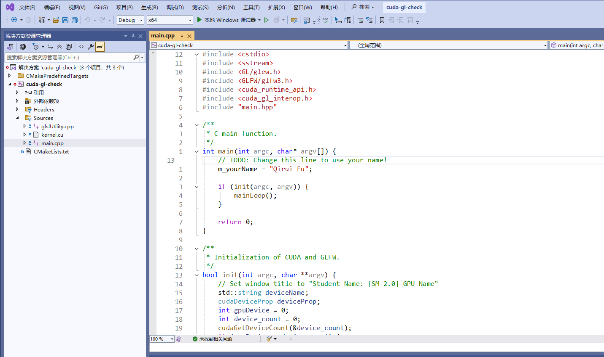

Project 0 Getting Started
====================

**University of Pennsylvania, CIS 5650: GPU Programming and Architecture, Project 0**

* Qirui (Chiray) Fu
  * [personal website](https://qiruifu.github.io/)
* Tested on my own laptop: Windows 11, i5-13500HX @ 2.5GHz 16GB, GTX 4060 8GB

### README

Compute Capability of my GPU : 8.9 

#### Part 2.1.2

#### Part 2.1.3

#### Part 2.1.4

#### Part 2.2

#### Part 2.3

