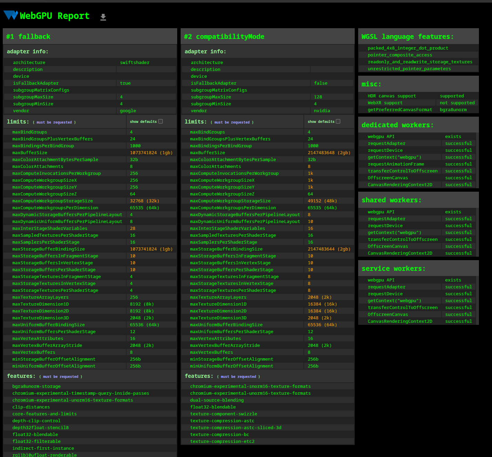

Project 0 Getting Started
====================

**University of Pennsylvania, CIS 5650: GPU Programming and Architecture, Project 0**

* Jacky Park
  * [LinkedIn](https://www.linkedin.com/in/soominjackypark/), [personal website](https://jackypark.com/)
* Tested on: Windows 11, i9-13900H @ 2.60 32GB, RTX 4070 Laptop GPU 8GB (Personal Laptop)

# Screenshots
### App Window

### CUDA Debug

### NSight Systems 

### WebGL Support

### WebGPU Report 
