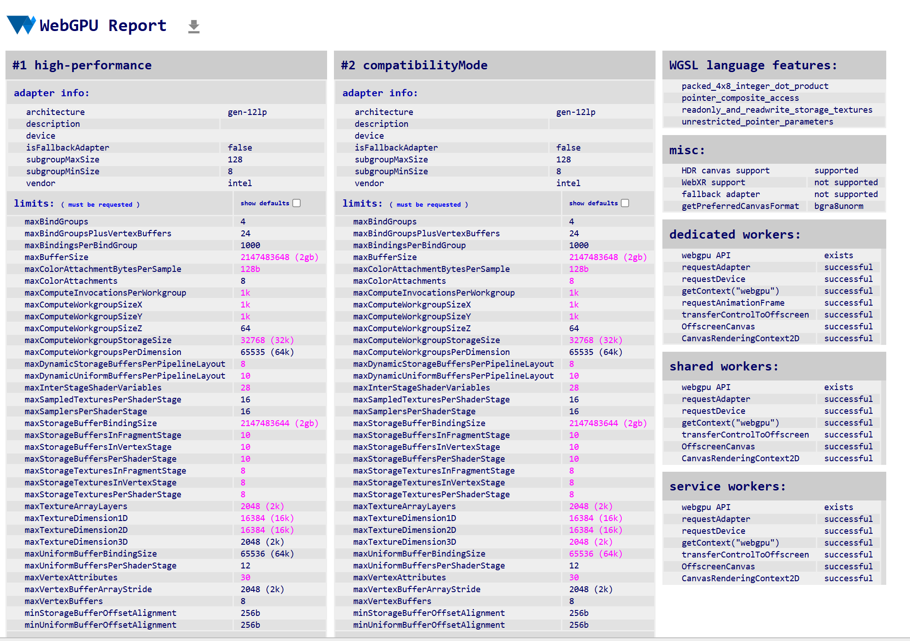

Project 0 Getting Started
====================

**University of Pennsylvania, CIS 5650: GPU Programming and Architecture, Project 0**

* Jefferson Koumba Moussadji Lu
  * [LinkedIn](https://www.linkedin.com/in/-jeff-koumba-0b356721b/), [personal website](), [twitter](), etc.
* Tested on: Personal Laptop, Windows 11 Home, Intel(R) Core(TM) i9-14900HX @ 2.22GHz @ 24 Cores @ 32GB RAM, Nvidia GeForce RTX 4090 @ 16 GB @  SM 8.9 

**CUDA GL Check**

**NVIDIA Nsight Debugging**

**NVIDIA Nsight System Analysis**

**NVIDIA Nsight System Timeline**

**NVIDIA Nsight Compute**

**WebGL**

**WebGPU**
