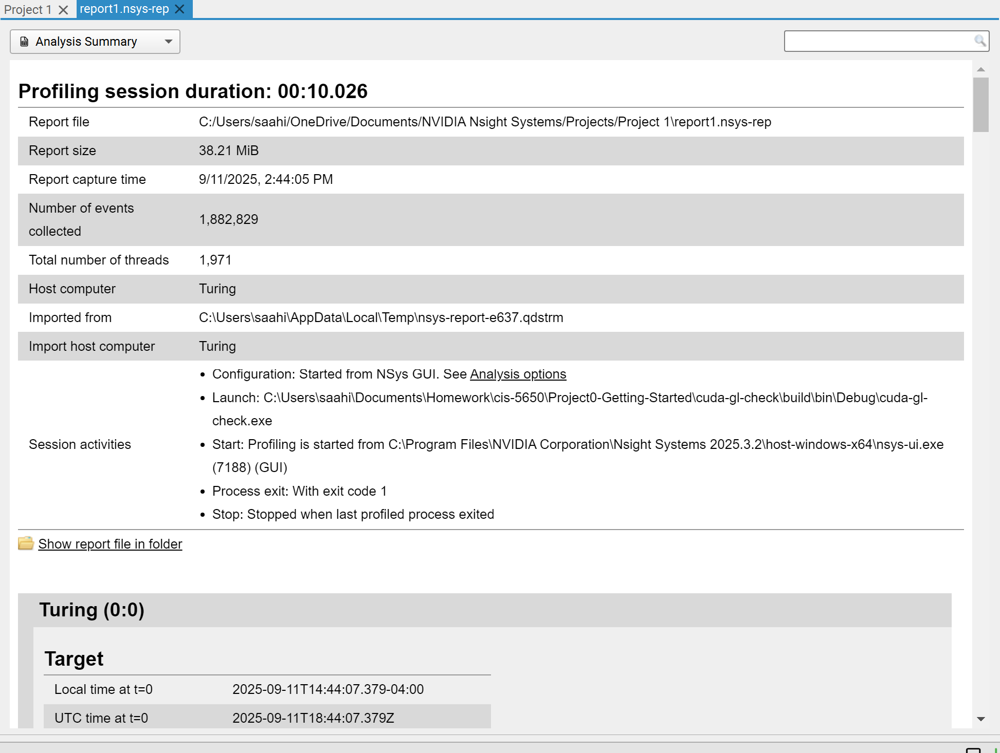
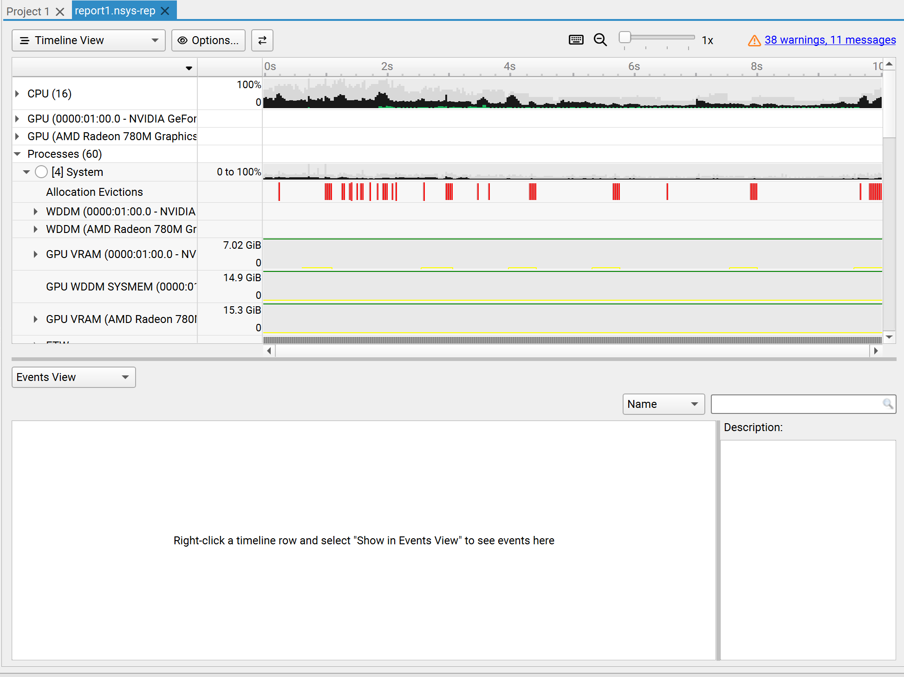
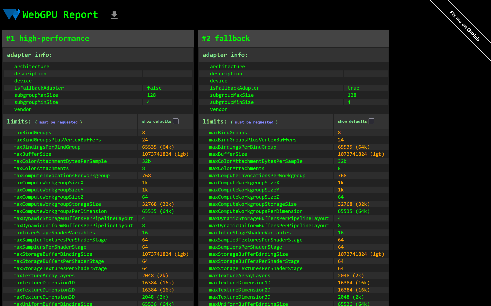

Project 0 Getting Started
====================

**University of Pennsylvania, CIS 5650: GPU Programming and Architecture, Project 0**

* Saahil Gupta
  * [LinkedIn](www.linkedin.com/in/saahil-g), [personal website](www.saahil-gupta.com)
* Tested on: Windows 11 10.0.26100, AMD Ryzen 9 7940HS @ 4.0GHz 32GB, RTX 4060 Laptop GPU 8GB

### Homework 0 - Getting Started

Lots of local setup stuff needed to be configured. Errors with the Windows SDK detection were causing CMake compiler detection to fail. More detail will be added later on after some thorough debugging. Current WAR is to manually transfer the WinSDK lib and incl files to a readable path (like MSVC base folders). `CMakeLists.txt` has not been altered. `.vscode` has been included as it contains configurations for intellisense and linter support for CUDA and the VSCode C/C++ extension.

### CUDA GL Check

### NSight Visual Studio

### NSight Compute

### NSight Systems

### WebGL

### WebGPU

