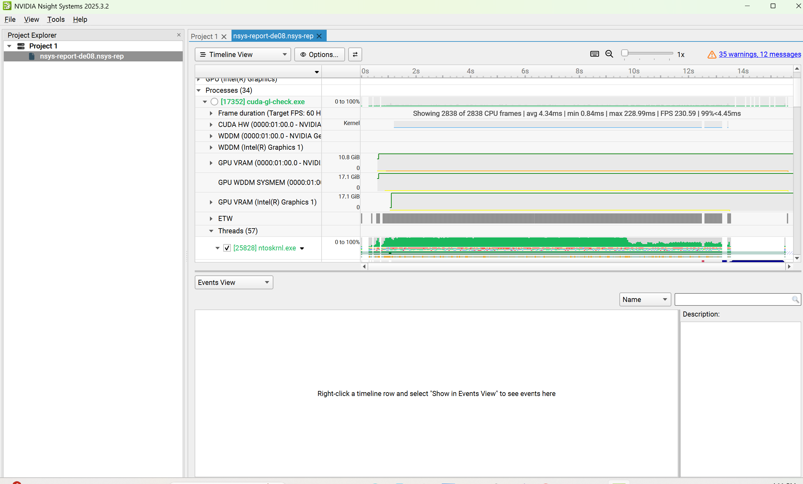

Project 0 Getting Started
====================

**University of Pennsylvania, CIS 5650: GPU Programming and Architecture, Project 0**

* Ruben Young
  * [LinkedIn](https://www.linkedin.com/in/rubenaryo/), [personal website](https://rubenaryo.com)
* Tested on: Windows 11, AMD Ryzen 7 7800X3D, RTX 4080 SUPER (Compute Capability 8.9)

