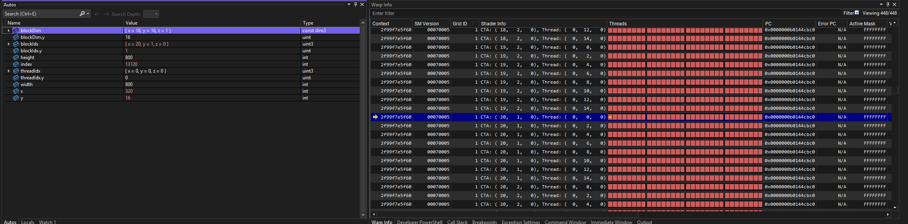
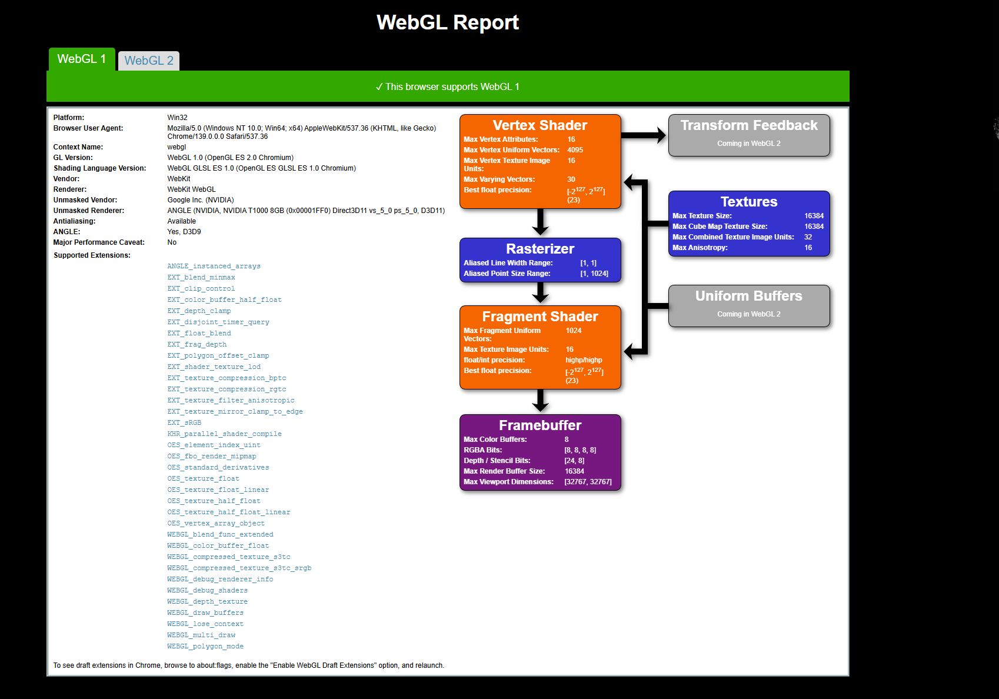

Project 0 Getting Started
====================

**University of Pennsylvania, CIS 5650: GPU Programming and Architecture, Project 0**

* Bryce Joseph
* [LinkedIn](https://www.linkedin.com/in/brycejoseph/), [GitHub](https://github.com/brycej217)
* Tested on: Windows 11, Intel(R) CORE(TM) Ultra 9 275HX @ 2.70GHz 32.0GB, NVIDIA GeFORCE RTX 5080 Laptop GPU 16384MB

