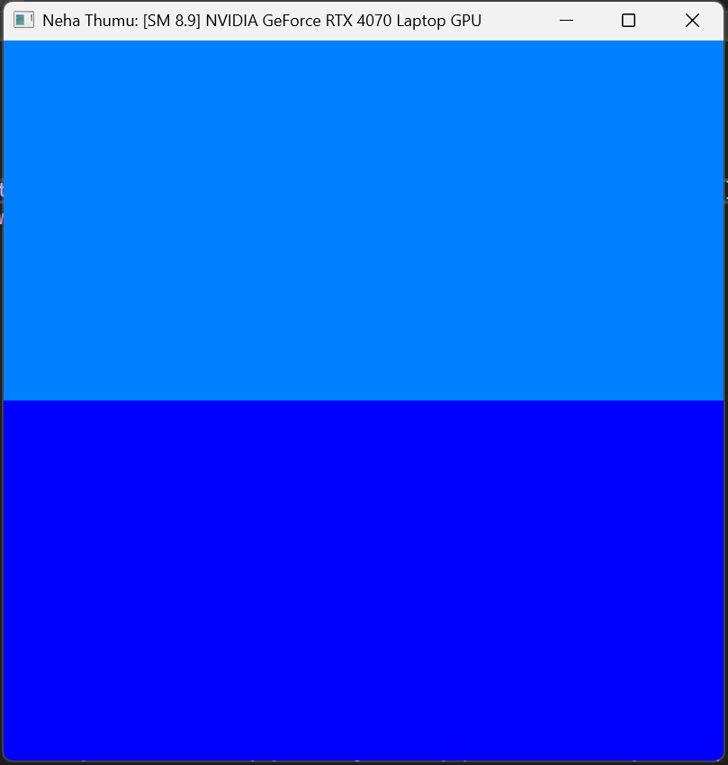
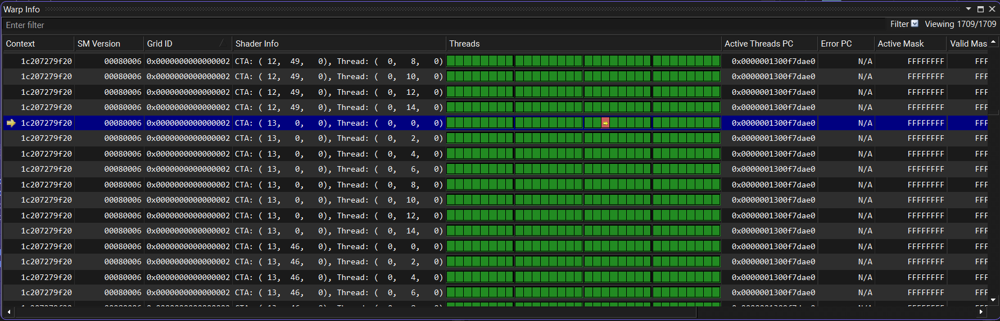
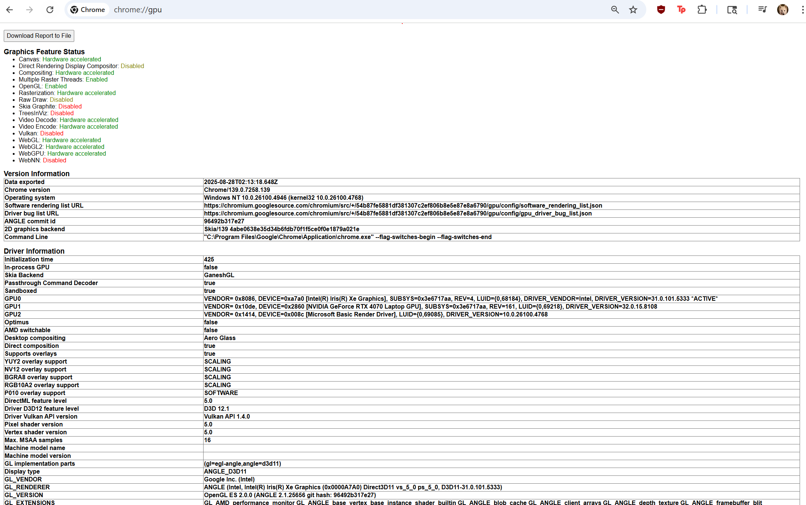

Project 0 Getting Started
====================

**University of Pennsylvania, CIS 5650: GPU Programming and Architecture, Project 0**

* Rachel Lin
  * [LinkedIn](https://www.linkedin.com/in/rachel-lin-452834213/), [personal website](https://www.artstation.com/rachellin4), [Instagram](https://www.instagram.com/lotus_crescent/)
* Tested on: (TODO) Windows 11, 12th Gen Intel(R) Core(TM) i7-12700H @ 2.30GHz, NVIDIA GeForce RTX 3080 Laptop GPU (16 GB)

### 2.1.2
cuda-gl-check output

### 2.1.3
NSight debug output at index 1002

### 2.1.4
NSight Systems analysis summary and timeline

### 2.2
WebGL compatibility check

### 2.3
WebGPU compatibility check

